# Harbor 搭建

参考网址：https://blog.csdn.net/funtaster/article/details/83268974

> harbor 是 Docker私有仓库

## 一 、安装Docker

> 见docker部署文档 （Docker部署.md）

## 二、 安装docker-compose

> docker-compose 是用来做docker 的多容器控制，是Docker容器进行编排的工具，定义和运行多容器的应用，可以一条命令启动多个容器，使用Docker Compose不再需要使用shell脚本来启动容器。（由于从hub下载过程可能会比较慢）

### 1、下载docker-compose

> ```
> sudo curl -L "https://github.com/docker/compose/releases/download/1.24.1/docker-compose-$(uname -s)-$(uname -m)" -o /usr/local/bin/docker-compose
> ```
>
> 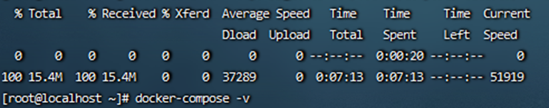

### 2、设置可执行权限

> 将可执行权限应用于二进制文件(设置可执行权限)
>
> ```
> sudo chmod +x /usr/local/bin/docker-compose
> ```
>

### 3、创建软链

> ```
> sudo ln -s /usr/local/bin/docker-compose /usr/bin/docker-compose
> ```
>

### 4、测试是否安装成功

> ```
> docker-compose –version 或docker-compose -v			（查看版本信息）
> ```
>
> 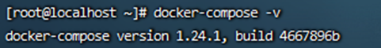
>

###  5、 安装epel

> ```
> yum –y install epel-release 
> ```
>

### 6、安装python3

**检查系统自带python** 

> 默认情况下，Linux会自带安装Python，可以运行python --version命令查看
>
> ```
> python --version
> ```
>

**查看Linux默认安装的Python位置**

> ```
> whereis python
> 
> which python
> ```
>

**导入安装包**

> 从官网下载[*https://www.python.org/ftp/python*](https://www.python.org/ftp/python)（这里我下载的是Python-3.7.0.tar.xz）
>
> ```
> mkdir -p /opt/python3 				（创建python3安装包存放路径）
> 
> tar –xvf  Python-3.7.0.tar.xz 		（上传tar包并解压）
> ```
>

**准备编译环境**

> ```
> yum -y install gcc
> 
> yum -y install zlib-devel bzip2-devel openssl-devel ncurses-devel sqlite-devel readline-devel tk-devel gdbm-devel db4-devel libpcap-devel xz-devel libffi-devel make
> ```
>

**编译安装**

> ```
> cd Python-3.7.0
> ```
>
> ```
> # 这里我得安装路径是/usr/bin/python3
> ./configure --prefix=/usr/bin/python3 --enable-optimizations
> ```
>
> ```
> make
> ```
>
> ```
> make install
> ```
>

**进入到安装目录/usr/bin/python3，查看安装结果**

> 应存在如下4个文件名： bin、include、lib、share

**创建软链接**

> 创建一个软链接并把软链接放到/usr/local/bin目录下
>
> ```
> # ln -s /安装路径/bin/python3.7 /usr/local/bin/python3
> 
> ln -s /usr/bin/python3/bin/python3.7 /usr/local/bin/python3
> ln -s /usr/bin/python3/bin/pip3 /usr/bin/pip3
> ```
>

**查看创建结果**

> ```
> ls -l /usr/local/bin
> ```
>

**查看是否安装成功**

> ```
> python3 --version
> ```
>
> 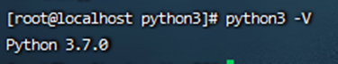
>

**配置环境变量**

> 配置环境变量主要是能快速使用pip3安装命令
>
> ```
> vi ~/.bash_profile		打开配置文件
> ```
>
> 最后一行进行添加：
>
> ```
> #配置python
> export PYTHON_HOME=安装路径
> export PATH=$PYTHON_HOME/bin:$PATH
> ```
>
> ```
> source ~/.bash_profile		使配置生效
> ```
>

**执行echo命令，查看是否配置成功**

> ```
> echo $PYTHON_HOME
> ```
>

查看安装的pip版本

> ```
> pip3 --version  或  pip3 –V
> ```
>

### 2.3 升级pip3

> ```
> pip3 install --upgrade pip
> ```
>

### 2.4 安装docker-compose

> ```
> pip3 install docker-compose
> ```
>

**查看是否安装成功**

> ```
> docker-compose -version
> ```
>

## 三、安装Harbor

### 3.1 下载Harbor安装包

> 下载链接：https://storage.googleapis.com/harbor-releases/harbor-offline-installer-v1.6.1.tgz
>
> ```
> wget https://storage.googleapis.com/harbor-releases/harbor-offline-installer-v1.6.1.tgz
> ```
>
> ```
> tar xvf harbor-offline-installer-v1.6.1.tgz
> ```

### 3.2  配置 harbor.cfg

> 配置harbor目录下的harbor.cfg  (详情配置信息在同级目录中)
>
> ```
> vi harbor.cfg
> ```
>
> 修改内容：
>
> ```
> hostname = 192.168.15.131			（配置本机ip）
> ```
>

### 3.3 启动 Harbor

> ```
> ./install.sh
> ```
>
> 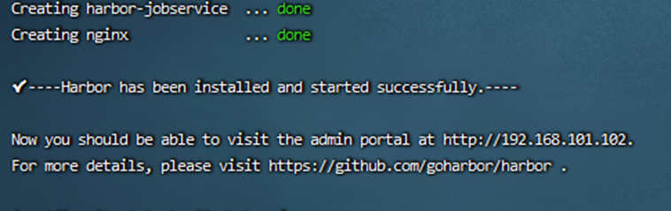
>

### 3.4 查看Harbor 镜像

> 依赖的镜像及启动服务如下
>
> ```
> docker images
> ```
>
> 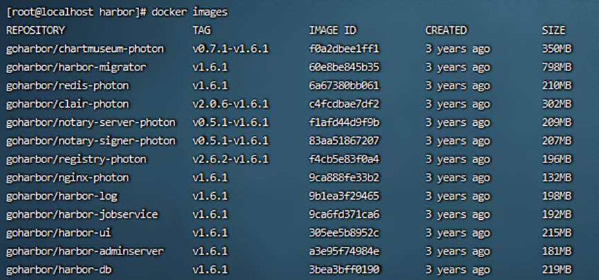
>
> ```
> docker-compose ps
> ```
>
> 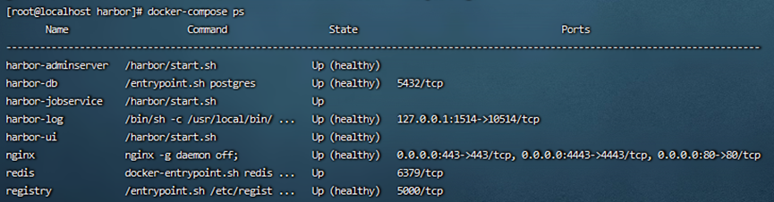
>

### 3.5 访问Web Harbor

> 启动完成后，我们访问刚设置的hostname即可 192.168.15.131，默认是80端口，如果端口占用，我们可以去修改docker-compose.yml文件中，对应服务的端口映射。（用户名admin登陆密码Harbor12345（默认））
>
> 把端口80 修改为 1180
>
> 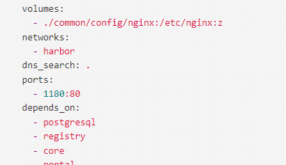

### 3.6 新建项目（仓库）

> 从web页面中新建一个私有仓库（wang_ning_test）
>
> 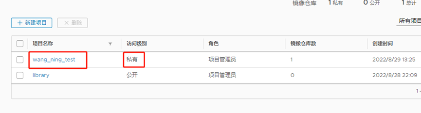
>

### 3.7 将docker镜像推送到Harbor仓库中

**登录** 

> 如果从其他虚机远程提交到Harbor上，先远程登录 (用harbor 账号登录)
>
> ```
> docker login 192.168.101.102
> ```
>

**可能会出现如下错误：**

> Error response from daemon: Get https://192.168.101.102/v2/: dial tcp 192.168.101.102:443: connect: connection refused
>
> 这里说拒绝连接，因为我是用http部署的harbor，这里是[https进行访问的，所有出现报错](https://进行访问的，所有出现报错) 

> **解决方法**
>
> > 那一台机器要远程Harbor就在那台机器上配置，就算harbor所在机器通过docker登录harbor，也需要配置
> >
> > （参考网址http://www.manongjc.com/detail/25-htulwbzcrdiooeg.html）
>
> **方法 一**  
>
> > 修改docker.service
> >
> > ```
> > vim /usr/lib/systemd/system/docker.service
> > 在ExecStart=/usr/bin/dockerd 后面加上--insecure-registry=harborIP
> > ```
> >
> > 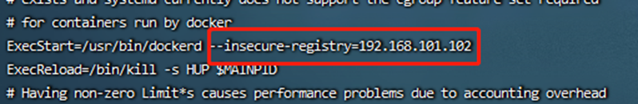
>
> **方法 二** 
>
> > 修改daemon.json （推荐使用）
> >
> > 在 /etc/docker 下编辑文件 daemon.json（没有就新建一个）
> >
> > ```
> > vim /etc/docker/daemon.json 添加如下内容
> > 
> > {
> > "insecure-registries": ["192.168.101.102"]
> > }
> > ```
> >
> > **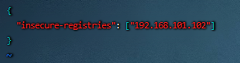**
>
> **加载配置重启docke** 
>
> > （无论执行方法一，还是方法二都要执行这里）
> >
> > ```
> > systemctl daemon-reload
> > 
> > systemctl restart docker
> > ```
> >
>

**登录测试**、

> ```
> docker login 192.168.101.102
> ```
>
> 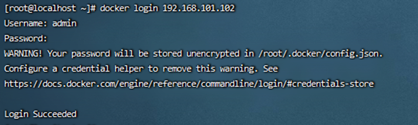
>

**制作tomcat 镜像**  

> 参考地址：https://blog.csdn.net/ysl_228/article/details/77368163
>
> 通过编写Dockerfile文件将tomcat及JDK 复制到docker容器的指定目录下（参考文件在Dockerfile/ Dockerfile制作tomcat镜像）
>
> DockerfileDocker入门与实践之 Dockerfile 语法详解地址如下：
>
> https://blog.csdn.net/weixin_43397326/article/details/83151255

**编译Dockerfile文件**

> ```
> 执行docker build -t 容器名字:版本号 .（docker build -t tomcat:v1.0.2 .）
> ```
>
> - build : 表示编译Dockerfile文件
>
> - -t : tomcat:v1.0.2:表示 镜像文件名称(自定义)为tomcat，本版号v1.0.2]
>
> - . : 一定要记住点 . 表示当前目录（即Dockerfile所在的目录）。

**查看是否生成镜像文件**

> ```
> docker images
> ```
>

**启动容器**


> ```
> docker run -d -p 8085:8080 容器名字:版本号（docker run -d -p 8085:8080 tomcat:v1.0.2）
> ```
>
> - -d:后台运行容器，并返回容器ID
> - -p: 指定端口映射，格式为：主机(宿主)端口:容器端口

**访问tomcat启动是否成功 ，浏览器输入 https://localhost:8085（或者ip + 端口）**

**进入容器查看**

> 首先查看正在运行的容器
>
> ```
>  docker images    
> ```
>

**进入容器**

> ```
> docker exec -it container id(通过查看正在运行的容器查到的) /bin/bash
> ```
>

**docker 镜像 push 到 Harbor中**

> 如果在制作镜像的时候是通过 docker build –t 域名/仓库名/镜像名:版本号 .
>
> 这种格式制作的镜像，直接执行8.2，否则先执行8.1.
>
> - 域名：harbor仓库地址或者设置的harbor域名
> -  仓库名：在harbor中创建的仓库（存放项目镜像的仓库）

**将镜重命名**

> 目的是给之前的镜像重新命名。
>
> docker tag 镜像名:TAG 域名/仓库名/镜像名:TAG
>
> （目的是将原来的REPOSITORY=镜像命名，修改为 REPOSITORY = 域名/仓库名/镜像名 ）

**将打包好的镜像推送到 Harbor**

> ```
> docker push REPOSITORY: TAG
> ```
>

**查看docker 镜像**

> 从Harbor web 页面对应的项目中查看是否推送成功

### 3.8 将镜像导出到本地

> 查看镜像
>
> ```
> docker images
> ```
>
> 保存到本地
>
> ```
> docker save -o 文件名.tar REPOSITORY:TAG
> ```
>
> 将本地镜像文件，运行在docker镜像中
>
> ```
> docker load < 本地镜像文件
> ```
