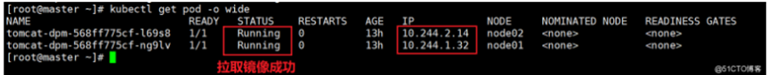

# K8s docker部署

参考网 https://blog.51cto.com/u_13760351/2533947

## 一、准备环节

> 1. 搭建好harbor仓库和k8s集群
> 2. 在根目录下建一个k8s文件夹，k8s文件夹下建一个应用目录（用应用名字命名）。将附件中的service.yml和deployment.yml 导入进去。

## 二、登录Harbor

> 这里看k8s 上的三台机器都需要登录，首先在/etc/docker/daemon.json下添加一下代码：
>
> ```
> vim /etc/docker/daemon.json
> 
> "insecure-registries":["192.168.37.111"]
> ```
>
> 
>
> 添加好后重启docker
>
> ```
> systemctl daemon-reload
> 
> systemctl restart docker
> ```
>
> K8S在默认情况下只能拉取Harbor仓库中的公有镜像，拉取私有镜像会报错：ErrImagePull 或 ImagePullBackOff
>
> **两种解决办法**
>
> > 方法一、到 Harbor 仓库中把该镜像的项目设置成公开权限
> >
> > 方法二、如果Harbor仓库中该镜像的项目不是公开的，可以创建认证登录秘钥，在拉取镜像时带上该秘钥
> >
> > - 查看登录的秘钥数据：
> >
> > ```
> > cat ~/.docker/config.json
> > ```
> >
> > 
> >
> > - 进行base64加密
> >
> > ```
> > cat ~/.docker/config.json | base64 -w 0
> > ```
> >
> > 执行命令后会生成一个密钥
> >
> > 
> >
> > - 创建 secret.yaml 文件
> >
> > 在拉取私有仓库时会用到附加文件secret.yaml
> >
> > - 创建对象
> >
> > ```
> > kubectl create -f secret.yaml
> > ```
> >
> > 

## 三、创建应用

### 1、编写deployment.yml文件

> 在附件中deployment.yml

## 2、创建，拉取私有镜像（创建deployment资源）

> ```
> kubectl create -f deployment.yml
> ```
>
> 其中deployment.yml文件可以任意命名例如tomcat_deployment.yml
>
> 在创建对象适合于应该kubectl create -f tomcat_deployment.yml

### 3. 删除deployment资源

```
kubectl delete –f deployment.yml
```

### 4. 查看pod

> ```
> kubectl get pod -o wide
> ```
>
> 

## 四、对外暴露端口

### 1.编写service.yml文件

> 附件service.yml

### 2.创建对象

```
kubectl create -f service.yml
```

### 3.查看service

> ```
> kubectl get svc
> ```
>
> 

### 4.  查看service详情

> ```
> kubectl describe service service
> ```
>
> 

## 五、测试项目

> 看pod所在的node节点，用该节点ip+对外暴露的端口访问