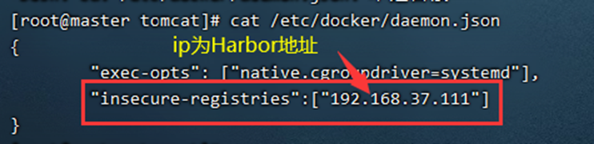
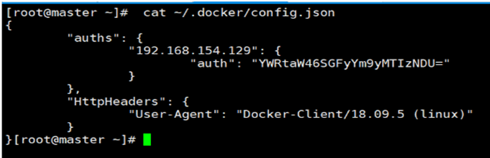
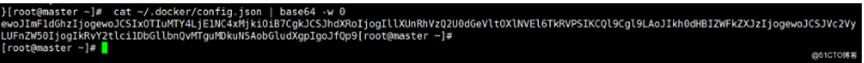
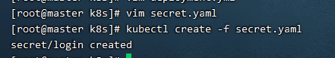
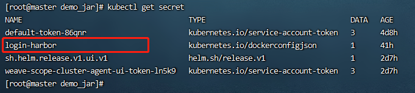
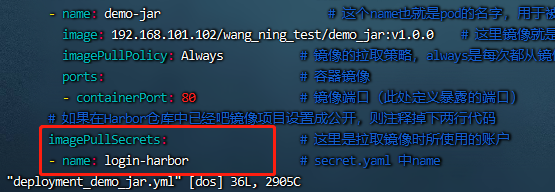
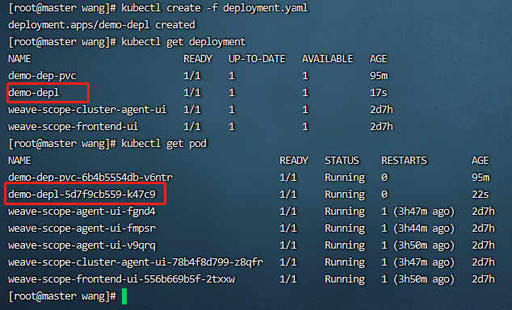
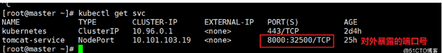
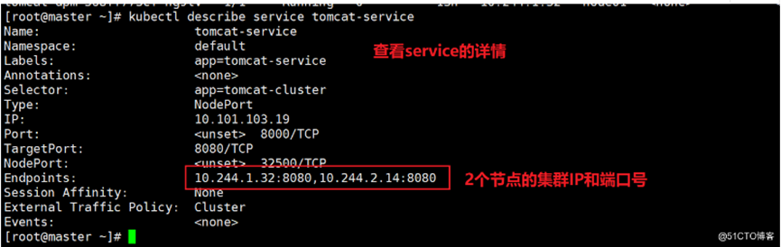

# K8s docker部署

参考网 https://blog.51cto.com/u_13760351/2533947

相关附件文件在 k8s_file 文件夹下面

## 一、准备环节

> 1. 搭建好harbor仓库和k8s集群
> 2. 在根目录下建一个k8s文件夹，k8s文件夹下建一个应用目录（用应用名字命名）。将附件中的service.yml和deployment.yml 导入进去。

## 二、登录Harbor

这里看k8s 上的三台机器都需要登录，首先在/etc/docker/daemon.json下添加一下代码：

```
vim /etc/docker/daemon.json

"insecure-registries":["192.168.37.111"]
```



添加好后重启docker

```
systemctl daemon-reload

systemctl restart docker
```

K8S在默认情况下只能拉取Harbor仓库中的公有镜像，拉取私有镜像会报错：ErrImagePull 或 ImagePullBackOff

**两种解决办法**

方法一、到 Harbor 仓库中把该镜像的项目设置成公开权限

方法二、如果Harbor仓库中该镜像的项目不是公开的，可以创建认证登录秘钥，在拉取镜像时带上该秘钥

> 1. 查看登录的秘钥数据
>
>    ```
>    cat ~/.docker/config.json
>    ```
>
>    
>
> 2. 进行base64加密
>
>    ```
>    cat ~/.docker/config.json | base64 -w 0
>    ```
>
> 3. 执行命令后会生成一个密钥
>
>    
>
> 4. 创建 secret.yaml 文件 (k8s_file\secret.yaml)
>
>    ```
>    apiVersion: v1    #Api接口版本
>    kind: Secret       #定义控制器
>    metadata:          #信息
>      name: login-harbor      #Sectet 名称
>    type: kubernetes.io/dockerconfigjson    #用来创建用户docker registry认证的Secret
>    data:
>       #这里添加加密后的密钥
>         .dockerconfigjson: ewoJImF1dGhzIjogewoJCSIxOTIuMTY4LjEwMS4xMDIiOiB7CgkJCSJhdXRoIjogIllXUnRhVzQ2U0dGeVltOXlNVEl6TkRVPSIKCQl9Cgl9LAoJIkh0dHBIZWFkZXJzIjogewoJCSJVc2VyLUFnZW50IjogIkRvY2tlci1DbGllbnQvMTguMDYuMy1jZSAobGludXgpIgoJfQp9
>    ```
>
> 5. 创建对象
>
>    ```
>    kubectl create -f secret.yaml
>    ```
>
>    
>
> 6. 查看是否创建成功
>
>    ```
>    kubectl get secret
>    ```
>
>    
>
> 7. 使用创建的 secret.yaml 的话需要在 deployment 的YAML 文件中进行引用
>
> 

## 三、创建应用

1. **获取 YMAL 文件**

   pod 是由 deployment 控制的，通过创建 deployment 创建 pod

   ```
   # 创建一个 资源类型为deployment初始化模板、名字为demo-depl
   # --image 指定镜像为192.168.101.102/wang_ning_test/demo_jar，版本号为v1.0.0
   # --dry-run=client，只打印显示对象，而不运行。
   
   kubectl create deployment demo-depl --image=192.168.101.102/wang_ning_test/demo_jar:v1.0.0 -o yaml --dry-run=client > deployment.yaml
   ```

   Deployment 文件字段解释说明（k8s_file\deployment.yaml）

   ```
   apiVersion: apps/v1                       # Api接口版本
   kind: Deployment                          # 指定创建资源的角色/类型 
   metadata:                                 # 资源的元数据(用来描述 deployment 的信息)
     name: demo                   # 用来描述 deployment 的名字，在同一个namespace中必须唯一
     namespace: default                         # 部署在哪个namespace中
     labels:                                 # labels是k8s特有的，可以叫做标签
       app: demo
       version: stable
   spec:                                     # 资源清单，在这里定义的是deployment所需要的资源清单
   # 在具体参数信息spec下，只指定了副本数量，还需要指定副本标签与Deploymen控制器进行匹配
     replicas: 1                             # 副本数
     revisionHistoryLimit: 3                 # 保留 3 个历史版本
     selector:                               # 选择器
       matchLabels:                          # 选择匹配
         app: demo                # 匹配 demo-deployment
         version: stable
     strategy:                              # 策略
       rollingUpdate:                       # 滚动更新
         maxSurge: 30%                      # 最大额外可以存在的副本数，可以为百分比，也可以为整数
         maxUnavailable: 30%                # 示在更新过程中能够进入不可用状态的 Pod 的最大值，可以为百分比，也可以为整数
       type: RollingUpdate                  # 滚动更新策略(先启动新的，等一个新的完全就绪后，就将老的停掉)
     template:                               # pod模板定义
       metadata:                             #  # 资源的元数据(用来描述 pod 的信息)
         labels:                             # 定义 pod 标签
           app: demo                    # 标签 tomcat-deployment
           version: stable 
       spec:                                 # 定义 pod 所需要的资源清单
         containers:                         # 容器
         - name: demo                # 这个name也就是pod的名字，用于被deployment来selector（选择）;
           image: 192.168.101.102/wang_ning_test/tomcat_demo01:v1.0.1 # 这里镜像就是harbor仓库的项目镜像
           imagePullPolicy: Always           # 镜像的拉取策略，always是每次都从镜像仓库拉取，IfNotPresent 如果本地没有就拉取，never 只从本地拉取
           ports:                            # 容器镜像
           - containerPort: 8080               # 镜像端口（此处定义暴露的端口）
         # 如果在Harbor仓库中已经吧镜像项目设置成公开，则注释掉下两行代码
         imagePullSecrets:                   # 这里是拉取镜像时所使用的账户
         - name: login-harbor                # secret.yaml 中name
   
   ```

2. **创建资源**

   ```
   # 创建，拉取私有镜像（创建deployment资源 和 pod）
   kubectl apply -f deployment.yaml
   ```

3. **查看创建的资源信息**

   ```
   # 查看 当资源创建成功后可以看到 deployment 和 pod 信息
   kubectl get deployment
   kubectl get pod
   ```

   

4. **删除资源**

   ```
   kubectl delete –f deployment.yaml
   ```

## 四、对外暴露端口

这里通过 service 将集群中应用的端口对外暴露，供用户访问

1.创建YAML对象

```
# 获取 demo-depl的service yam配置文件
# deployment demo-depl （demo-deplr 为要配置的 deployment 名字）
# --port=8080 暴露给集群内客户访问服务
# --type=NodePort pod上的真实端口（应用的真实端口）
# --name=demo-service 给 service 起一个名字，为了区别，不要和deployment 名字一致

kubectl expose deployment demo-depl --port=8001 --type=NodePort --target-port=8080 --name=demo-service -o yaml --dry-run=client > service.yaml
```

Service 文件字段解释说明(k8s_file\service.yaml)

```
apiVersion: v1                  # 指定api版本，此值必须在kubectl api-versions中
kind: Service                   # 指定创建资源的角色/类型 
metadata:
  name: demo-service            # 资源的名字，在同一个namespace中必须唯一
  namespace: default            # 部署在哪个namespace中  
  labels:                       # 设定资源的标签
    app: demo-service
spec:
  type: NodePort                 # 配置 Nodeport 外部流量可访问k8s中的服务
  selector:                      # 选择标签  匹配的是deployment容器标签
    app: demo                    # 匹配 demo   
  ports:
  - port: 8000                   # 暴露给集群内客户访问服务
    targetPort: 8080             # pod上的真实端口
    nodePort: 32500              # 对外暴露的端口号，对外提供访问的端口，暴露给集群外客户访问服务

```

2. 执行创建

```
kubectl create -f service.yaml
```

3.查看service

```
kubectl get svc
```



**4.  查看service详情**

```
kubectl describe service
```



## 五、测试项目

> 看pod所在的node节点，用该节点ip+对外暴露的端口访问(ip:32500)
>
> 也可以使用master ip+对外暴漏的端口访问

## 六、设置域名访问

使用 ingress 可以实现通过域名访问应用，具体的ingress部署参考 ingress_部署 文档
