# ingress

作用：通过域名进行访问

参考网站：https://blog.csdn.net/m0_56069948/article/details/124263634

Ingress 工作流程：


## 安装

### 一、 环境要求

K8s version：v1.23.6

controller：v1.1.1

### 二、获取 yaml 配置文件

官方地址 

```
https://raw.githubusercontent.com/kubernetes/ingress-nginx/controller-v1.1.1/deploy/static/provider/cloud/deploy.yaml
```

Ingress-nginx 新版本的 depoly.yaml 有些不同，需要拉取下面2个镜像

- k8s.gcr.io/ingress-nginx/controller:v1.1.2
- k8s.gcr.io/ingress-nginx/kube-[webhook](https://so.csdn.net/so/search?q=webhook&spm=1001.2101.3001.7020)-certgen:v1.1.1

由于无法访问，从国内镜像网站获取

镜像查找地址 https://hub.docker.com（这里我一下下载好可以从自己百度网盘下载）

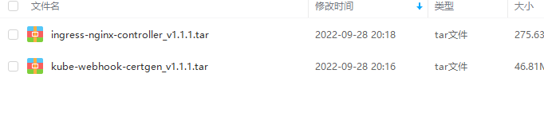

```
# 直接从国内镜像仓库拉取镜像
docker pull liangjw/ingress-nginx-controller:v1.1.1

docker pull liangjw/kube-webhook-certgen:v1.1.1
```

### 三、修改配置文件

这里配置后的配置文件在k8s_file\ingress_file\ngress-deploy.yaml

#### 1、 修改镜像地址

方法一、修改进行为能获取到的镜像地址（修改三处）

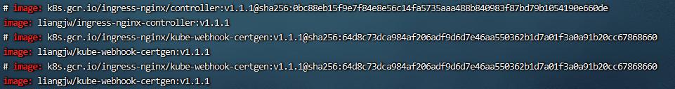

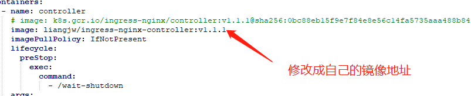

方法二、将下载好的镜像导入自己的 Harbor 镜像仓库进行获取

```
# liangjw/ingress-nginx-controller:v1.1.1
ingress-nginx-controller_v1.1.1.tar  

# liangjw/kube-webhook-certgen:v1.1.1
kube-webhook-certgen_v1.1.1.tar
```

导入镜像

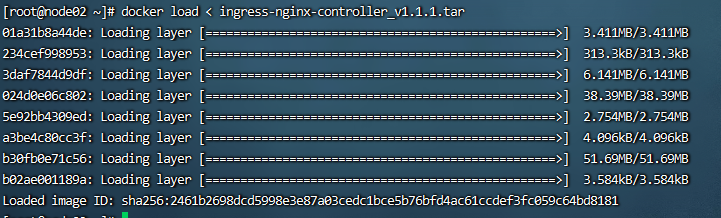

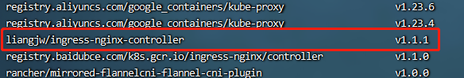

修改镜像名字

```
docker tag liangjw/ingress-nginx-controller:v1.1.1 192.168.101.102/ingress/ingress-nginx-controller:v1.1.1
```

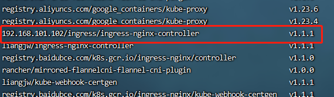

推送到公司的dockerhub中

```
docker push 192.168.101.102/ingress/ingress-nginx-controller:v1.1.1
```

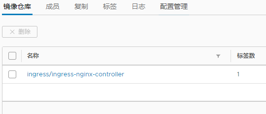

#### 2、 Deployment 配置

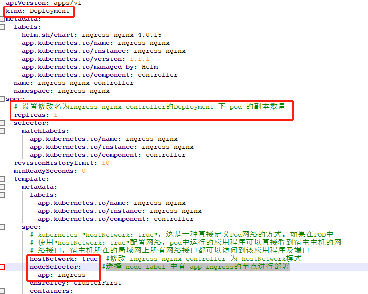

### 四、部署 Ingress-nginx

#### 1、准备工作

> 给 node01 节点打了app=ingress标签，因为上面的ingress-nginx-controller 使用的是 hostNetwork 模式（只会放pod真实pod 的 端口） + nodeSelector

```
kubectl label node node01 app=ingress 
```

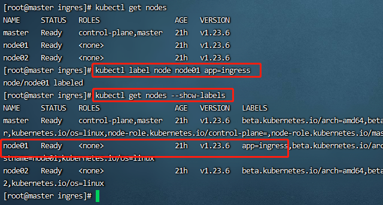

#### 2、部署

```
kubectl apply -f deploy.yaml
```

查看 ingress-nginx-controller pod 运行情况

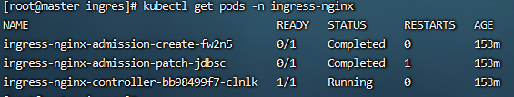

查看日志有没有报错

```
kubectl logs -f  ingress-nginx-controller-bb98499f7-clnlk -n ingress-nginx
```

#### 3、测试访问

> 直接访问 kube-node-2的 ip 即可，因为 ingress-nginx-controller 默认是 监听 80端口，由于上面的 nodeSelector: #选择 node label 中有 app=ingress的节点进行部署 ,而 node01 是被打了标签的节点node

使用的是 node01 的ip访问测试。

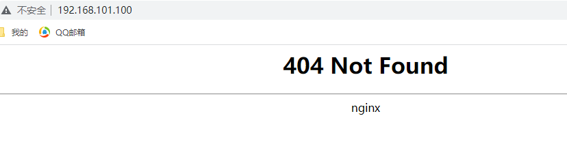

### 五、部署一个应用测试 Ingress-nginx

这里之前部署了一个demo，service内容如下（pode真实端口8080，暴露给集群的端口8001，外部进行访问的端口30001）

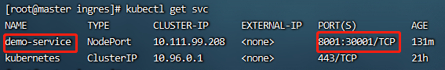

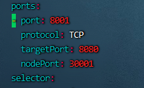

创建 ingress 规则配置文件（配置文件在k8s_file\ingress_file/ingress-http.yaml）

```
apiVersion: networking.k8s.io/v1
kind: Ingress
metadata:
  name: demo-ingress
spec:
  ingressClassName: nginx #！重点 需要指定哪个 IngressClass 可以看上面的 deploy.yaml 最后定义的
  rules:
  - host: wang.demo.com #所有的 wang.demo.com 请求都转发到 Service demo-service
    http:
      paths:
      - pathType: Prefix
        path: "/"
        backend:
          service:
            name: demo-service
            port: 
              number: 8001  # 应用暴露给集群的端口

```

```
kubectl apply -f ingress-deploy.yaml
```

测试：

由于我们 ingress 资源配置的 域名 是 wang.demo.com，所以我需要把它添加到 宿主机的hosts 文件中，如下

> 这里的ip 为部署 ingress-nginx 的ip，因为ingress-nginx-controlle r在node01 上运行

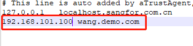

那么按照预期，当我访问 wang.demo.com 的时候其实就是访问 192.168.101.100 上的 ingress-nginx-controller 这个nginx，那么根据 ingress 的 资源的设定 它会把请求 转发到 Service demo-service 上，从而访问到应用界面

这里的 demo-service 为设置域名应用的 service name

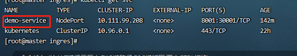

访问 wang.demo.com

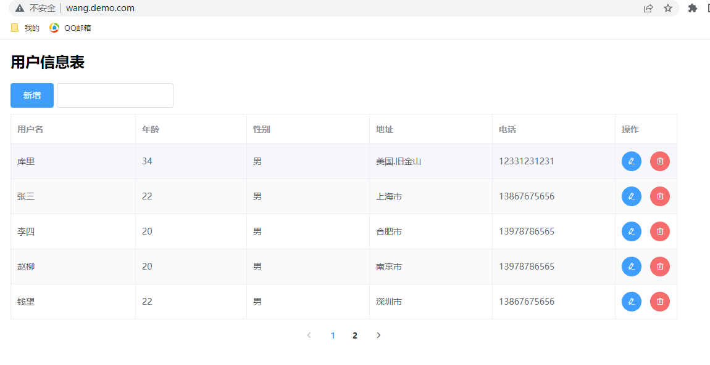