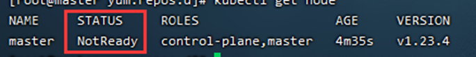
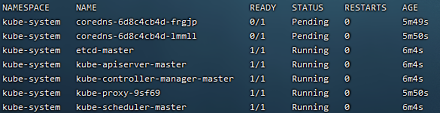
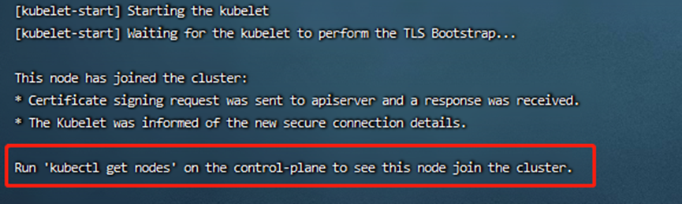

#  k8s 集群在线集群搭建

参考网址：https://baijiahao.baidu.com/s?id=1693739720541425345&wfr=spider&for=pc

## 1、机器准备

> 这里我们准备三台虚拟机，一台master、两台node
>
> | 机器角色 |       ip       | 主机名 |
> | :------: | :------------: | :----: |
> |  master  | 192.168.37.110 | master |
> |   node   | 192.168.37.111 | node01 |
> |   node   | 192.168.37.112 | node02 |
>

## 2、安装前环境确认

> $\textcolor{red}{三台机器都需要执行：}$
>
> 1. 三台机器都可以联网，uname -a查看内核是否大于等于3.1
>
> 2.  关闭三台机器的防火墙
>
>    ```
>    systemctl status firewalld      	查看防火墙是否关闭
>    
>    systemctl stop firewalld	    	暂时关闭防火墙
>    
>    systemctl disable firewalld   		永久关闭防火墙
>    ```
>
>    
>
> 3. 关闭selinux
>
>    > SELinux共有3个状态enforcing （执行中）、permissive （不执行但产生警告）、disabled（关闭）
>
>    ```
>    sed -i 's/enforcing/disabled/' /etc/selinux/config
>    ```
>
> 4.   执行命令 getenforce 检查是否关闭 selinux
>
>    
>
> 5. 关闭swap（关闭内存交换）
>
>    ```
>    swapoff –a  			 # 临时关闭
>    
>    vi /etc/fstab  			 # 永久关闭，注释这一行: swap defaults 0 0
>    ```
>
> 6. 检查swap 是否关闭
>
>    > 查看swap是否全为0，全部为零则已经关闭内存交换
>
>    ```
>    free -m 
>    ```
>
>    
>
> 7. $\textcolor{red}{修改三台机器的主机名,分别在三台机器上执行命令}$
>
>    ```
>    hostnamectl set-hostname master &&bash
>    
>    hostnamectl set-hostname node01 &&bash
>    
>    hostnamectl set-hostname node02 &&bash
>    ```
>
> 8. 在master的机器上添加hosts （$\textcolor{red}{只在master上执行}$）
>
>    ```
>    cat >> /etc/hosts << EOF
>    192.168.37.110 master
>    192.168.37.111 node01
>    192.168.37.112 node02
>    EOF
>    ```
>
> 9.  配置路由  ($\textcolor{red}{所有机器都要执行}$)
>
>    ```
>    cat > /etc/sysctl.d/k8s.conf << EOF
>    net.bridge.bridge-nf-call-ip6tables = 1
>    net.bridge.bridge-nf-call-iptables = 1
>    EOF
>    ```
>
> 10. 使配置生效  （$\textcolor{red}{所有机器都要执行命令}$）
>
>     ```
>     sysctl --system
>     ```
>
> 11. 同步每个服务器的时间和时区 （$\textcolor{red}{所有机器都要执行}$）
>
> ```
> yum install ntpdate -y
> 
> ntpdate time.windows.com
> 
> cp /usr/share/zoneinfo/Asia/Shanghai /etc/localtime
> ```
>

## 3、docker安装

> $\textcolor{red}{所有机器都要安装docker}$  (docker 安装见文档Docker搭建.md)

## 4、配置kubeadm,kubelet,kubectl镜像

> - kubelet：运行在集群所有节点上,负责启动POD和容器
> - kubeadm：用于初始化集群
> - kubectl：kubenetes命令行工具，通过kubectl可以部署和管理应用，查看各种资源，创建，删除和更新组件
>
> $\textcolor{red}{所有机器都要执行}$
>
> 1.  创建yum源的文件
>
>    ```
>    cat > kubernetes.repo << EOF
>    [kubernetes]
>    name=Kubernetes
>    baseurl=https://mirrors.aliyun.com/kubernetes/yum/repos/kubernetes-el7-x86_64
>    enabled=1
>    gpgcheck=1
>    repo_gpgcheck=1
>    gpgkey=https://mirrors.aliyun.com/kubernetes/yum/doc/yum-key.gpg https://mirrors.aliyun.com/kubernetes/yum/doc/rpm-package-key.gpg
>    EOF
>    ```
>
> 2. 将文件移到yum的目录
>
> ```
> mv kubernetes.repo /etc/yum.repos.d/
> ```

## 5、安装kubeadm,kubelet,kubectl

> - 在部署kubernetes时，要求master node和worker node上的版本保持一致，否则会出现版本不匹配导致奇怪的问题出现
>
> - 使用yum list kubeadm --showduplicates 可以查看版本列表
>
> - 安装指定版本格式如下
>
> - yum install -y kubelet-<version> kubectl-<version> kubeadm-<version>
>
>
> > 不指定则版本号默认为最新版本
> >
> > yum install -y kubelet kubectl kubeadm
> >
>
> > $\textcolor{red}{所有机器都要执行}$
> >
> > 这里为了避免出现版本不匹配使用指定安装版本1.23.0-0和kubeadm初始化版本v1.23.4对应
> >
> > ```
> > yum install -y kubeadm-1.23.0-0 kubelet-1.23.0-0 kubectl-1.23.0-0 --disableexcludes=kubernetes
> > ```
> >
>
> > 如果卸载后重新安装需要使用kubeadm重新部署
> >
> > kubeadm reset # 重置
> >
> > systemctl enable kubelet

## 6、初始化kubeadm

> 为了避免 docker和kubernetes所使用的cgroup不一致，先在docker中修改配置文件 $\textcolor{red}{所有机器都要执行}$
>
> ```
> vim /etc/docker/daemon.json
> ```
>
> 添加配置："exec-opts": ["native.cgroupdriver=systemd"]
>
> 
>
> 修改daemon.json后重启docker
>
> ```
> systemctl daemon-reload
> 
> systemctl restart docker
> ```
>
> 修改kubelet的配置文件(路径可能会有差异)
>
> ```
> vim /usr/lib/systemd/system/kubelet.service.d/10-kubeadm.conf
> ```
>
> 添加配置：--cgroup-driver=system
>
> 
>
> 使修改生效：
>
> ```
> systemctl daemon-reload
> 
> systemctl restart kubelet
> 
> kubeadm reset # 重置
> ```
>

> $\textcolor{red}{初始化kubeadm只执行master机器上执行}$
>
> ```
> kubeadm init \
> --apiserver-advertise-address=192.168.37.110 \
> --image-repository registry.aliyuncs.com/google_containers \
> --kubernetes-version v1.23.4 \
> --service-cidr=10.96.0.0/12 \
> --pod-network-cidr=10.244.0.0/16
> ```
>
> 
>
> 当出现下图所示说明k8s初始化成功
>
> 初始化成功可以通过docker images 查看到k8s的docekr镜像信息
>
> 
>

## 7、拷贝配置文件

> 将k8s生成的管理员连接k8s集群的配置文件考到它默认的工作目录，目的是可以通过kubectl连接k8s集群了，执行命令：
>
> 1. $\textcolor{red}{只在master机器上执行}$
>
>    ```
>    mkdir -p $HOME/.kube
>    
>    sudo cp -i /etc/kubernetes/admin.conf $HOME/.kube/config
>    
>    sudo chown $(id -u):$(id -g) $HOME/.kube/config
>    ```
>
> 2. 测试：
>
>    当STATUS 的状态为Ready时候说明成功 NOTReady 不成功,VETRSION 为当前版本号（这里为NotReady可以先忽略)
>
>    ```
>    kubectl get node
>    ```
>
>    
>
> 3. 查看pod的命名空间（这里两个cordens 状态为Pendin先忽略可继续向下执行）
>
>    ```
>    kubectl get pod --all-namespaces
>    ```
>
>    

## 8、安装pod网络插件CNI

> $\textcolor{red}{只在master机器上执行}$
>
> https://github.com/coreos/flannel/releases 官方仓库下载镜像 
>
> 这里我下载的是 flanneld-v0.12.0-amd64.docker
>
> 1. 加载本地docker镜像：
>
>    ```
>    docker load < flanneld-v0.12.0-amd64.docker
>    ```
>
>    
>
> 2. 装好之后执行执行以下命令 STATUS 状态全部为 Running则网络插件安装成功
>
> ```
> kubectl get pods -n kube-system
> ```
>
> 
>
> ```
> kubectl get pod --all-namespaces
> ```
>
> 
>
> ```
> kubectl get node 
> ```
>
> STATUS状态由 NotReady变成Ready
>
> 

## 9、配置KUBECONFIG变量

> $\textcolor{red}{只在master机器上执行}$
>
> 先去etc/profile环境变量中看看是否已经配置环境变量中，若没有则执行以下命令。
>
> ```
> echo "export KUBECONFIG=/etc/kubernetes/admin.conf" >> /etc/profile
> 
> source /etc/profile         #使配置文件生效
> ```
>
> 检查环境变量是否配置成功
>
> ```
> echo $KUBECONFIG 		#应该返回/etc/kubernetes/admin.conf
> ```
>
> 

## 10、将节点加入集群中

> $\textcolor{red}{只在master机器上执行}$
>
> 1.  首先检查现有的token, kubeadm初始化成功后肯定会有一条记录
>
>    - kubeadm token list #查看现在有的token
>
>    - kubeadm token create #生成一个新的token
>
>    - kubeadm token create --ttl 0 #生成一个永远不过期的token
>
>    - kubeadm token create delete 删除
>
>      注：这里删除其他的token，只留一个生成永不过期的token
>
> 2. 获取ca证书sha256编码hash值（$\textcolor{red}{在master机器上运行}$）
>
>    ```
>    openssl x509 -pubkey -in /etc/kubernetes/pki/ca.crt | openssl rsa -pubin -outform der 2>/dev/null | openssl dgst -sha256 -hex | sed 's/^.* //'
>    ```
>
> 3. 加入节点（$\textcolor{red}{在要加入node的机器上执行}$）
>
>    kubeadm join master机器Ip:6443 --token 查到没过期token --discovery-token-ca-cert-hash sha256:获取的字符串
>
>    例如：
>
>    ```
>    kubeadm join 192.168.37.113:6443 --token 1ayh8d.appc4wdm4i252pha --discovery-token-ca-cert-hash sha256:1c1f329742faf59cff79dd25a0f748a0a92237c16fbd99b9ddf29df08443d4b6
>    ```
>
>    
>
> 4.  查看现在的节点情况 $\textcolor{red}{只在master机器上执行}$
>
>  STATUS状态全为Ready，说明node节点加入集群成功
>
> ```
> kubectl get nodes 
> ```
>
> 

