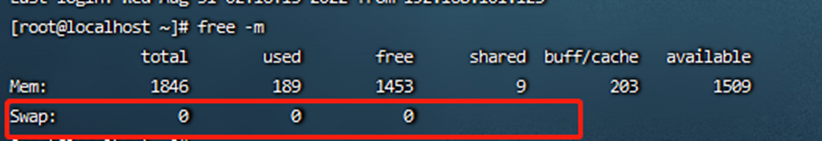
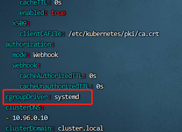
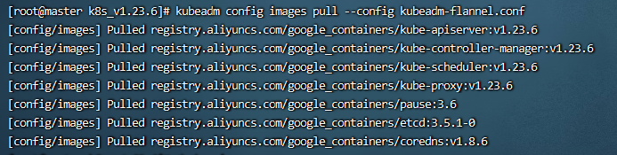
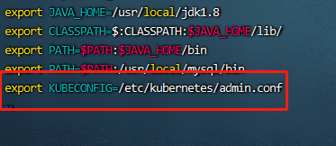
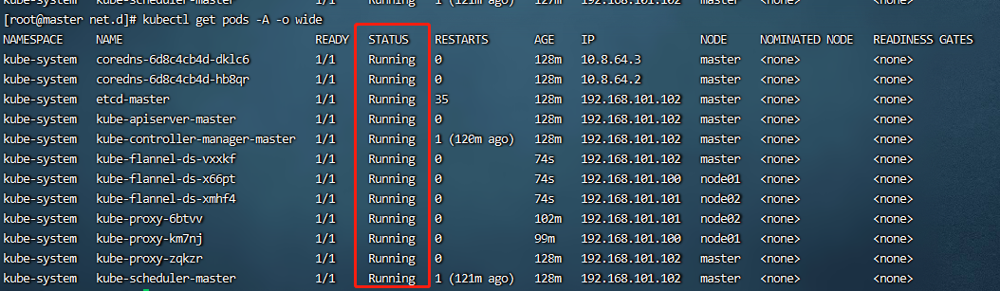
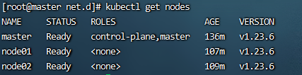
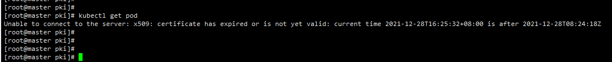
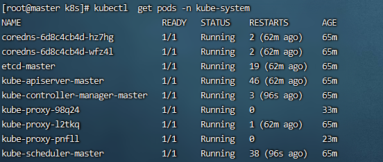

#  k8s 集群在线集群搭建

## 1、高可用集群

之前我们搭建的集群，只有一个master节点，当master节点宕机的时候，通过node将无法继续访问，而master主要是管理作用，所以整个集群将无法提供服务。搭建一个多master节点的高可用集群，不会存在单点故障问题，但是在node 和 master节点之间，需要存在一个 LoadBalancer组件，对外有一个统一的VIP：虚拟ip来对外进行访问


## 2、高可用集群技术细节


- keepalived：配置虚拟ip，检查节点的状态
- haproxy：负载均衡服务【类似于nginx】


## 3、机器准备

> 这里我们准备四台虚拟机，两台master、两台node、一个虚拟VIP（可以用机器就是一个ip）
>
> |   机器角色    |       ip        |    主机名    |
> | :-----------: | :-------------: | :----------: |
> |    master     | 192.168.101.102 | k8s-master01 |
> |    master     | 192.168.101.103 | k8s-master02 |
> |     node      | 192.168.101.104 |  k8s-node01  |
> |     node      | 192.168.101.105 |  k8s-node02  |
> | VIP（虚拟ip） | 192.168.101.106 |              |
>
> 

## 4、安装前环境确认

> $\textcolor{red}{三台机器都需要执行：}$
>
> 1. 三台机器都可以联网，uname -a查看内核是否大于等于3.1
>
> 2.  关闭三台机器的防火墙
>
>    ```
>    systemctl status firewalld      	查看防火墙是否关闭
>
>    systemctl stop firewalld	    	暂时关闭防火墙
>
>    systemctl disable firewalld   		永久关闭防火墙
>    ```
>
>    
>
> 3. 关闭selinux
>
>    > SELinux共有3个状态enforcing （执行中）、permissive （不执行但产生警告）、disabled（关闭）
>
>    ```
>    sed -i 's/enforcing/disabled/' /etc/selinux/config
>    ```
>
> 4.   执行命令 getenforce 检查是否关闭 selinux
>
>    
>
> 5. 关闭swap（关闭内存交换）
>
>    ```
>    swapoff –a  			 # 临时关闭
>
>    vi /etc/fstab  			 # 永久关闭，注释这一行: swap defaults 0 0
>    ```
>
> 6. 检查swap 是否关闭
>
>    > 查看swap是否全为0，全部为零则已经关闭内存交换
>
>    ```
>    free -m 
>    ```
>
>    
>
> 7. $\textcolor{red}{修改三台机器的主机名,分别在三台机器上执行命令}$
>
>    ```
>    hostnamectl set-hostname k8s-master01 &&bash
>    
>    hostnamectl set-hostname k8s-master02 &&bash
>    
>    hostnamectl set-hostname k8s-node01 &&bash
>    
>    hostnamectl set-hostname k8s-node02 &&bash
>    ```
>
> 8. 在master的机器上添加hosts （$\textcolor{red}{只在两个master上执行}$）
>
>    ```
>    cat >> /etc/hosts << EOF
>    192.168.101.102 k8s-master01
>    192.168.101.103 k8s-master02
>    192.168.101.104 k8s-node01
>    192.168.101.105 k8s-node02
>    EOF
>    ```
>
> 9. 将桥接的IPv4流量传递到iptables的链 ($\textcolor{red}{所有机器都要执行}$)
>
>    ```
>    cat > /etc/sysctl.d/k8s.conf << EOF
>    net.bridge.bridge-nf-call-ip6tables = 1
>    net.bridge.bridge-nf-call-iptables = 1
>    net.ipv4.ip_forward = 1
>    EOF
>    ```
>
> 10. 使配置生效  （$\textcolor{red}{所有机器都要执行命令}$）
>
>     ```
>     sysctl --system
>     ```
>
> 11. 同步每个服务器的时间和时区 （$\textcolor{red}{所有机器都要执行}$）
>
> ```
> yum install ntpdate -y
> 
> ntpdate time.windows.com
> 
> cp /usr/share/zoneinfo/Asia/Shanghai /etc/localtime
> ```
>
> 12. 重启机器再检查selinux、防火墙、swap是否都关闭
>
>     ```
>     reboot
>     ```

## 5、docker安装

> $\textcolor{red}{所有机器都要安装docker}$  (docker 安装见文档Docker搭建.md)


## 6、配置 cgroup 驱动

> 而当一个系统中同时存在cgroupfs和systemd两者时，容易变得不稳定，因此最好更改设置，令容器运行时和 kubelet 使用 `systemd` 作为 `cgroup` 驱动，修改docker和k8s统一使用systemd.先在docker中修改配置文件 $\textcolor{red}{所有机器都要执行}$
>
> ```
> vim /etc/docker/daemon.json
> ```
>
> 添加配置："exec-opts": ["native.cgroupdriver=systemd"]
>
> 
>
> 修改daemon.json后重启docker
>
> ```
> # 加载配置
> systemctl daemon-reload
> # 重启docker
> systemctl restart docker
> ```
>
> ```
> # 最后检查一下Cgroup Driver是否为systemd
> docker info | grep systemd 
> ```
>
> 
>
> kubelet的`cgroup driver`从1.22版本开始，如果没有手动设置kubelet的cgroup driver，那么默认会设置为system
>
> ```
> vim /var/lib/kubelet/config.yaml
> ```
>
> 
>
> kubelet 相关操作
>
> ```
> # 检查是否启动 （往往可以做集群日志排查工作）
> systemctl status kubelet
> # 启动
> systemctl start kubelet
> # 重启
> systemctl restart kubelet
> ```
>

## 7、所有master节点部署keepalived

### 7.1安装相关包和keepalived

```
yum install -y conntrack-tools libseccomp libtool-ltbl

yum install -y keepalived
```

### 7.2 修改配置文件

```
# 修改两台master机器配置文件，略有不同,# virtual_ipaddress使用VIP，interface网卡
# 修改k8s-master01配置文件
cat > /etc/keepalived/keepalived.conf <<EOF 
! Configuration File for keepalived

global_defs {
   router_id k8s
}

vrrp_script check_haproxy {
    script "killall -0 haproxy"
    interval 3
    weight -2
    fall 10
    rise 2
}

vrrp_instance VI_1 {
    state MASTER       # 与master02 不同，master02 是BACKUP
    interface ens33    # 修改网卡信息
    virtual_router_id 51
    priority 250
    advert_int 1
    authentication {
        auth_type PASS
        auth_pass ceb1b3ec013d66163d6ab
    }
    virtual_ipaddress {
        192.168.101.106    # 添加虚拟ip
    }
    track_script {
        check_haproxy
    }

}
EOF

# 修改k8s-master02

cat > /etc/keepalived/keepalived.conf <<EOF 
! Configuration File for keepalived

global_defs {
   router_id k8s
}

vrrp_script check_haproxy {
    script "killall -0 haproxy"
    interval 3
    weight -2
    fall 10
    rise 2
}

vrrp_instance VI_1 {
    state BACKUP 
    interface ens33 
    virtual_router_id 51
    priority 200
    advert_int 1
    authentication {
        auth_type PASS
        auth_pass ceb1b3ec013d66163d6ab
    }
    virtual_ipaddress {
        192.168.101.106
    }
    track_script {
        check_haproxy
    }

}
EOF
```

6.3 启动和检查

```
# 启动keepalived
systemctl start keepalived.service
# 设置开机自启
systemctl enable keepalived.service
# 查看启动状态
systemctl status keepalived.service
```

### 7.4 查看网卡信息

```
# 启动后查看master1、master2的网卡信息
ip a s ens33
```

可以看到k8s-master01多出一个ip，是自己是设置的VIP虚拟ip信息

k8s-master02 是看不到的（因为k8s-master01是主节点，当主节点挂了后，再在从节点master02上生成虚拟ip,这里可以自己做宕机测试）


### 7.5 部署haproxy

haproxy主要做负载的作用，将我们的请求分担到不同的node节点上

```
# 在所有master 上执行
yum install -y haproxy
```

修改配置文件（修改所有master这里，所有机器的配置文件相同）

两台master节点的配置均相同，配置中声明了后端代理的两个master节点服务器，指定了haproxy运行的端口为16443等，因此16443端口为集群的入口

```
cat > /etc/haproxy/haproxy.cfg << EOF
#---------------------------------------------------------------------
# Global settings
#---------------------------------------------------------------------
global
    # to have these messages end up in /var/log/haproxy.log you will
    # need to:
    # 1) configure syslog to accept network log events.  This is done
    #    by adding the '-r' option to the SYSLOGD_OPTIONS in
    #    /etc/sysconfig/syslog
    # 2) configure local2 events to go to the /var/log/haproxy.log
    #   file. A line like the following can be added to
    #   /etc/sysconfig/syslog
    #
    #    local2.*                       /var/log/haproxy.log
    #
    log         127.0.0.1 local2
    
    chroot      /var/lib/haproxy
    pidfile     /var/run/haproxy.pid
    maxconn     4000
    user        haproxy
    group       haproxy
    daemon 
       
    # turn on stats unix socket
    stats socket /var/lib/haproxy/stats
#---------------------------------------------------------------------
# common defaults that all the 'listen' and 'backend' sections will
# use if not designated in their block
#---------------------------------------------------------------------  
defaults
    mode                    http
    log                     global
    option                  httplog
    option                  dontlognull
    option http-server-close
    option forwardfor       except 127.0.0.0/8
    option                  redispatch
    retries                 3
    timeout http-request    10s
    timeout queue           1m
    timeout connect         10s
    timeout client          1m
    timeout server          1m
    timeout http-keep-alive 10s
    timeout check           10s
    maxconn                 3000
#---------------------------------------------------------------------
# kubernetes apiserver frontend which proxys to the backends
#--------------------------------------------------------------------- 
frontend kubernetes-apiserver
    mode                 tcp
    bind                 *:16443   
    option               tcplog
    default_backend      kubernetes-apiserver    
#---------------------------------------------------------------------
# round robin balancing between the various backends
#---------------------------------------------------------------------
# server 添加所有master ip地址  ip:6443 cherck  6443 为k8s 端口  
backend kubernetes-apiserver
    mode        tcp
    balance     roundrobin
    server      master01.k8s.io   192.168.101.102:6443 check
    server      master02.k8s.io   192.168.101.103:6443 check
#---------------------------------------------------------------------
# collection haproxy statistics message
#---------------------------------------------------------------------
listen stats
    bind                 *:1080
    stats auth           admin:awesomePassword
    stats refresh        5s
    stats realm          HAProxy\ Statistics
    stats uri            /admin?stats
EOF
```

```
# 启动 haproxy
systemctl start haproxy
# 开启自启
systemctl enable haproxy
```

启动后，我们查看对应的端口是否包含 16443

```
lsof -i:16443
```


## 8、安装 kube 三件套

> 安装 kubeadm , kubelet , kubectl
>
> - kubelet：运行在集群所有节点上,负责启动POD和容器
> - kubeadm：用于初始化集群
> - kubectl：kubenetes命令行工具，通过kubectl可以部署和管理应用，查看各种资源，创建，删除和更新组件
>
> $\textcolor{red}{所有机器都要执行}$
>
> 1. 创建yum源的文件
>
>    目录在获取k8s镜像的时候，从阿里云仓库中获取，避免了直接从官网上拉取失败的问题
>
>    ```
>    cat > kubernetes.repo << EOF
>    [kubernetes]
>    name=Kubernetes
>    baseurl=https://mirrors.aliyun.com/kubernetes/yum/repos/kubernetes-el7-x86_64
>    enabled=1
>    gpgcheck=0
>    repo_gpgcheck=0
>    gpgkey=https://mirrors.aliyun.com/kubernetes/yum/doc/yum-key.gpg https://mirrors.aliyun.com/kubernetes/yum/doc/rpm-package-key.gpg
>    EOF
>    ```
>
> 2. 将文件移到yum的目录
>
>    ```
>    mv kubernetes.repo /etc/yum.repos.d/
>    ```
>
> 3. 查看可以安装版本列表 （ 这里我安装1.23.6 版本）
>
>    ```
>    yum list kubeadm --showduplicates 
>    ```
>
> 4. 安装 kubeadm,kubelet,kubectl
>
>    ```
>    # 安装指定版本格式如下
>    # yum install -y kubelet-<version> kubectl-<version> kubeadm-<version>
>                      
>    # 不指定则版本号默认为最新版本
>    # yum install -y kubelet kubectl kubeadm
>                      
>    # 这里为了避免出现版本不匹配使用指定安装版本1.23.6和kubeadm初始化版本v1.23.6对应
>    yum install -y kubeadm-1.23.6 kubelet-1.23.6 kubectl-1.23.6
>                      
>    # 设置开机启动
>    systemctl enable kubelet  
>    ```
>
> 在部署kubernetes时，要求master node和worker node上的版本保持一致，否则会出现版本不匹配导致奇怪的问题出现
>
> 5. 如果卸载后重新安装需要使用kubeadm重新部署
>
>    ```
>    kubeadm reset # 重置
>                      
>    systemctl enable kubelet  # 设置开机启动
>    ```

## 9、初始化集群 

### 9.1  编写配置文件

> 在集群中所有节点都执行完上面的三点操作之后，我们就可以开始创建k8s集群了。因为涉及高可用部署，**在具有vip的master上进行初始化操作**，这里为master1
>
> ```
> # 我们先使用kubeadm命令查看一下主要的几个镜像版本
> # 查询的结果是 可以安装的k8s 集群版本在 1.23-1.25.2 之间 （这里我们选择1.23.6）
> kubeadm config images list
> ```
>
> 
>
> 为了方便编辑和管理，我们还是把初始化参数导出成配置文件
>
> ```
> kubeadm config print init-defaults > kubeadm-config.yaml
> ```
>
> 考虑到大多数情况下国内的网络无法使用谷歌的k8s.gcr.io镜像源，我们可以直接在配置文件中修改imageRepository参数为阿里的镜像源
>
> - imageRepository 指定镜像源
> - advertiseAddress 控制节点 ip （master ip）
>
> - kubernetesVersion 字段用来指定我们要安装的k8s版本
> - localAPIEndpoint 参数需要修改为我们的master节点的IP和端口，初始化之后的k8s集群的apiserver地址就是这个
> - serviceSubnet 和 dnsDomain 两个参数默认情况下可以不用修改，这里我按照自己的需求进行了变更
> - nodeRegistration 里面的 name参数修改为对应 master 节点的hostname
> - certSANs         #vip地址（原文档没有新增）
> - controlPlaneEndpoint    #vip地址（原文的没有新增）
>
> 新增配置块使用ipvs，具体可以参考官方文档
>
> ```
> apiVersion: kubeadm.k8s.io/v1beta3
> bootstrapTokens:
> - groups:
>   - system:bootstrappers:kubeadm:default-node-token
>   token: abcdef.0123456789abcdef
>   ttl: 24h0m0s
>   usages:
>   - signing
>   - authentication
> kind: InitConfiguration
> localAPIEndpoint:
>   advertiseAddress: 192.168.101.102  【控制节点IP】
>   bindPort: 6443
> nodeRegistration:
>   criSocket: /var/run/dockershim.sock
>   imagePullPolicy: IfNotPresent
>   name: k8s-master01                  【控制节点主机名】
>   taints: null
> ---
> apiServer:
>   certSANS:                            【#虚拟vip地址，更高版本使用certSANs】
>   - 192.168.101.106
>   timeoutForControlPlane: 4m0s
> apiVersion: kubeadm.k8s.io/v1beta3
> certificatesDir: /etc/kubernetes/pki
> clusterName: kubernetes
> controlPlaneEndpoint: 192.168.101.106:16443  【#虚拟vip地址】
> controllerManager: {}
> dns: {}
> etcd:
>   local:
>     dataDir: /var/lib/etcd
> imageRepository: registry.aliyuncs.com/google_containers  【指定镜像仓库】
> kind: ClusterConfiguration 
> kubernetesVersion: 1.23.6         【安装的k8s 版本】
> networking:
>   dnsDomain: cluster.local
>   serviceSubnet: 10.1.0.0/16      【配置集群网段，可不修改，默认没有】
>   podSubnet: 10.244.0.0/16        【配置容器pod网段，可不修改，默认没有】
> scheduler: {}
> 
> ```

### 9.2 初始化集群

> 1. 查看一下对应的镜像版本，确定配置文件是否生效
>
>    ```
>    kubeadm config images list --config kubeadm-config.yaml
>    ```
>
> 
>
> 2. 确认没问题之后我们直接拉取镜像
>
>    ```
>    kubeadm config images pull --config kubeadm-config.yaml
>    ```
>
> 
>
> 3. 检查镜像是否全部拉取
>
> ```
> docker images
> ```
>
> 
>
> 4. 初始化
>
> ```
> kubeadm init --config kubeadm-config.yaml
> ```
>
> 

### 9.3  配置 kubeconfig

> 刚初始化成功之后，我们还没办法马上查看k8s集群信息，需要配置kubeconfig相关参数才能正常使用kubectl连接apiserver读取集群信息。
>
> 1. 如果是root用户
>
>    - 设置环境变量
>
>      ```
>      # 设置环境变量
>      export KUBECONFIG=/etc/kubernetes/admin.conf  
>      echo "export KUBECONFIG=/etc/kubernetes/admin.conf" >> /etc/profile
>      ```
>
>    - 检查环境变量是否配置成功
>
>      ```
>      vim /etc/profile
>      或者
>      echo $KUBECONFIG 
>      ```
>
>      
>
>      
>
>    - 使配置文件生效
>
>      ```
>      source /etc/profile 
>      ```
>
> 2. 对于非root用户，可以这样操作
>
>    ```
>    mkdir -p $HOME/.kube
>    sudo cp -i /etc/kubernetes/admin.conf $HOME/.kube/config
>    sudo chown $(id -u):$(id -g) $HOME/.kube/config
>    ```
>
> 3. 我们可以直接查看 configmaps 来查看初始化之后集群的 kubeadm-config 配置
>
>    ```
>    kubectl describe configmaps kubeadm-config -n kube-system
>    ```
>
> 5. 测试：
>
>    当STATUS 的状态为Ready时候说明成功 NOTReady 不成功,VETRSION 为当前版本号（这里为NotReady可以先忽略)
>
>    ```
>    kubectl get node
>    ```
>
>    
>
> 6. 查看pod的命名空间（这里两个cordens 状态为Pendin先忽略可继续向下执行）
>
>    ```
>    kubectl get pod -A
>    ```
>
>    


## 10、将节点加入集群中

> $\textcolor{red}{只在master机器上执行}$
>
> 1. **首先检查现有的token, kubeadm初始化成功后肯定会有一条记录**
>
>    - kubeadm token list #查看现在有的token
>
>    - kubeadm token create #生成一个新的token
>
>    - kubeadm token create --ttl 0 #生成一个永远不过期的token
>
>    - kubeadm token  delete TOKEN # 删除
>
>      注：这里删除其他的token，只留一个生成永不过期的token
>
> 2. **获取ca证书sha256编码hash值（$\textcolor{red}{在master机器上运行}$）**
>
>    ```
>    openssl x509 -pubkey -in /etc/kubernetes/pki/ca.crt | openssl rsa -pubin -outform der 2>/dev/null | openssl dgst -sha256 -hex | sed 's/^.* //'
>    ```
>
> 3. **master节点加入集群**
>
>    **3.1. 复制密钥及相关文件**
>
>    ```
>    #从其他master节点创建文件
>    mkdir -p /etc/kubernetes/pki/etcd
>    
>    scp /etc/kubernetes/admin.conf root@192.168.101.103:/etc/kubernetes
>       
>    scp /etc/kubernetes/pki/{ca.*,sa.*,front-proxy-ca.*} root@192.168.101.103:/etc/kubernetes/pki
>       
>    scp /etc/kubernetes/pki/etcd/ca.* root@192.168.101.103:/etc/kubernetes/pki/etcd
>    
>    ```
>
>    **3.2. master节点加入集群**
>
>    ```
>    kubeadm join master.k8s.io:16443 --token 65vbbj.blu45v7rxxz0icu9 \
>        --discovery-token-ca-cert-hash sha256:0122bcf73cc6ed237d9e0c32761cc376a532be026f88a5b3b5666ae8f3fe3590 \
>        --control-plane
>    ```
>
>    
>
>    **3.3 配置环境变量**
>
>    ```
>    mkdir -p $HOME/.kube
>    sudo cp -i /etc/kubernetes/admin.conf $HOME/.kube/config
>    sudo chown $(id -u):$(id -g) $HOME/.kube/config
>    或者
>    echo "export KUBECONFIG=/etc/kubernetes/admin.conf" >> /etc/profile
>    ```
>
>    **3.4 使配置文件生效**
>
>    ```
>    source /etc/profile 
>    ```
>
> 4. **加入节点（$\textcolor{red}{在要加入node的机器上执行}$）**
>
>    kubeadm join master机器Ip:6443 --token 查到没过期token --discovery-token-ca-cert-hash sha256:获取的字符串
>
>    例如：
>
>    ```
>    kubeadm join 192.168.37.113:6443 --token 1ayh8d.appc4wdm4i252pha --discovery-token-ca-cert-hash sha256:1c1f329742faf59cff79dd25a0f748a0a92237c16fbd99b9ddf29df08443d4b6
>    ```
>
>    
>
> 5. **查看现在的节点情况 $\textcolor{red}{只在master机器上执行}$**
>
>    只要能看到 各节点信息，说明 node 加入 master 成功 （ 如果 status 状态为 NotReady 先忽略）
>
>    ```
>    kubectl get nodes 
>    ```
>
> 

## 11、安装网络插件CNI

> $\textcolor{red}{在所有机器上执行}$
>
> https://github.com/coreos/flannel/releases 官方仓库下载镜像 
>
> 这里我下载的是 flanneld-v0.19.0-amd64.docker
>
> 1. 加载本地docker镜像：（所有机器都要导入 docker 镜像,包括node）
>
>    ```
>    # 需要用到两个镜像flanneld-v0.19.0-amd64.docker、mirrored-flannelcni-flannel-cni-plugin-v1.0.0.tar
>    docker load < flanneld-v0.19.0-amd64.docker
>    docker load < mirrored-flannelcni-flannel-cni-plugin-v1.0.0.tar
>    ```
>
>    
>
> 2. 导入或者下载 flannel 的yaml 文件 kube-flannel.yml （文件在 k8s_file 下）
>
> 3. 这里 修改镜像 替换成本地导入的镜像
>
>    
>
> 4. 修改 net-conf.json 参数 （配置在 kube-flannel.yml 文件内）
>
>    ```
>    # 配置的是pod的网段，这里我们使用此前计划好的10.244.0.0/16
>    net-conf.json: |
>        {
>          "Network": "10.244.0.0/16",
>          "Backend": {
>            "Type": "vxlan"
>          }
>        }
>    ```
>
>    
>
> 5. 方法二
>
>    ```
>    直接拉去镜像
>    docker pull quay.io/coreos/flannel:v0.15.0
>    加载配置文件
>    curl -O https://raw.githubusercontent.com/coreos/flannel/v0.15.0/Documentation/kube-flannel.yml
>    ```
>
>    
>
> 6. 部署 yaml 文件 
>
>    ```
>    kubectl apply -f kube-flannel.yaml
>    ```
>
>    
>
> 7. 装好之后执行执行以下命令 STATUS 状态全部为 Running则网络插件安装成功
>
> ```
> # 注意这里，flannel 会在所有节点运行
> kubectl get pods -A -o wide
> ```
>
> 
>
> ```
> kubectl get node 
> ```
>
> STATUS状态由 NotReady变成Ready
>
> 

> 5. 

## 12. 测试kubernetes集群

> 在Kubernetes集群中创建一个pod，验证是否正常运行：
>
> ```
> # 创建 nginx 资源文件(创建pod)
> kubectl create deployment nginx --image=nginx
> 
> # 将资源文件端口对外暴露
> kubectl expose deployment nginx --port=80 --type=NodePort
> 
> kubectl get pod,svc -o wide
> ```
>
> 
>
> 访问地址：http://NodeIP:Port  (NodelP:32504)

## 13、k8s 证书相关问题

参考网站：https://blog.csdn.net/erhaiou2008/article/details/124168680

参考网站：https://www.cnblogs.com/niuben/p/18120379

k8s默认证书有效时间是1年，证书过期后就不能执行相关命令进行管理，如下图：



> 查看k8s证书是否过期
>
> ```
> openssl x509 -in /etc/kubernetes/pki/apiserver.crt -noout -text |grep ' Not '
> ```
>
> 
>
> **更新证书有效期为10年（只在masters上执行）**
>
> 1. 将脚本上传到masters上，脚本位置**k8s_file/update-kubeadm-cert.sh**
>
> 2. 给update-kubeadm-cert.sh证书授权可执行权限
>
>    ```
>    chmod +x update-kubeadm-cert.sh
>    ```
>
> 3. 执行下面命令，修改证书过期时间，把时间延长到10年
>
>    ```
>    ./update-kubeadm-cert.sh all
>    ```
>
> 4. 在master节点查询Pod是否正常,能查询出数据说明证书签发完成
>    注：执行命令时需要断开连接重新连接命令才生效
>
>    ```
>    kubectl  get pods -n kube-system
>    ```
>
>    显示如下，能够看到pod信息，说明证书签发正常：
>
>    
>
>    5. 重启kubelet
>
>       ```
>       systemctl restart kubelet
>       ```
>
>    6. 验证证书有效时间是否延长到10年
>
>       ```
>       openssl x509 -in /etc/kubernetes/pki/apiserver.crt -noout -text |grep ' Not '
>       ```
>
>       

> 查看证书有效时间方法二
>
> ```
> kubeadm certs check-expiration
> ```
>
> 
>
> 如果RESIDUAL的显示结果是invalid，表示证书过期

## 14、允许 master 节点运行 pod

master 节点默认是不允许运行pod的，由于我们采用的是三主一丛集群模式，为了保证有充足的节点能够运行pod。这里将两名master从节点设置为可以运行的pod节点即（k8s-master02,k8s-master-03）

1、 查看 所有 node 节点的调度

```
kubectl describe node|grep -E "Name:|Taints:"
```


污点可选参数

- NoSchedule: 一定不能被调度
- PreferNoSchedule: 尽量不要调度
- NoExecute: 不仅不会调度, 还会驱逐Node上已有的Pod

2. 去除 k8s-master1 节点不允许配置的 label

```
kubectl taint node k8s-master02 node-role.kubernetes.io/master-
kubectl taint node k8s-master03 node-role.kubernetes.io/master-
```


3. 重新设置 master 节点不允许调度 pod

```
kubectl taint node k8s-master1 node-role.kubernetes.io/master=:NoSchedule
```

