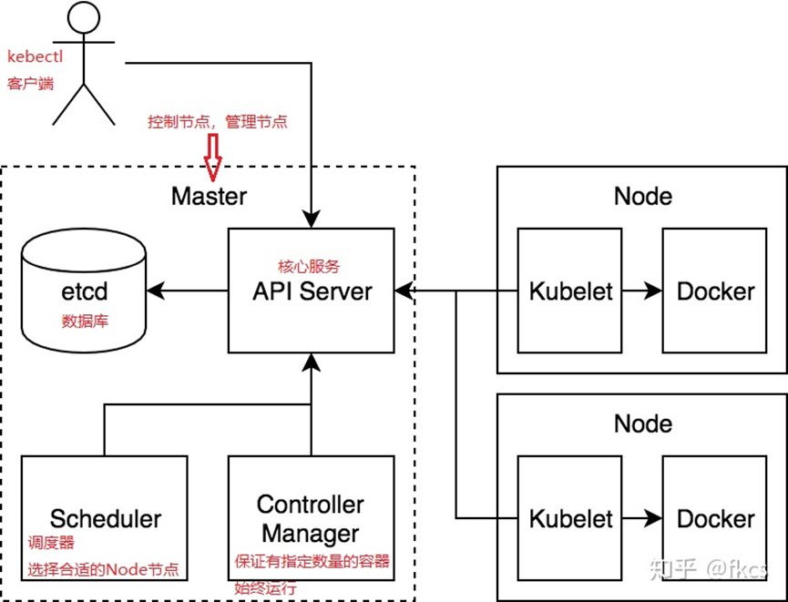

# K8S_理论知识

## 1. 简单了解K8S

> l K8s是一个主流的微服务框架，来自Google。
>
> l K8s是一个docker集群的管理工具。

## 2. K8s架构图

## 1. K8s重要节点描述

> - **master**节点
>
> Master 是 Cluster 的大脑，它的主要职责是调度，即决定将应用放在哪里运行。
>
> - **node**节点
>
> Node 的职责是运行容器应用。Node 由 Master 管理，Node 负责监控并汇报容器的状态，并根据 Master 的要求管理容器的生命周期。

## 4、过程原理

> - 用户通过kubectl提交需要运行的docker     container(pod);
> - master节点的api server把请求存储在etcd数据库中;
> - scheduler调度器进行扫描 ,将合适的node节点机器分配出去;
> - node节点的kublet找到自己要跑的container,在本机上运行

# 一、pod

## 1、pod概览

> Pod是k8s中你可以创建和部署的最小也是最简单位。一个Pod代表着集群中运行的一个进程。
>
> Pod中封装着应用的容器（有的情况下是好几个容器），存储、独立的网络IP，管理容器如何运行的策略选项。Pod代表着部署的一个单位：kubernetes中应用的一个实例，可能由一个或者多个容器组合在一起共享资源
>
> 在Kubrenetes集群中Pod有如下两种使用方式：
>
> 一个Pod中运行一个容器。“每个Pod中一个容器”的模式是最常见的用法：在这种使用方式中，你可以把Pod想象成是单个容器的封装，kuberentes管理的是Pod而不是直接管理容器。
>
> 在一个Pod中同时运行多个容器。一个Pod中也可以同时封装几个需要紧密耦合互相协作的容器，它们之间共享资源。这些在同一个Pod中的容器可以互相协作成为一个service单位——一个容器共享文件，另一个“sidecar”容器来更新这些文件。Pod将这些容器的存储资源作为一个实体来管理。

## 2. pod网络

> 由于一个pod中的容器运行于相同的Network命名空间中，因此它们共享相同的IP地址和端口空间。当两个pod彼此之间发送网络数据包时，它们都会将对方的实际IP地址看作数据包中的源IP。
>
> pod 是逻辑主机，其行为与非容器世界中的物理主机或虚拟机非常相似。此外，运行在同一个pod中的进程与运行在同一物理机或虚拟机上的进程相似，只是每个进程都封装在一个容器之中。

# 二、创建pod的两种方式

## 1. 命令方式（不常用）

## 2. 文件方式（常用）

> ​    文件方式就是通过配置deployment类型控制器，内容如下：
>
> 
>
> 通过执行创建命令kubectl create –f 文件名 创建pod
>
> 例如：kubectl create -f deployment.yml
>
> 进入pod： kubectl exec –it pod NAME

 