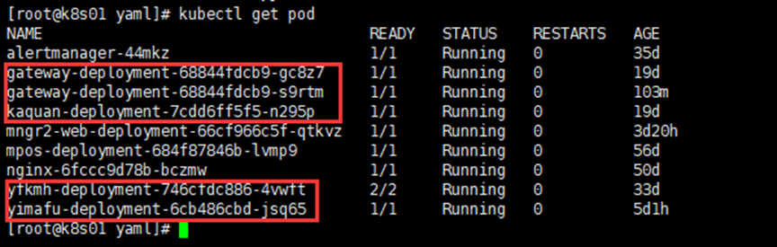
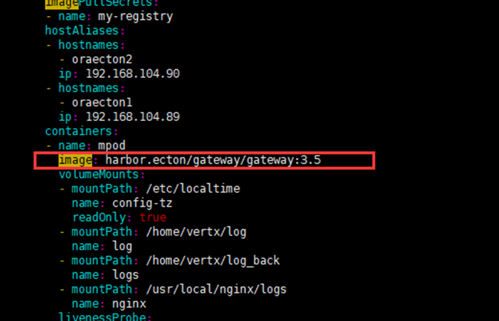

K8s容器部署在19，49，上

19，mngr2（清算管控台）

## 容器发版

> 1. 从（k8s部署机器） 上输入。kubectl get pod -A 从name中找到名字。
> 2. 通过容器，将上线文件上传到容器中。
> 3. 回到k8s机器，通过kubectl get deployment -owide -A（也可以查看版本号） 找到上传项目对应的NAMESPACE 。
> 4.  kubectl edit deployment NAME -n NAMESPACE 找到 spec – image 修改版本号。
> 5.   kubectl get pod -A | grep NAME 查看进程是否启动。
> 6.  如果 使用1找不到名字 查看进程就使用kubectl get pods -n NAMESPACE | grep NAME
> 7.  kubectl logs -f NAME -n NAMESPACE 查看输出日志

## K8s文件考取

> 1. 从home中找到用户
> 2. kubectl get pod -A | grep 用户名 查看运行的容器
> 3. kubectl exec -ti NAME -n NAMESPACE /bin/bash 进入容器
> 4. 把要考取的文件打包。打包好后 exit 退出
> 5. kubectl cp NAME:容器中文件路径 /root/打包文件名 -n NAMESPACE
>
> > 在查看运行的容器时 第一列是NAMESPACE 第二列是运行的容器NAME

## K8s常用命令

> -  kubectl get pod -A 查看所有的pod信息
> -  kubectl get pod -A|grep NAMESPACE 查看指定的pod信息
> - kubectl get deployment -owide -A 查看所有的 deployment

## 易通笔记

> 测试UAT k8s 上线 从
>
> 177 上传文件，执行脚本打镜像，
>
> 174上执行k83命令
>
> 177上mngr2是清算前台 mngr是清算后台

> docker 手动创建镜像将镜像，推送到harbor
>
> 1. kubectl get deployment -owide -n 镜像名 找到 images
>
> 2. Dockerfile 文件
>
>    form images（基础的镜像和版本）
>
>    ADD 要上传的文件  上传的文件在docker中的路径
>
> 3. 制作镜像
>
>    docker build -t 容器名字:版本号 .（docker build -t tomcat:v1.0.1 .）
>
> 4. 将镜像推送到harbor
>
>    格式：docker push hub.ecton.pro/mpos/镜像名:版本
>
>    docker push hub.ecton.pro/mpos/mpos:1.8


> 测试环境容器镜像仓库
>
> https://192.168.104.177/harbor/projects/12/repositories/gateway%2Fgateway
>
>  admin Harbor12345

**查看node**

> ```
> kubectl get node 
> ```
>
> 

**查看正在运行的pod**

> 在192.168.104.174/175/176上执行此操作
>
> ```
> kubectl get pod (查看默认命名空间运行的pod)
> ```
>
> 
>
> ```
> kubectl get pod --all-namespaces  (查看全部命名空间运行的pod)
> ```
>
> 
>
> ```
> kubectl get pod -n uat(查看uat命名空间运行的pod)
> ```
>
> 

**查看正在运行的deployment**

> ```
> kubectl get deployment(查看默认命名空间)
> ```
>
> 
>
> ```
> kubectl get deployment --all-namespaces(查看全部命名空间)
> ```
>
> 
>
> ```
> kubectl get deployment -n uat (查看uat命名空间)
> ```
>
> 

**查看正在运行的service**(svc)

> ```
> kubectl get svc(查看默认命名空间)
> ```
>
> 
>
> ```
> kubectl get svc --all-namespaces(查看全部命名空间)
> ```
>
> 
>
> ```
> kubectl get svc -n uat（查看uat命名空间）
> ```
>
> 

## 制作docker镜像

> 在192.168.104.177上执行，之前生成镜像的路径都在/root/buildimages下
>
> 编写dockerfile
>
> vim Dockerfile
>
> ```
> FROM centos:7.5.1804 #指定所创建镜像的基础镜像
> ENV JAVA_HOME /home/vertx/java #配置环境变量
> RUN mkdir test #运行centos的命令
> ADD 123 /root/ #将123文件添加到镜像的/root/目录下
> WORKDIR /root #指定镜像的工作目录
> ENTRYPOINT cd /home/vertx/bin && sh ms && pm2 start /home/vertx/conf/nodecfg/nodecfg.json && cd /usr/local/nginx/sbin/ && ./nginx && cd /home/vertx/log && tail -f nohup.out #指定镜像的默认入口，作为镜像启动的根命令
> ```
>
> 制作docker镜像
>
> ```
> docker build -t test:1.0 .
> ```
>
> -t 命令：指定生成镜像的标签信息
>
> . 是Dockerfile所在的路径，一般是在Dockerfile所在的文件夹下执行，所以为.。
>
> Run启动

 

## 上传下载镜像

> 在192.168.104.177上执行
>
> 上传镜像
>
> ```
> docker push test:1.0
> ```
>
> 下载镜像
>
> ```
> docker pull test:1.0
> ```

## 应用更新

> 在192.168.104.174上执行
>
> 
>
> 这几个系统可以在/k8s/yaml/下有部署的文件，再更新的时候可以直接修改应用的deployment文件即可，然后执行kubectl apply -f deployment文件，以网关为例。
>
> ```
> vim gateway-deployment.yaml
> ```
>
> 
>
> 更改为新的镜像地址即可，然后应用一下。
>
> ```
> kubectl apply -f gateway-deployment.yml
> ```
>
> 