K8s 中deployment 和 service 是独立ip 端口不受影响

## 一、pod 操作

**列出所有运行的Pod信息。**

```
kubectl get pods

# 显示更多的pods列表信息(例如 pod的ip和所处的node)-o wide/yaml/json 可以用不用格式查看，常用wide格式
kubectl get pods -o wide
```

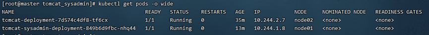

> ​    NAME：pod的名字
>
> ​    IP：pod 中的独立ip
>
> ​    AGE：运行时间
>
> ​    NODE：镜像所在的node节点

```
# 查看指定 pods 并以 yaml 方式输出
kubectl get pods [NAME] -o yaml
```

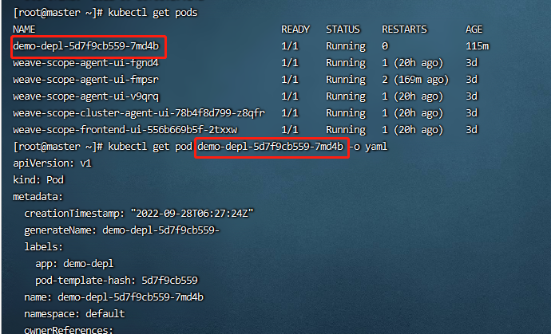


**查看 pod 中项目日志**

```
kubectl logs –f pod name

# 如果pod有多个容器需要加-c 容器名
kubectl logs –f pod name –c 容器名
```

**重启pod容器**

可以直接删除一个pod信息，然后会自动再重启一个新的pod节点从而实现重启容器（因为pod节点由副本控制，删除pod也会再重新拉起来）。

```
# 格式
kubectl delete pods pod的名字

kubectl delete pods tomcat-deployment-7d574c4df8-ctrlv
```

**进入容器**

```
kubectl exec -it NAME /bin/bash
```

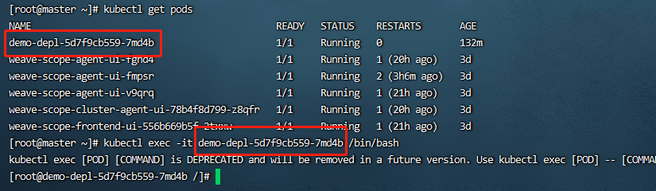

## 二、deployment 操作

**列出deployment的所有信息以wide形式输出**

```
kubectl get deployment –o wide –A
```

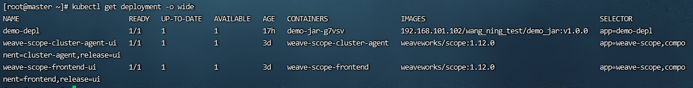

> NAMESPACE：命名空间
>
> NAME：deployment名字
>
> UP-TO-DATE:最新部署副本数
>
> AVAILBLE: 运行中的副本数
>
> AGE: 已经运行的时间

**列出deployment的所有信息以 yaml 形式输出**

```
kubectl get deployment [NAME] -o yaml
```

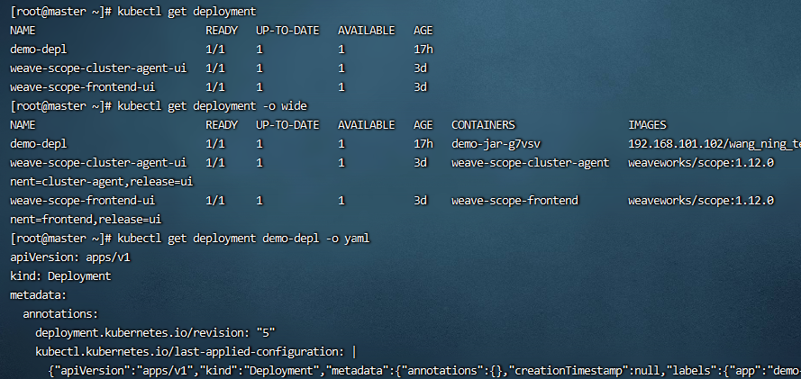

**修改deployment的yaml文件**

```
# -n 后面是资源的命名空间
kubectl edit deployment [NAME] -n [NAMESPACE]
kubectl edit deployment -n default
```

## 三、查看 service 信息

> ```
> kubectl get service -o wide
> kubectl get svc -o wide
> ```
>
> 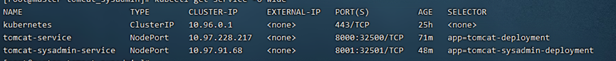
>
> - NAME：service 的名字
>
> - TYPE：serivce类型
>
> -  CLUSTER-IP：service在集群中的ip 是系统自动分配且独立的
>
> -  PORT(S)：端口信息

## 四、获取集群中所有资源

```
kubectl get all
```

## 五、暂停容器

> 这里需要修改deployment中的副本，让副本为0使其失效，即修改spec中的replicas为0。（原来是让副本失效从而达到暂停容器的目的）
>
> 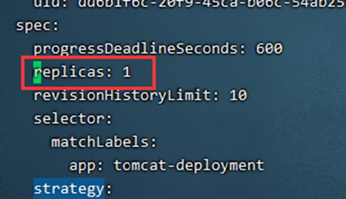
>
> 修改 deployment 命令
>
> ```
> kubectl edit deployment deployment名字 –n NAMESPACE(命名空间)
> ```

## 六、查看k8s服务日志

```
journalctl -f -u kubelet
```

## 七、查看nodes

```
kubectl get nodes
或者
kubectl get node
```

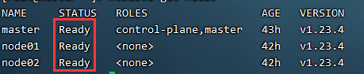

## 八、namespace命名空间

> 命名空间吧 pod 进行隔离
>
> k8s默认会自动生成3个命名空间 
>
> - default：所有未指定Namespace的对象都会被分配在default命名空间。 
> - kube-system：所有由Kubernetes系统创建的资源都处于这个命名空间。
> - kube-public：此命名空间下的资源可以被所有人访问（包括未认证用户）。
> - kubectl get pods 查看的是默认default命名空间下的资源
> -  kubectl get pods –A 则是展示所有命名空间下的资源
>
> 1 查看现有命名空间
>
> ```
> kubectl get ns
> ```
>
> 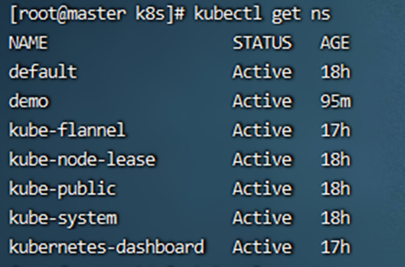
>
> 2 使用命令行创建自定义命名空间
>
> ```
> kubectl create namespace test
> ```
>
> 
>
> 3 删除命名空间 
>
> ```
> kubectl delete ns test
> ```

## 九、kubectl delete

kubectl delete 是用于删除集群中的资源文件

这里以删除 deployment 资源文件为例 （service，pod，等同样适用）

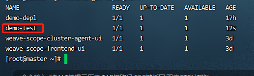

方法一

```
# 格式 NAME 为资源的名字
kubectl delete deployment [NAME]
kubectl delete deployment demo-test
```

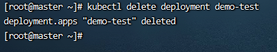

方法二

```
# 格式
kubectl delete -f YAML文件
kubectl delete -f deployment.yaml  # deployment.yaml 是创建deployment资源的yaml文件
```

## 十、kubectl describe

kubectl describe 显示资源详情，可以查看资源的详情信息和启动情况。当节点状态不是 Running 时，可以用该命令进行排查。

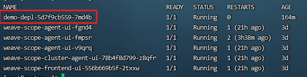

```
# 格式
kubectl describe 资源名[pod、deployment等] [name] -n [命名空间]

# 以 pod 为例如何不知道命名空间默认的是 default
kubectl describe pod demo-depl-5d7f9cb559-7md4b
kubectl describe pod demo-depl-5d7f9cb559-7md4b -n default
```

## 十一、create 和 apply

kubectl create 

> 它明确告诉kubectl要创建某个资源或对象，前提是这个资源或者对象不存在。如果不存在则创   建，如果存在，则报错，

kubectl apply 

> 如果资源或者对象不存在则创建，如果已经存在，则对比差异，然后更新替换。

以创建更新 deployment 为例

```
# 创建系统中没有的deployment 资源对象
kubectl create -f deployment.yaml
kubectl apply -f deployment.yaml

# 更新，例如镜像升级，先修改该资源的yaml文件，修改对应的版本号后保存，使用apply -f 对其进行升级
kubeclt apply -f deployment.yaml
```

##  十二、获取默认的YAML文件

获取资源类型为 deployment  yam配置文件

```
# 创建一个 资源类型为deployment、名字为demo-depl
# --image 指定镜像为192.168.101.102/wang_ning_test/demo_jar，版本号为v1.0.0
# --dry-run=client，只打印显示对象，而不运行。
kubectl create deployment demo-depl --image=192.168.101.102/wang_ning_test/demo_jar:v1.0.0 -o yaml --dry-run=client > demo_deployment.yaml
```

获取资源类型为  service yam配置文件前提是集群有已经有了 资源类型为deployment 的资源对象，可以通过expose 获取指定资源对象的 service yam配置文件

```
# 获取 demo-depl的service yam配置文件
# deployment demo-depl （demo-deplr 为要配置的 deployment 名字）
# --port=8080 暴露给集群内客户访问服务
# --type=NodePort pod上的真实端口（应用的真实端口）
# --name=demo-service 给 service 起一个名字，为了区别，不要和deployment 名字一致

kubectl expose deployment demo-depl --port=8001 --type=NodePort --target-port=8080 --name=demo-service -o yaml --dry-run=client > demo_service.yaml
```


## 十三、其他命令参数

```
get       #显示一个或多个资源

describe  #显示资源详情

create    #从文件或标准输入创建资源

update   #从文件或标准输入更新资源

delete   #通过文件名、标准输入、资源名或者 label 删除资源

log       #输出 pod 中一个容器的日志

rolling-update  #对指定的 RC 执行滚动升级

exec  #在容器内部执行命令

port-forward #将本地端口转发到 Pod

proxy   #为 Kubernetes API server 启动代理服务器

run     #在集群中使用指定镜像启动容器

expose   #将 SVC 或 pod 暴露为新的 kubernetes service

label     #更新资源的 label

config   #修改 kubernetes 配置文件

cluster-info #显示集群信息

api-versions #以”组/版本”的格式输出服务端支持的 API 版本

version       #输出服务端和客户端的版本信息

help         #显示各个命令的帮助信息

ingress-nginx  #管理 ingress 服务的插件(官方安装和使用方式
```
