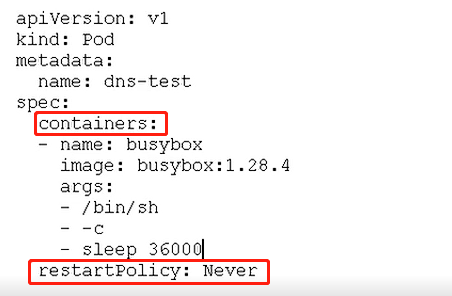
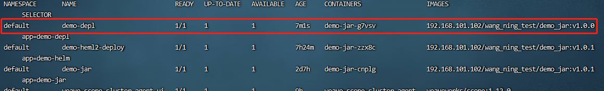

# k8s 笔记

## 一、k8s 概述

### 1、k8s 概述和特征

**1.1 概述：**

- k8s 是由谷歌在2014年开源的容器化集群管理系统
- K8s是一个docker集群的管理工具。
- 使用k8s进行容器化应用部署
- 使用k8s利于应用的扩展
- k8s目标实施让部署容器化应用更加简洁高效   

**1.2 功能**

- **自动装箱**

  基于容器对应用运行环境的资源配置要求自动部署应用容器

- **水平扩展**

  当容器失败时，会对容器进行重启

  当所部署的 Node 节点有问题时，会对容器进行重新部署和重新调度

  当容器未通过监控检查时，会关闭此容器直到容器正常运行时，才会对外提供服务

- **服务发现**	

  通过简单的命令、用户 UI 界面或基于 CPU 等资源使用情况，对应用容器进行规模扩大或规模剪裁

- **滚动更新**	

  可以根据应用的变化，对应用容器运行的应用，进行一次性或批量式更新

- **版本回退**

  可以根据应用部署情况，对应用容器运行的应用，进行历史版本即时回退

- **密钥和配置管理**

  在不需要重新构建镜像的情况下，可以部署和更新密钥和应用配置，类似热部署。

- **存储编排**

  自动实现存储系统挂载及应用，特别对有状态应用实现数据持久化非常重要,

  存储系统可以来自于本地目录、网络存储(NFS、Gluster、Ceph 等)、公共云存储服务

- **批处理**

  提供一次性任务，定时任务；满足批量数据处理和分析的场景

### 2、K8s 集群架构


**主从 master 和 node** 

1. master：主控节点，做管理工作，管理node节点工作 
   - API server：核心服务，集群的统一入口，各个组件的协调者。以restful方式，交给etcd存储。
   - scheduler：节点的调度，是一个调度器，用于选择合适的node节点部署pod。
   - controller-manager:处理集群中常规的后台任务，一个资源对应一个控制器。
   - etcd：是一种存储，用于保存集群相关的数据。

2. node：工作节点
   - kubelet : 是master派到node的一个代表，管理本机容器
   - kube-proxy:提供网络代理，实习负责均衡等操作。

### 3、K8s 核心概念

三大核心：pod、Controller、Service

1. **pod**
   - Pod是k8s中你可以创建和部署的最小也是最简单位。一个Pod代表着集群中运行的一个进程。
   - Pod中封装着应用的容器（有的情况下是好几个容器），存储、独立的网络IP，管理容器如何运行的策略选项。Pod代表着部署的一个单位：kubernetes中应用的一个实例，可能由一个或者多个容器组合在一起共享资源。
   - 共享网络，生命周期是短暂的。

2. **controller**
   - 确保预期的pod副本的数量（通过controller就可以创建pod）
   - 无状态应用部署
   - 有状态应用部署
   - 确保所有的node运行同一个pod
   - 一次性任务和定时任务

3. **service**
   - 定义一组pod的访问规则

总结：通过service统一入口进行访问，由controller去创建pod进行部署。

## 二、k8s 集群搭建

> 目前生产中部署 k8s 集群的方式主要有两种：
>
> 1. kubeadm
>    Kubeadm 是一个 K8s 部署工具，提供 kubeadm init 和 kubeadm join，用于快速部
>    署 Kubernetes 集群。
>    官方地址：https://kubernetes.io/docs/reference/setup-tools/kubeadm/kubeadm/
>
> 2. 二进制包 （了解）

### 1、使用 kubeadm 快速搭建 k8s 集群。

> 有单独的文件进行详细的部署搭建，不在重复介绍。

## 三、k8s集群YAML文件

### 1、YAML 文件概述

k8s 集群中对资源管理和资源对象编排部署都可以通过声明样式（YAML）文件来解决，也
就是可以把需要对资源对象操作编辑到 YAML 格式文件中，我们把这种文件叫做资源清单文
件，通过 kubectl 命令直接使用资源清单文件就可以实现对大量的资源对象进行编排部署
了。

### 2、YAML 文件书写格式

**2.1、YAML 介绍**

> YAML 是一种标记语言。为了强调这种语言以数据做为中心，而不是以标记语言为重点。
>
> YAML 是一个可读性高，用来表达数据序列的格式。

**2.2、语法格式：**

> 通过缩进表示层级关系。
>
> 使用空格做缩进，不能使用Tab建。
>
> 一般开头缩进两个空格。
>
> 字符后面缩进一个空格，比如，冒号，逗号等。
>
> 使用 --- 表示新的yaml文件开始。
>
> 使用 # 做注释。

**2.3、yaml文件组成部分**

> 控制器定义：从开头到template。
>
> 被控制对象：从template开始到结束。

**2.3、常用字段含义**

> 参考 k8s_file\YAML（deployment.yaml、service.yaml）
>
> 

**2.4、如何快速编写yaml文件**

第一种 使用 kubectl create 命令生成yaml文件 （适用于初始项目系统中没有yaml文件）

```
# 创建一个 资源类型为deployment、名字为demo-depl
# --image 指定镜像为192.168.101.102/wang_ning_test/demo_jar，版本号为v1.0.0
# --dry-run=client，只打印显示对象，而不运行。
kubectl create deployment demo-depl --image=192.168.101.102/wang_ning_test/demo_jar:v1.0.0 -o yaml --dry-run=client > demo_deployment.yaml
```


第二种 使用 kubectl get 命令导出 yaml 文件 （使用系统中存在，拿来修改）


这里首先查看 demo-depl 的时间

```
 # 导出 deployment资源，名字为demo-depl，输出格式为yaml，重定向出来。
 kubectl get deployment demo-depl -o yaml > damo_jar_deployment.yaml
```

### 3、通过 YAML 文件创建资源

在 k8s 中，一般使用 YAML 格式的文件来创建符合我们预期期望的 pod,这样的 YAML 文件称为资源清单。

```
# 一般使用 apply -f 创建yaml文件资源
# 格式
kubectl apply -f  yaml文件名字

# 例子
kubectl apply -f demo_deployment.yaml
```

## 四、k8s集群命令行工具kubectl

### 1、kubectl 概述

kubectl  是  Kubernetes 集群的命令行工具，通过 kubectl 能够对集群本身进行管理，并能
够在集群上进行容器化应用的安装部署。

### 2、kubectl 命令语法

```
kubectl [command] [TYPE] [NAME] [flags]
```

1. command: 指定要对资源执行的操作，例如 create、get、exec、edit、 delete 等。

2. TYPE：指定资源类型，资源类型大小写是敏感的。

```
# 例如：查看node01节点
kubectl get nodes node01
```

3. NAME :指定资源名称，名称大小写也是敏感的。

```
# 查看pod信息
kubectl get pods

# 查看nods信息
kubectl get nods
```

4. flags: 指定可选参数，例如：-s 、 -o、 -A 等。

```
# 查看pod的详情信息，以wide方式显示
kubectl get pods -o wide

# 查看集群中所有命名空间的pod信息
kubectl get pods -A
```

### 3、k8s获取更多信息

```
kubectl --help
```

### 4 、lkubectl 子命令使用分类

- 基础命令

  

- 部署和集群管理命令

  

- 故障和调试命令

  

-  其他命令

  

## 五、k8s核心技术-Pod

### 1、pod基本概念

> pod是k8s集群中的最小的部署单元。
>
> 每个 Pod 都是应用的一个实例，有专用的 IP
>
> 一个pod包含一个或多个容器（一组容器集合）。
>
> 一个pod中的容器共享网络命名空间，和存储单元。
>
> pod是一个短暂的存在(生命周期短暂，重启pod,网络ip也会改变)

### 2、pod存在的意义

> 创建容器使用的是docker，一个docker对应的是一个容器，一个容器运行一个进程，一个容器对应一个应用。
>
> pod是多进程设计，，运行多个应用进程。（一个pod可以有多个容器，一个容器运行一个应用）
>
> pod的存在为了亲密性应用（两个或者多个应用，可以进行交互，网络之间的调用）

### 3、pod的实现机制

> 共享网络：通过Pause容器，把其他业务容器加入到Pause容器里面，让所有业务容器在同一个命名空间中，				   可以实现网络共享。
>
> 共享存储：引入数据卷的概念Volumn,使用数据卷进行持久化存储。
>

### 4、pod的YAML配置

**4.1 pod镜像拉取策略**

pod完整定义如下

```
apiVersion: v1
kind: Pod
metadata: //元数据
name: string
namespace: string
labels:
-name: string
annotations:
-name: string
spec:
containers: //pod 中的容器列表，可以有多个容器
- name: string //容器的名称
image: string //容器中的镜像
imagesPullPolicy: [Always|Never|IfNotPresent]//获取镜像的策略，默认lways，每次都尝试重新下载镜像
command: [string] //容器的启动命令列表（不配置的话使用镜像内部的命令） args:[string] //启动参数列表
workingDir: string //容器的工作目录 volumeMounts: //挂载到到容器内部的存储卷设置
-name: string
mountPath: string //存储卷在容器内部 Mount 的绝对路径 readOnly: boolean //默认值为读写
ports: //容器需要暴露的端口号列表
-name: string
containerPort: int //容器要暴露的端口
hostPort: int //容器所在主机监听的端口（容器暴露端口映射到宿主机的端口，设置hostPort 时同一 台宿主机将不                能再启动该容器的第 2 份副本）
protocol: string //TCP 和 UDP，默认值为 TCP env: //容器运行前要设置的环境列表
-name: string value: string
resources:
limits: //资源限制，容器的最大可用资源数量 cpu: Srting
memory: string
requeste: //资源限制，容器启动的初始可用资源数量 cpu: string
memory: string
livenessProbe: //pod 内容器健康检查的设置 exec:
command: [string] //exec 方式需要指定的命令或脚本 httpGet: //通过 httpget 检查健康
path: string port: number host: string scheme: Srtring httpHeaders:
- name: Stirng value: string
tcpSocket: //通过 tcpSocket 检查健康
port: number initialDelaySeconds: 0//首次检查时间 timeoutSeconds: 0 //检查超时时间
periodSeconds: 0 //检查间隔时间
successThreshold: 0
failureThreshold: 0 securityContext: //安全配置
privileged: falae
restartPolicy: [Always|Never|OnFailure]//重启策略，默认值为 Always
nodeSelector: object //节点选择，表示将该Pod 调度到包含这些 label 的 Node 上，以key:value 格式指定
imagePullSecrets:
-name: string
hostNetwork: false //是否使用主机网络模式，弃用 Docker 网桥，默认否
volumes: //在该 pod 上定义共享存储卷列表
-name: string emptyDir: {} hostPath:
path: string secret:
secretName: string item:
-key: string path: string
configMap: name: string items:
-key: string
path: string
```

在 containers 下通过 imagePullPolicy 配置镜像拉取策略。

- IfNotPresent: 默认值，镜像在宿主机上不存在时才拉取（本地没有就拉取），
- Never：pod 永远不会主动拉取镜像

- Always：每次创建 pod 都会主动拉取一次镜像

】

**4.2 pod资源限制**

在 containers 下通过 resources 配置pod资源限制

- requests：调度资源限制

- limits：最大资源限制


**4.3 pod重启机制**

在 containers 下通过 restartPolicy 配置 pod 重启机制

- Always：默认策略，当容器终止退出后，总是重启容器。

- Never:当容器终止退出，从不重启容器。

- OnFailure: 当容器异常退出时，才重启容器。



**4.4 pod健康检查**


### 5、Pod创建流程

master:

​	创建pod（create Pod）==> API service ==> etcd

​	Scheduler ==> API service ==> etcd ==> 通过调度算法，吧Pod调度到某个 node 节点上

node：

​	kubectlt ==>  API service ==> 读取etcd，拿到分配给当前节点pod ==> docker 创建容器并自动启动容器。


### 6、影响调度的属性（了解）

**6.1 Pod 资源限制**

节点选择标签，通过 nodeAffinity 标签设置


**6.2 对节点创建标签**

```
# 设置，node01标签为dev，这样通过上面配置，就直接吧pod分配给nod01节点（env_role=dev 两个名字自定义）
#格式
kubectl taint node [nodName] key=value

# 例子
kubectl label node node01 env_role=dev
```

5 、Pod 的分类
Pod 有两种类型
（1 ）普通 Pod
普通 Pod 一旦被创建，就会被放入到 etcd 中存储，随后会被 Kubernetes Master 调度到某
个具体的 Node 上并进行绑定，随后该 Pod 对应的 Node 上的 kubelet 进程实例化成一组相
关的 Docker 容器并启动起来。在默认情 况下，当 Pod 里某个容器停止时，Kubernetes 会
自动检测到这个问题并且重新启动这个 Pod 里某所有容器， 如果 Pod 所在的 Node 宕机，
则会将这个 Node 上的所有 Pod 重新调度到其它节点上。
（2 ）静态 Pod
静态 Pod 是由 kubelet 进行管理的仅存在于特定 Node 上的 Pod,它们不能通过 API Server
进行管理，无法与 ReplicationController、Deployment 或 DaemonSet 进行关联，并且
kubelet 也无法对它们进行健康检查

```
kubectl get node node01 --show-labels
```

节点亲和性，通过nodeAffinity,标签设置


**6.4 污点和污点容忍**

Taint污点：节点不做普通调度，是节点属性

查看节点污点属性

```
kubectl describe node |grep Taints

# NoSchedule 这个节点一定不被调度
# PreferNoSchdule 尽量不被调度
# NoExecute 不会调度，并且还会被驱逐Node已有的Pod
```


为节点加污点

```
# 格式
kubectl taint node [nodName] key=value:污点值（NoSchedule，PreferNoSchdule，NoExecute）

# 例子
kubectl taint node node01 env_role=yes:NoSchedule

# 查看
kubectl describe node node01 |grep Taints
```

### 7、pod相关命令

```
# 创建 pod （Pod是由deployment管理的）
kubeclt create -f XXX.yaml

# 查看 pod
kubectl get pod
# 查看 pod 以 wide 方式
kubectl get pod -o wide
# 查看 pod 以 yaml 方式
kubectl get pod -o yaml
# 查看集群中全部命名空间下的pod信息
kubectl get pod -A

# 删除 pod (其中xxx.yaml为创建pod的yaml文件)
kubectl delete -f xxx.yaml
kubectl delete pod pod_name

```

### 8 、Pod 的分类
Pod 有两种类型
（1）普通 Pod
普通 Pod 一旦被创建，就会被放入到 etcd 中存储，随后会被 Kubernetes Master 调度到某
个具体的 Node 上并进行绑定，随后该 Pod 对应的 Node 上的 kubelet 进程实例化成一组相
关的 Docker 容器并启动起来。在默认情 况下，当 Pod 里某个容器停止时，Kubernetes 会
自动检测到这个问题并且重新启动这个 Pod 里某所有容器， 如果 Pod 所在的 Node 宕机，
则会将这个 Node 上的所有 Pod 重新调度到其它节点上。
（2）静态 Pod
静态 Pod 是由 kubelet 进行管理的仅存在于特定 Node 上的 Pod,它们不能通过 API Server
进行管理，无法与 ReplicationController、Deployment 或 DaemonSet 进行关联，并且
kubelet 也无法对它们进行健康检查

### 9、Pod的状态


### 10、pod 网络

> 由于一个pod中的容器运行于相同的Network命名空间中，因此它们共享相同的IP地址和端口空间。当两个pod彼此之间发送网络数据包时，它们都会将对方的实际IP地址看作数据包中的源IP。
>
> pod 是逻辑主机，其行为与非容器世界中的物理主机或虚拟机非常相似。此外，运行在同一个pod中的进程与运行在同一物理机或虚拟机上的进程相似，只是每个进程都封装在一个容器之中。

## 六、K8s核心技术-Label

### 1、Label 概述

> Label 是 Kubernetes 系统中另一个核心概念。一个 Label 是一个 key=value 的键值对，其
> 中 key 与 value 由用户自己指 定。Label 可以附加到各种资源对象上，如 Node、Pod、
> Service、Controller，一个资源对象可以定义任意数量的 Label， 同一个 Label 也可以被添加到
> 任意数量的资源对象上，Label 通常在资源对象定义时确定，也可以在对象创建后动态 添
> 加或删除。
> Label 的最常见的用法是使用 metadata.labels 字段，来为对象添加 Label，通过
> spec.selector 来引用对象

### 2、Label 示例

```
apiVersion: apps/v1
kind: Deployment
metadata:
  creationTimestamp: null
  labels:  # deployment定义标签
    app: demo-depl
  name: demo-depl
spec:
  replicas: 1
  selector:
    matchLabels: # 定义标签
      app: demo-depl
  strategy: {}
  template:
    metadata:
      creationTimestamp: null
      labels:
        app: demo-depl
    spec:
      containers:
      - image: 192.168.101.102/wang_ning_test/demo_jar:v1.0.0
        name: demo-jar-g7vsv
        resources: {}
status: {
```

Label 附加到 Kubernetes 集群中各种资源对象上，目的就是对这些资源对象进行分组管理，
而分组管理的核心就 是 Label Selector。Label 与 Label Selector 都是不能单独定义，
必须附加在一些资源对象的定义文件上，一般附加 在 Controller 和 Service 的资源定义文件中

## 七、k8s核心技术-Controller

Deployment 是最常用的 Controller 控制器

### 1、Controller概述

Replication Controller(RC)是 Kubernetes 系统中核心概念之一，当我们定义了一个 RC
并提交到 Kubernetes 集群中以后，Master 节点上的 Controller Manager 组件就得到通知，
定期检查系统中存活的 Pod,并确保目标 Pod 实例的数量刚好等于 RC 的预期值，如果有过
多或过少的 Pod 运行，系统就会停掉或创建一些 Pod.此外我们也可以通过修改 RC 的副本
数量，来实现 Pod 的动态缩放功能（动态缩放是指控制集群中pod启动的数量）。

**1.1、什么是Controller**

Controller是在我们的集群上管理和运行容器的对象

**1.2、Pod 和 Controller 关系**

pod 是通过 Controller 实现应用运维，比如伸缩，滚动升级

Pod 和 Controller直接是通过 label 和 selector 标签建立关系（？）


### 2、Deployment 控制器

Deployment 是最常用的 Controller 控制器，Kubenetes v1.2 引入的新概念，引入的目的是为了更好的解决 Pod 的编排问题。

**Deployment控制器作用**

> 部署无状态的应用
>
> 管理 Pod 和 ReplicaSet
>
> 部署，升级，回滚等功能
>

**应用场景**

> web服务，微服务

**使用 Deployment 部署应用 （yaml）**

```
# 创建一个 资源类型为deployment、名字为demo-depl
# --image 指定镜像为192.168.101.102/wang_ning_test/demo_jar，版本号为v1.0.0
# --dry-run=client，只打印显示对象，而不运行。
kubectl create deployment demo-depl --image=192.168.101.102/wang_ning_test/demo_jar:v1.0.0 -o yaml --dry-run=client > demo_deployment.yaml
```

通过label 和 selector 进行匹配


```
# 应用部署
kubectl apply -f demo_deployment.yaml
```


```
# 查看部署的deployment 和 pod
kubectl get deployment,pod
```


### 3、Deployment yam文件

文件地址k8s_file/YAML/deployment.yaml

```
apiVersion: apps/v1            # Api接口版本
kind: Deployment               # 指定创建资源的角色/类型 
metadata:                      # 资源的元数据(用来描述 deployment 的信息)
  name: demo                   # 用来描述 deployment 的名字，在同一个namespace中必须唯一
  namespace: default           # 部署在哪个namespace中
  labels:                      # labels是k8s特有的，可以叫做标签
    app: demo
    version: stable
spec:                           # 资源清单，在这里定义的是deployment所需要的资源清单
# 在具体参数信息spec下，只指定了副本数量，还需要指定副本标签与Deploymen控制器进行匹配
  replicas: 1                             # 副本数
  revisionHistoryLimit: 3                 # 保留 3 个历史版本
  selector:                               # 选择器
    matchLabels:                          # 选择匹配
      app: demo                # 匹配 demo-deployment
      version: stable
  strategy:                    # 策略
    rollingUpdate:             # 滚动更新
      maxSurge: 30%            # 最大额外可以存在的副本数，可以为百分比，也可以为整数
      maxUnavailable: 30%   # 示在更新过程中能够进入不可用状态的Pod的最大值，可以为百分比，也可以为整数
    type: RollingUpdate     # 滚动更新策略(先启动新的，等一个新的完全就绪后，就将老的停掉)
  template:                               # pod模板定义
    metadata:                             #  # 资源的元数据(用来描述 pod 的信息)
      labels:                             # 定义 pod 标签
        app: demo                    # 标签 tomcat-deployment
        version: stable 
    spec:                                 # 定义 pod 所需要的资源清单
      containers:                         # 容器
      - name: demo                        # 这个name也就是pod的名字，用于被deployment来selector（选择）;
        image: 192.168.101.102/wang_ning_test/tomcat_demo01:v1.0.1   # 这里镜像就是harbor仓库的项目镜像
        imagePullPolicy: Always      # 镜像的拉取策略，always是每次都从镜像仓库拉取
        ports:                            # 容器镜像
        - containerPort: 8080             # pod内部容器的端口（此处定义暴露的端口）
      # 如果在Harbor仓库中已经吧镜像项目设置成公开，则注释掉下两行代码
      imagePullSecrets:                   # 这里是拉取镜像时所使用的账户
      - name: login-harbor                # secret.yaml 中name

```

### 4、升级回滚

```
# 查看deployment 详情信息
kubectl get deployment -o wide -A
```



**方法一**

```
# 这里升级的是NAME=demo-depl的项目进入 deployment 的 yaml 文件
# 格式
kubectl edit deployment [NAME] -n [NAMESPACE]

kubectl edit deployment damo-depl -n default
```

通过修改版本号，升级或回滚成想要运行的docker版本（v1.0.0 ==> v1.0.1）


查看 pod信息，新的pod在起来，旧的镜像在停止


```
# 通过 pod 查看
# 等新的pod起来，旧的pod消失后查看正在运行的pod信息
kubectl get pods demo-depl-75959ff556-j9wvs -o yaml|grep image
```


```
# 通过 deployment 查看
kubectl get deployment -o wide -A
```


**方式二** 

升级

```
# 通过命令修改deployment的yaml文件中的image的name信息
# 首先查看 name 的名字
kubectl edit deployment demo-depl -n default

# 通过 set 命令修改
kubectl set image deployment demo-depl demo-jar-g7vsv=192.168.101.102/wang_ning_test/demo_jar:v1.0.1
```


回滚

```
# 格式
kubectl rollout undo deployment [NAME]

# 直接回滚到上一个版本
kubectl rollout undo deployment demo-depl
# 查看回滚状态
kubectl rollout status deployment demo-depl
```


回滚指定版本:

```
方法一
kubectl rollout undo deployment [NAME] --to-revision=[版本号]
kubectl rollout undo deployment --to-revision=2

方法二 （反向操作升级步骤）
```

### 5、弹性伸缩(修改副本数量)

```
# 使用命令格式
kubectl scale deployment [NAME] replicas=[具体值]

# 例如 创建 10 个副本
kubectl scale deployment demo-depl replicas=10

# 直接修改deployment的yaml文件 replicas=10
kubectl edit deployment demo-depl -n default
```


**了解**

> **Controller 部署守护进程**
>
> **Controller 部署 job （一次行任务）**
>
> 
>
> **Controller 部署 CronJob （定时任务）**
>
> 

## 八、k8s核心技术-Service

### 1、Service 概述

> Service 是 Kubernetes 最核心概念，通过创建 Service,可以为一组具有相同功能的容器应
> 用提供一个统一的入口地址，并且将请求负载分发到后端的各个容器应用上。
>
> service 定义一组pod的访问规则

**pod、service、controller 三者之间的关系：**

> controller 创建管理 pod
>
> 用户通过service 访问 pod里面的应用
>

**service存在的意义：**

> 防止pod失联（服务发现）
>
> 定义一组 Pod 的访问策略 （负载均衡）

**pod 和 service 之间的关系：**

> 通过 label 和 selector 标签建立关系 （通 controller 和 pod 建立关系一样）
>
> 
>
> - 通过service 实习 pod 的负载均衡
>
> - service 通过管理 虚拟ip 管理 pod。（ip 都是 虚拟的IP地址）

### 2 、Service 的定义

yaml 格式的 Service 定义文件 （k8s_file\YAML\service.yaml）

```
apiVersion: v1                  # 指定api版本，此值必须在kubectl api-versions中
kind: Service                   # 指定创建资源的角色/类型 
metadata:
  name: demo-service            # 资源的名字，在同一个namespace中必须唯一
  namespace: default            # 部署在哪个namespace中  
  labels:                       # 设定资源的标签
    app: demo-service
spec:
  type: NodePort                 # 配置 Nodeport 外部流量可访问k8s中的服务
  selector:                      # 选择标签  匹配的是deployment容器标签
    app: demo                    # 匹配 demo   
  ports:
  - port: 8000                   # 暴露给集群内客户访问服务
    targetPort: 8080             # pod上的真实端口
    nodePort: 32500              # 对外暴露的端口号，对外提供访问的端口，暴露给集群外客户访问服务

```

### 3、常见的 service 类型

ClusterIP：在集群内部访问 （默认）

NodePort：对外访问应用的时候使用

LoaBalancer：对外访问应用的时候使用，可以使用公有云


```
# 可以使用一下命令查询 service 类型
kubectl get service  # 查询结果的 type 字段是
```


### 4、无状态和有状态 pod

无状态：

- 任务pod都是一样的（一个控制器多个副本）
- 使用那个 pod 没有具体要求
- 不用考虑在那个node上运行
- 随意进行伸缩和扩展。

有状态：

- 无状态的因素都要考虑
- 让每一个pod 都是独立的，保持pod的启动顺序和唯一性
- 唯一的网络标识符，持久存储

**无状态pod下的service部署**

> 首先创建一个pod（因为pod是由deployment控制的，这里创建的的deployment资源），通过部署service修改对pod的访问规则
>
> ```
> # 创建一个 资源类型为deployment、名字为demo-depl
> # --image 指定镜像为192.168.101.102/wang_ning_test/demo_jar，版本号为v1.0.0
> # --dry-run=client，只打印显示对象，而不运行。
> kubectl create deployment demo-depl --image=192.168.101.102/wang_ning_test/demo_jar:v1.0.0 -o yaml --dry-run=client > demo_deployment.yaml
> 
> kubectl apply -f demo_deployment.yaml
> ```
>
> 
>
> ```
> # 获取 demo-depl的service yam配置文件
> # deployment demo-depl （demo-deplr 为要配置的 deployment 名字）
> # --port=8080 暴露给集群内客户访问服务
> # --type=NodePort pod上的真实端口（应用的真实端口）
> # --name=demo-service 给 service 起一个名字，为了区别，不要和deployment 名字一致
> 
> kubectl expose deployment demo-depl --port=8001 --type=NodePort --target-port=8080 --name=demo-service -o yaml --dry-run=client > demo_service.yaml
> ```
>
> 获取的文件如下为，这里通过nodePort自定义了对外暴露端口,若不指定，随机分配
>
> 
>
> ```
> # 创建 service 资源文件
> kubectl apply -f demo_service.yaml
> ```
>
> 
>
> 测试访问：master ip:30023
>
> 

**有状态 pod 下的service部署**(了解)

> 使用 SatefulSet 有状态部署pod
>
> yaml 配置文件如下（k8s_file\YAML\statefulset\service_statefulset.yaml）
>
> ```
> apiVersion: v1
> kind: Service
> metadata:
>   labels:
>     app: demo-wang
>   name: demo-wang
> spec:
>   ports:
>   - port: 8001
>     name: demo-test
>   clusterIP: None
>   selector:
>     app: demo-wang
> 
> ---
> 
> apiVersion: apps/v1
> kind: StatefulSet   # 部署有状态pod
> metadata:
>   name: demo-statefulset
>   namespace: default
> spec:
>   serviceName: demo-wang
>   replicas: 2
>   selector:
>     matchLabels:
>       app: demo-wang
>   template:
>     metadata:
>       labels:
>         app: demo-wang
>     spec:
>       containers:
>       - name: demo-wang
>         image: 192.168.101.102/wang_ning_test/demo_jar:v1.0.0
>         ports:
>         - containerPort: 8080   # pod 内部容器端口
> ```
>
> 想对于无状态多个以下配置 
>
> service  ClusterIP：none 
>
> pod  kind：StatefulSet
>
> 
>
> 查看pod 每一个的名字都是唯一的
>
> 
>
> 查看创建的service
>
> 
>
> deployment 和 statefueset 区别
>
> 根据主机名 + 按照一定规则生成域名。
>
> 每个pod 有唯一主机名
>
> 唯一域名
>
> 格式：主机名称.service名称.名称空间.svs.cluster.local

## 九、k8s核心技术-Secret

> 作用：加密数据存在etcd里面，然Pod容器以挂载Volume方式进行访问
>
> 场景：凭证、编码、加密数据

**相关文件在 k8_file\Sercrte 目录下**


1、创建一个加密数据

```
# 常用加密方式：base64编码。例如加密过程
# username：admin
# password：root
echo -n 'admin' | 'base64'
echo -n 'root' | 'base64'
```


2、创建一个 Secret 加密数据 （sercret.yaml）

```
apiVersion: v1
kind: Secret
metadata:
  name: demo-secret
type: Opaque
data:
  username: YWRtaW4=
  password: cm9vdA==
```

3、创建一个 pod 并且以变量的形式挂载到 pod中 （secret-pod.yaml）

```
apiVersion: v1
kind: Pod
metadata:
  name: demo-pod             # pod 名字
spec:
  containers:
  - name: demo-jar           # 镜像名字
    image: 192.168.101.102/wang_ning_test/demo_jar:v1.0.0
    env:
      - name: SECRET_USERNAME  # 用户名的名字
        valueFrom:			   # 以变量形式挂载
          secretKeyRef:
            name: demo-secret    # mysecret 为 Secret 的 name
            key: username      # key 值为 
      - name: SECRET_PASSWORD  # 密码的名字 
        valueFrom:
          secretKeyRef:
            name: demo-secret
            key: password
```

4、执行 sercret.yaml 和 secret-pod.yaml 的创建

```
kubectl apply -f secret.yaml

kubectl apply -f secret-pod.yaml
```

5、查看创建的资源

```
kubectl get secret,pod
```


6、测试

这里进入容器输出变量，进行解密


**应用案例**

> 集群从harbor上拉取镜像前需要登录harbor，可以创建认证登录秘钥，在拉取镜像时带上该秘。
>
> 1、查看登录密钥
>
> ```
> cat ~/.docker/config.json
> ```
>
> 
>
> 2、进行base64加密
>
> ```
> # 执行命令后会生成一个密钥
> cat ~/.docker/config.json | base64 -w 0
> ```
>
> 
>
> 3、创建 secret_test.yaml 文件
>
> ```
> apiVersion: v1            #Api接口版本
> kind: Secret              #定义控制器
> metadata:                 #信息
>   name: login-harbor      #Sectet 名称
> type: kubernetes.io/dockerconfigjson    #用来创建用户docker registry认证的Secret
> data:                         #这里添加加密后的密钥
>      .dockerconfigjson: ewoJImF1dGhzIjogewoJCSIxOTIuMTY4LjEwMS4xMDIiOiB7CgkJCSJhdXRoIjogIllXUnRhVzQ2U0dGeVltOXlNVEl6TkRVPSIKCQl9Cgl9LAoJIkh0dHBIZWFkZXJzIjogewoJCSJVc2VyLUFnZW50IjogIkRvY2tlci1DbGllbnQvMTguMDYuMy1jZSAobGludXgpIgoJfQp9
> 
> ```
>
> 4、修改 deployment.yaml文件
>
> 在deployment.yaml 配置文件中添加 imagePullSecrets 字段
>
> 
>
> 5、创建应用
>
> ```
> kubectl apply -f yaml文件
> ```
>
> 6、查看创建的pod,和secret
>
> ```
> kubectl get pods -o wide
> kubectl get secret
> ```
>
> 
>
> 通过Service配置免密登录Harbor就能自动登录，从本地Harbor镜像仓库中拉取镜像了.等一段时间后pod的状态能从ContainerCreating ==> Running 说明 Harbot 的认证登录秘钥创建成功

## 十、k8s 核心技术-Namespace

### 1、 Namespace 概述

​		Namespace 在很多情况下用于实现多用户的资源隔离，通过将集群内部的资源对象分配到不同的 Namespace 中， 形成逻辑上的分组，便于不同的分组在共享使用整个集群的资源同时还能被分别管理。Kubernetes 集群在启动后，会创建一个名为"default"的 Namespace，如果不特别指明 Namespace,则用户创建的 Pod，RC，Service 都将 被系统 创建到这个默认的名为 default 的 Namespace 中。

## 十一、k8s 集群安全机制

### 1、概述

在访问k8s集群的时候，需要经过三个步骤完成具体操作

> 认证
>
> 鉴权（授权）
>
> 准入控制

### 2、访问k8s集群的过程

进行访问的时候，过程中都需要经过一个地方 API service,由API service做统一协调（相当于门卫）。


1. 认证 （传输安全）

   传输安全： 对外不暴露8080 端口，只能内部访问，对外统一使用6443端口

   认证：

   - 客户端身份常用方式：
     - https证书认证，基于ca证书
     - http token认证，通过token识别用户
     - http基本认证，用户名+密码 （不安全不推荐）

2. 鉴权 （授权）

   （通俗将相当于门禁卡，只能通过特定的门）

   基于RBAC进行鉴权操作

   基于角色访问控制

3. 准入控制

   就是一个准入控制器的列表，如果列表中有请求内容通过，没有拒绝

### 3、RBAC

RBAC是基于角色的访问控制

**角色：**

> role: 特定命名空间访问权限
>
> ClusterRole:所有命名空间访问权限
>

**角色绑定：**

> rolebBinding：角色绑定到主体上
>
> ClusterRolebBinding:集群角色绑定到主体上
>

**主体：**

> user：用户
>
> group：用户组
>
> serviceAccount: 服务账号

### 4、实例

 YAML文件相关在 k8s_file\YAML\rbac 中

**4.1、创建名空间**

```
# 创建一个名字为 roledemo 的命名空间，这里 ns 全称namespace
kubectl create ns roledemo 

# 查看集群的命名空间
kubectl get ns
```


**4.2、在新创建的命名空间下创建 pod**

```
# 这里通过创建 deployment 资源创建管理 pod，-n roledemo 指定命名空间

kubectl create deployment demo-rbac --image=192.168.101.102/wang_ning_test/demo_jar:v1.0.1 -n roledemo -o yaml --dry-run=client > deployment.yaml
```


```
# 运行 yaml 文件创建pods
kubectl apply -f deployment.yaml

# 查看roledemo 命名空间下的pod
kubectl get pods -n roledemo
```


**4.3、创建一个角色**

创建 yaml 文件 rbac_role.yaml

```
kind: Role
apiVersion: rbac.authorization.k8s.io/v1
metadata:
  namespace: roledemo  # 创建当前命名空间的角色
  name: pod-reader
rules:
- apiGroups: [""] # "" 表示核心API组
  resources: ["pods"]  # 资源类型 pods
  verbs: ["get", "watch", "list"] # 用于的权限
```

```
# 执行创建并查看命名空间
kubectl apply -f rbac_role.yaml

kubectl get role -n roledemo
```


**4.4、创建角色绑定**

创建 yaml 文件 rbac_rolebinding.yaml

```
kind: RoleBinding
apiVersion: rbac.authorization.k8s.io/v1
metadata:
  name: read-pods
  namespace: roledemo   # 命名空间
subjects:
- kind: User
  name: wangning # 自定义名称区分大小写
  apiGroup: rbac.authorization.k8s.io
roleRef:
  kind: Role #这必须是Role或ClusterRole
  name: pod-reader # 这必须与您希望绑定的Role或ClusterRole的名称匹配
  apiGroup: rbac.authorization.k8s.io
```

```
# 执行创建
kubectl apply -f rbac_rolebinding.yaml

# 查看创建的rolebinding，role
kubectl get rolebinding,role -n roledemo
```


4.5、使用证书识别身份

> 这里需要导入两个json文件文件：ca-config.json、ca-csr.json、
>
> 三个证书文件：ca-key.pem、ca.csr、ca.pem（这里需要从集群中导出）
>
> 文件都导入好后执行脚本文件：rabc-user.sh

4.6、鉴权验证

> 身份认证之后 只能用pods 查看roledemo 命名空间，而service，deployment 是无法查看的，至此完成了通过RBAC方式，对普通用户对命名空间的鉴权过程。

## 十二、k8s-Ingress

之前介绍过service作用是把端口号对外暴露，通过ip+端口号进行访问（使用的是service里面的NodePod）

### 1、NodePod 存在的缺陷：

在每一个节点上都会起到一个端口，在访问的时候是通过node节点ip + 对外暴露的端口进行访问（意味着每个端口只能使用一次，并且一点端口对应一个应用），实际访问中都是用域名，根据不通的域名跳转到不同的端口服务中 

### 2、引入Ingress目的

> 引入Ingress 的目的是解决使用NodePod的不足
>
> Ingress 和 pod 之间的关系
>
> Ingress 和 pod 之间是通过service进行管理，吧Ingress 作为一个统一的入口，由 service 关联一组pod
>
> 

### 3、Ingress 工作流程

实际上 Ingress 是客户端和集群中的Service的中间件，把 Service 中定义的端口和集群中的应用ip，转换成域名供给客户端使用


### 4、Ingress 部署

> Ingress 不是 k8s 中内置的需要单独部署
>
> 这里部署文档单独编写了，这里不在编写具体请参考 ingress_部署.md

## 十三、helm

### 1、引入 helm 的目的

回顾之前的应用部署过程，一般都是采用 编写 yaml 的方式就行部署。如果集群部署的应用比较单一，或者，服务的应用较少，使用 编写 yaml 的方式部署。是比较方便的。如果部署微服务项目，可能有几十个服务，每个服务都有一套yaml文件，不好维护和管理。从而引入helm

### 2、使用 helm 可以解决那些问题

> 使用helm可以把这些 yaml 文件作为一个整体进行管理。
>
> 实现yaml文件高效复用。
>
> 使用helm可以实现应用级别的管理。

### 3、helm中的三个重要概念

> helm：是一个命令行的客户端工具，主要用于 Kubernetes 应用 chart 的创建、打包、发
> 			 布和管理
>
> Chart：把yaml打包，是yaml的集合，（是用于描述 k8s 资源相关文件的集合）
>
> Release：基于chart 部署实体，应用级别的版本管理

### 4、V3版本架构

> helm在2019年发布了V3版本，这里用的也是v3版本,架构图如下。
>
> 

### 5、Helm 客户端安装

**5.1、下载 helm** 

我这里下载的是 v3.10.0 （helm官网，https://helm.sh/）


**5.2、解压压缩文件**

将下载的文件上传到服务器，解压 helm-v3.10.0-linux-amd64.tar.gz 压缩文件，把解压后的 helm 目录复制到 user/bin目录下，就可以使用 heml 命令。 


**5.3、配置 helm 仓库**

```
微软仓库（http://mirror.azure.cn/kubernetes/charts/）这个仓库推荐，基本上官网有的 chart 这里都有。

阿里云仓库（https://kubernetes.oss-cn-hangzhou.aliyuncs.com/charts ）

官方仓库（https://hub.kubeapps.com/charts/incubator）官方 chart 仓库，国内有点不好使。
```

设置 helm 仓库

```
# 命令格式
helm repo add 仓库的名称 仓库地址

# 设置阿里云仓库为镜像仓库地址
helm repo add stable https://kubernetes.oss-cn-hangzhou.aliyuncs.com/charts

# 删除存储库 
helm repo remove aliyun

# 设置微软仓库为镜像仓库地址
helm repo add stable http://mirror.azure.cn/kubernetes/charts
```


查看镜像

```
helm repo list
```


### 6、使用 helm 快速部署应用

> 这里以部署Weave Scope为例，Weave Scope 是 Docker 和 kubernetes 可视化监控工具

使用 helm 命令搜索应用

```
helm search repo weave
```


根据搜索内容，选择安装

```
# 安装stable/weave-scope。注意helm install后面接的第一个参数叫做Release，名字可以随意取，我们起名为ui

helm install 安装之后的名称 搜索之后的应用名称
```


> 报错：是因为weave版本太低，k8s版本太高了，不支持资源对象版本了

解决方案：

```
# 首先导出镜像，得到weave-scope-1.1.12.tgz 文件
helm pull stable/weave-scope

# 解压导出文件
tar -zxvf weave-scope-1.1.12.tgz

# 进入解压后的文件中
cd weave-scope/

# 找到要替换的文件位置
# 之后把对应文件里的rbac.authorization.k8s.io/v1beta1替换成rbac.authorization.k8s.io/v1 即可
grep -r rbac.authorization
```


```
# 删除来的 weave-scope-1.1.12.tgz ，将修改好的weave-scope目录重新打包
rm -rf weave-scope-1.1.12.tgz
tar -czvf weave-scope-1.1.12.tgz weave-scope/

# 直接安装 
helm install ui weave-scope-1.1.12.tgz
```


```
# 查看安装之后的状态
helm list

# 查看详情信息
helm status ui
```


```
# 由于端口没有对外暴露，需要对外暴露端口，这里需要修改service的yaml文件，type 改为NodePort
kubectl edit svc ui-weave-scope
```


测试访问：master ip:32381 (这里可以通过页面查看集群中的信息)


### 7、自定义Chart完成应用部署

创建一个chart模板

```
# 创建完成后这里会生成一个模板文件夹，这里我定义的项目名为mychart
helm create chart名称（项目名）
helm create mychart
```


查看生成的文件结构

> 
>
> Chart.yaml：配置当前chart属性的配置信息
>
> templates：主要是存放 yaml 文件的目录（可以说是存放的项目yaml文件集合）
>
> 
>
> values.yaml：定义 yaml 文件可以是使用的全局变量

清空 templates 文件下的文件，并且新建 deployment 和 service 配置文件

```
# 创建deployment.yaml 文件
kubectl create deployment demo_helm --image=192.168.101.102/wang_ning_test/demo_jar:v1.0.1 --dry-run=client -o yaml > deployment.yaml

# 运行 yaml 文件（这里先运行目的是为了创建 service.yaml 文件，创建出service.yaml文件后面还会删除，不采用这种方式部署）
kubectl apply -f deployment.yaml

# 创建 service.yaml 文件
kubectl expose deployment demo-helm --port=8001 --type=NodePort --target-port=8080 -o yaml --name=demo-heml --dry-run=client > service.yaml
  
# 删除刚刚运行的 deployment.yaml
kubectl delete -f deployment.yaml

# 确定刚刚运行的pod已经删除
kubectl get pods
```


项目部署

```
# 这里项目部署的时候，直接部署的是templates文件下全部的 yaml 资源文件，
# 格式
# 这里的NAME 是自定义项目在集群中的 name
helm install NAME chart项目

heml install demo-helm mychart
```


应用升级

```
# 格式
helm upgrade chart名称

# 方法一
# 直接通过命令修改版本号
helm upgrade --set imageTag=v1.0.1 demo-helm mychart
 
# 方法二
#首先修改mychart/templates/deployment.yaml 中的版本号，保存后执行下面命令进行升级
helm upgrade demo-helm mychart
```


回滚到上一个版本

```
# demo-helm 为 项目在集群中的name
# 格式
helm rollback [name] [参数]

# 无参数默认回滚到上一个版本
helm rollback demo-helm

# 回滚到第一个版本
helm rollback demo-helm 1
```


```
# 卸载项目
helm uninstal demo-helm

# 卸载历史版本，第一个版
helm uninstal 1 demo-helm
```

```
# 查看当前版本信息
helm get all --revision demo-helm

# 查看历史版本信息（以查看第一版为例）
helm get all --revision 1 demo-helm
```

### 8、实现yaml高效复用（动态渲染）

> 通过传递参数，动态渲染模板，yaml内容动态传入参数生成。
>
> 在chart中有个 values.yaml，定义yaml 文件全局变量，
>
> - 在 values.yaml定义变量和值
>
> - 在具体的yaml文件，获取定义的变量值
>
>   yaml 文件中有几个地方是不相同的
>
>   image、tag、label、port、replicas

在 values.yaml 定义变量和值


在 templates 的yaml 文件中使用 values.yaml 定义的变量

> 通过一种表达式的方式使用全局变量格式：{{.Values.变量名称}}
>
> 或者 {{.Release.Name}}（这获取的是在创建时候给的name）
>
> 

```
# 修改deployment.yaml
apiVersion: apps/v1
kind: Deployment
metadata:
  creationTimestamp: null
  labels:
    app: demo-helm
  name: {{ .Release.Name}}-deploy # {{ .Release.Name}}或者在创建的时候给给项目的集群name
spec:
  replicas: 1
  selector:
    matchLabels:
      app: {{ .Values.label}}
  strategy: {}
  template:
    metadata:
      creationTimestamp: null
      labels:
        app: {{ .Values.label}}
    spec:
      containers:
      - image: {{ .Values.image}}:{{ .Values.tag}}
        name: demo-jar-zzx8c
        resources: {}
status: {}
```

```
# 修改service.yaml
apiVersion: v1
kind: Service
metadata:
  creationTimestamp: null
  labels:
    app: {{ .Values.label}}
  name: {{ .Release.Name}}-svc
spec:
  ports:
  - port: {{ .Values.port}}
    protocol: TCP
    targetPort: 8080
  selector:
    app: {{ .Values.label}}
  type: NodePort
status:
  loadBalancer: {}
```

运行项目


查看运行pods、service


## 十四、k8s核心技术-Volume

> Volume 是 Pod 中能够被多个容器访问的共享目录。
>
> Kubernetes 的 Volume 定义在 Pod 上，它被一个 Pod 中的多个容 器挂载到具体的文件目录下。
>
> Volume 与 Pod 的生命周期相同，
> 但与容器的生命周期不相关，当容器终止或重启时，Volume 中的数据也不会丢失。要使用
> volume，pod 需要指定 volume 的类型和内容（ 字段），和映射到容器的位置（ 字段）

### 1、yaml 示例

```
apiVersion: apps/v1
kind: Deployment
metadata:
  name: demo-dep1
spec:
  replicas: 1
  selector:
    matchLabels:
      app: demo-nfs
  template:
    metadata:
      labels:
        app: demo-nfs
    spec:
      containers:
      - name: demo
        image: 192.168.101.102/wang_ning_test/demo_jar:v1.0.0
        volumeMounts:           # 指定在 docker 容器中挂接路径
        - name: wwwroot
          mountPath: /log4j      # 要持久化的容器路径文件
        ports:
        - containerPort: 8080    # 应用的内部端口
      volumes:                   # 指定所提供的存储卷
        - name: wwwroot
          nfs:
            server: 192.168.101.103 # nfs 服务端ip
            path: /data/nfs  # 吧容器路径为/log4j 下的文件保存到nfs服务端信息/data/nfs 下

```


## 十五、k8s核心技术-configMap

> 作用：存储不加密数据到etcd，让Pod以变量过着以Volume挂载到容器中
>
> 场景：配置文件

### 1、ConfigMap 的创建

YAML文件相关 k8s_file\YAML\configmap

**1.1 创建配置文件**

```
# 编辑文件内容如下
vim redis.properties

redis.host=127.0.0.1
redis.port=6379
redis.password=123456

# 创建 configmap 配置文件并运行
kubectl create configmap redis-config --from-file=redis.properties

# 查看
kubectl get cm

# 查看详情
kubectl describe cm redis-config
```


### 2、挂载到 pod 中

1. **创建pod 并且Volume挂载到 Pod 容器中 （cm_pod.yaml）**

   ```
   apiVersion: v1
   kind: Pod
   metadata:
     name: mypod
   spec:
     containers:
       - name: demo-jar
         image: 192.168.101.102/wang_ning_test/tomcat_demo01:v1.0.1
         command: [ "/bin/sh","-c","cat /etc/config/redis.properties" ]
         volumeMounts:
         - name: config-volume
           mountPath: /etc/config
     volumes:
       - name: config-volume
         configMap:
           name: redis-config   # 上面创建的configMapname
     restartPolicy: Never
   ```

   ```
   # 创建资源
   kubectl apply -f cm_pod.yaml
   # 查看创建的资源
   kubectl get pod
   ```

   

2. **以变量方式挂载** （）

   ```
   # ConfigMap 配置文件 （myconfig.yaml）
   apiVersion: v1
   kind: ConfigMap
   metadata:
     name: myconfig
     namespace: default
   data:
     special.level: info
     special.type: hello
     
   # pod 配置文件  （config-var.yaml）
   apiVersion: v1
   kind: Pod
   metadata:
     name: mypod
   spec:
     containers:
       - name: busybox
         image: busybox
         command: [ "/bin/sh", "-c", "echo $(LEVEL) $(TYPE)" ]
         env:
           - name: LEVEL
             valueFrom:
               configMapKeyRef:
                 name: myconfig
                 key: special.level
           - name: TYPE
             valueFrom:
               configMapKeyRef:
                 name: myconfig
                 key: special.type
     restartPolicy: Never
   
   ```

## 

## 十六、持久存储

数据卷emptydir,是本地存储，pod重启后，数据不存在了，需要对数据持久化存储。这里以容器中持久化日志保存为例进行学习。

资源文件：k8s_file\pv_nfs

### 1、nfs 网络存储搭建

> NFS 类型 volume。允许一块现有的网络硬盘在同一个 pod 内的容器间共享
>
> 作用吧 pod 中的一些数据保存在的服务器上，pod重启，数据还是存在的

**1.1、找一台服务器nfs服务端，安装nfs，设置挂载路径**

```
# 下载安装 nfs
yum install -y nfs-utils

# 设置挂载路径
vim /etc/exports

# 内容如下（路径可以自定义，前提是路径已经创建出来，实际存在的）
/data/nfs *(rw,no_root_squash)
```


**1.2、在 k8s node集群节点也安装 nfs** 

**1.3、在 nfs 服务端启动nfs服务**

```
# 启动服务

systemctl start nfs

# 查看进程

ps -ef|grep nfs
```

**1.4、在 k8s 集群中部署应用使用nfs持久网络存储**

> 这里已吧容器中的日志文件，保存早nfs服务端为例 
>
> 作用是吧容器里 /log4j文 件存储单 nfs 服务端的 /data/nfs 下（项目日志持久化存储）

nfs_deployment.yaml 文件如下

```
# 作用是吧容器里 /log4j文 件存储单 nfs 服务端的 /data/nfs 下（项目日志持久化存储）
apiVersion: apps/v1
kind: Deployment
metadata:
  name: demo-dep1
spec:
  replicas: 1
  selector:
    matchLabels:
      app: demo-nfs
  template:
    metadata:
      labels:
        app: demo-nfs
    spec:
      containers:
      - name: demo
        image: 192.168.101.102/wang_ning_test/demo_jar:v1.0.0
        volumeMounts:           # 指定在 docker 容器中挂接路径
        - name: wwwroot
          mountPath: /log4j      # 要持久化的容器路径文件
        ports:
        - containerPort: 8080    # 应用的内部端口
      volumes:                   # 指定所提供的存储卷
        - name: wwwroot
          nfs:
            server: 192.168.101.103 # nfs 服务端ip
            path: /data/nfs  # 吧容器路径为/log4j 下的文件保存到nfs服务端信息/data/nfs 下

```


应用场景二

nfs持久网络存储，可以实现 nfs服务端和容器数据互访，例如创建一个tomcat pod。吧 webapp 里面的一   个demo 项目做持久化存储， 这样在 nfs服务端 中修改 /data/nfs/demo下的代码。容器一样可以改变。他们是同步的。

yaml文件如下

```
spec:
      containers:
      - name: demo
        image: 192.168.101.102/wang_ning_test/demo_jar:v1.0.0
        volumeMounts:
        - name: wwwroot
          mountPath: /home/tomcat/webapps/demo
        ports:
        - containerPort: 8080
      volumes:             # nfs 服务端信息
        - name: wwwroot
          nfs:
            server: 192.168.101.103   # nfs服务端服务ip
            path: /data/nfs
```

### 2、PV 和 PVC存储

使用 nfs 网络存储弊端，nfs 的 ip 地址就在pod中，别人容易发现。从而引入了PV 和 PVC存储

> PV ：持久化存储，对存储资源进行抽象，对外提供一个可以调用的地方，在这里定义好ip，对外提供一个接口，这样其他资源就可以通过PV提供的接口，调用 nfs 服务器ip。
>
> PVC：用于调用，不需要关心内部实现细节（消费者）
>
> 实现流程
>
> 

**演示：创建PVC，将PVC绑定到 PV 上**

创建 pv （PV yaml 文件 pv.yaml）

```
apiVersion: v1
kind: PersistentVolume
metadata:
  name: my-pv
spec:
  capacity:
    storage: 5Gi   # 定义 nfs 服务器容量
  accessModes:     # 定义访问模式
    - ReadWriteMany  
  nfs:
    path: /data/nfs  # 定义存储位置
    server: 192.168.101.103 # 定义 nfs 服务器 ip
```

执行创建

```
kubectl apply -f pv.yaml
```

查看pv状态

> PV卷阶段状态：
>
> Available – 资源尚未被 claim 使用
> Bound – 卷已经被绑定到 claim 了
> Released – claim 被删除，卷处于释放状态，但未被集群回收。
> Failed – 卷自动回收失败

```
kubectl get pv
```


创建 pvc 并将PVC绑定到 PV 上  （PVC yaml 文件 pvc.yaml）

```
apiVersion: apps/v1
kind: Deployment
metadata:
  name: demo-dep-pvc
spec:
  replicas: 1
  selector:
    matchLabels:
      app: demo-pvc
  template:
    metadata:
      labels:
        app: demo-pvc
    spec:
      containers:
      - name: demo-pvc
        image: 192.168.101.102/wang_ning_test/demo_jar:v1.0.0
        volumeMounts:       # 设置挂载
        - name: wwwroot
          mountPath: /log4j
        ports:
        - containerPort: 8080
      volumes:
      - name: wwwroot
        persistentVolumeClaim:
          claimName: my-pvc

---

apiVersion: v1
kind: PersistentVolumeClaim
metadata:
  name: my-pvc
spec:
  accessModes:    # 定义匹配模式
    - ReadWriteMany
  resources:
    requests:
      storage: 5Gi  # 定义容量

```

执行创建

```
kubectl apply -f pvc.yaml
```

查看创建的PVC 和 PV

```
kubectl get pv,pvc

# 注意观察这里创建 pvc 并将PVC绑定到 PV 上后的状态变化
# 绑定后可以通过 claim 查看到绑定信息 
```


验证 查看 先查看创建的pod状态，pod正常启动后再去nfs 服务端/data/nfs下是否有日志生产,若有则 搭建成功


## 十七、YAML 文件中端口相关

> 在YAML文件中有四个字段时关于端口分别是：port、NodePort、targetPort、containerPort。
>
> 其中 port、NodePort、targetPort 在 service 中，containerPort 在 pod 中。

**port：**

kubernetes中的服务之间访问的端口，或者说是暴露给集群访问的端口，但是集群内其他容器需要通过8090端口访问该服务

**nodePort：**

外部机器可访问的端口，比如一个Web应用需要被其他用户访问，那么需要配置type=NodePort，而且配置nodePort=，那么其他机器就可以通过浏览器访问。例如nodePort：32501，那么用户就可以通过ip:32501访问集群上对应的应用。

**targetPort：**

容器的端口（最终的流量端口），或者说是容器里应用的真实端口，targetPort是pod上的端口，从port和nodePort上来的流量，经过kube-proxy流入到后端pod的targetPort上，最后进入容器，与制作容器时暴露的端口一致（使用DockerFile中的EXPOSE）


**containerPort：**

containerPort是在pod控制器中定义的、pod中的容器需要暴露的端口。

> 例如，mysql 服务需要暴露 3306 端口，redis 暴露 6379 端口，tomcat 默认暴露 8080 端口


**举例：自己创建一个 java demo 对外访问的端口是8080** 

首先创建一个 pod 查看集群中该 pod 的 ip


测试访问容器中应用端口8080 (这里只能通过pod的虚拟ip访问)

```
curl 10.8.65.36:8080
```


然后创建service服务对集群内暴露，8090端口，对外暴露30023端口。


测试service 的 port 端口 通过service + 对集群内部暴露的端口访问

```
curl 10.101.24.70:8090
```


测试 service 的 targetPort 端口 ，直接浏览器通过集群ip+端口访问


