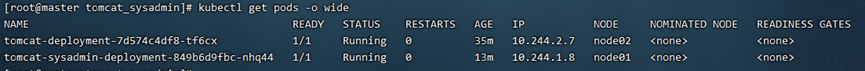

K8s 中deployment 和 service 是独立ip 端口不受影响

## 一、pod 操作

> **列出所有运行的Pod信息。**
>
> ```
> kubectl get pods
> ```
>
> **显示更多的pods列表信息(例如 pod的ip和所处的node)**
>
> >  -o wide/yaml/json 可以用不用格式查看，常用wide格式
> >
> > ```
> > kubectl get pods -o wide
> > ```
> >
> > 
> >
> > - ​    NAME：pod的名字
> >
> > - ​    IP：pod 中的独立ip
> >
> > - ​    AGE：运行时间
> >
> > - ​    NODE：镜像所在的node节点
>
> **查看pod 日志(如果pod有多个容器需要加-c 容器名)**
>
> ```
> kubectl logs –f pod name
> 
> kubectl logs –f pod name –c 容器名
> ```
>
> **重启pod容器**
>
> > 可以直接删除一个pod信息，然后会自动再重启一个新的pod节点从而实现重启容器（因为pod节点由副本控制，删除pod也会再重新拉起来）。
> >
> > kubectl delete pods pod的名字
> >
> > 例如 : 
> >
> > ```
> > kubectl delete pods tomcat-deployment-7d574c4df8-ctrlv
> > ```

## 二、deployment操作

> **列出deployment的所有信息以wide形式输出**
>
> > ```
> > kubectl get deployment –o wide –A
> > ```
> >
> > 
> >
> > - NAMESPACE：命名空间
> >
> > - NAME：deployment名字
> >
> > - UP-TO-DATE:最新部署副本数
> >
> > - AVAILBLE: 运行中的副本数
> >
> > - AGE: 已经运行的时间

## 三、查看 service 信息

> ```
> kubectl get service -o wide
> ```
>
> 
>
> - NAME：service 的名字
>
> - TYPE：serivce类型
>
> -  CLUSTER-IP：service在集群中的ip 是系统自动分配且独立的
>
> -  PORT(S)：端口信息

## 四、获取所有resource

```
kubectl get all
```

## 五、暂停容器

> 这里需要修改deployment中的副本，让副本为0使其失效，即修改spec中的replicas为0。（原来是让副本失效从而达到暂停容器的目的）
>
> 
>
> 修改 deployment 命令
>
> ```
> kubectl edit deployment deployment名字 –n NAMESPACE(命名空间)
> ```

## 六、查看k8s服务日志

```
journalctl -u kubelet –f
```

## 七、查看nodes

```
kubectl get nodes
或者
kubectl get node
```


## 八、namespace命名空间

> k8s默认会自动生成3个命名空间 
>
> - default：所有未指定Namespace的对象都会被分配在default命名空间。 
> - kube-system：所有由Kubernetes系统创建的资源都处于这个命名空间。
> - kube-public：此命名空间下的资源可以被所有人访问（包括未认证用户）。
> - kubectl get pods 查看的是默认default命名空间下的资源
> -  kubectl get pods –A 则是展示所有命名空间下的资源
>
> 1 查看现有命名空间
>
> ```
> kubectl get ns
> ```
>
> 
>
> 2 使用命令行创建
>
> ```
> kubectl create namespace test
> ```
>
> 
>
> 3 删除命名空间 
>
> ```
> kubectl delete ns test
> ```