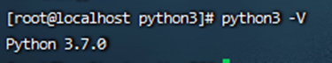

## 安装python3

1、默认情况下，Linux会自带安装Python，可以运行python --version命令查看

> ```
> python --version
> ```
>

2、查看Linux默认安装的Python位置

> ```
> whereis python
> 
> which python
> ```
>

3、安装python3

> 从官网下载[*https://www.python.org/ftp/python*](https://www.python.org/ftp/python)（这里我下载的是Python-3.7.0.tar.xz）
>
> ```
> mkdir -p /opt/python3
> 
> tar –xvf Python-3.7.0.tar.x
> ```
>

4、准备编译环境

> ```
> yum -y install gcc
> 
> yum -y install zlib-devel bzip2-devel openssl-devel ncurses-devel sqlite-devel readline-devel tk-devel gdbm-devel db4-devel libpcap-devel xz-devel libffi-devel make
> ```
>

5、编译安装

> 我的安装路径是/usr/bin/python3
>
> ```
> cd Python-3.7.0
> 
> # 这里我得安装路径是/usr/bin/python3
> ./configure --prefix=/usr/bin/python3 --enable-optimizations
> 
> make
> 
> make install
> 
> ```
>

6、进入到安装目录/usr/bin/python3，查看安装结果

> 应存在如下4个文件名：bin、include、lib、share
>

7、创建软链接

> 创建一个软链接并把软链接放到/usr/local/bin目录下
>
> ```
> # ln -s /安装路径/bin/python3.7 /usr/local/bin/python3
> 
> ln -s /usr/bin/python3/bin/python3.7 /usr/local/bin/python3
> ln -s /usr/bin/python3/bin/pip3 /usr/bin/pip3
> ```
>
> 查看创建结果
>
> ```
> ls -l /usr/local/bin
> ```
>

8、查看是否安装成功

> ```
> python3 --version
> ```
>
> 
>

9、配置环境变量

> 配置环境变量主要是能快速使用pip3安装命令
>
> ```
> vi ~/.bash_profile
> ```
>
> 最后一行进行添加：
>
> ```
> #配置python
> 
> export PYTHON_HOME=安装路径
> 
> export PATH=$PYTHON_HOME/bin:$PATH
> 
> :wq进行退出执行source ~/.bash_profile命令使配置生效
> 
> ```
>
> 执行echo命令，查看是否配置成功
>
> ```
> echo $PYTHON_HOME
> ```
>

10、查看安装的pip版本

> ```
> pip3 --version 或 pip3 –V 
> ```

