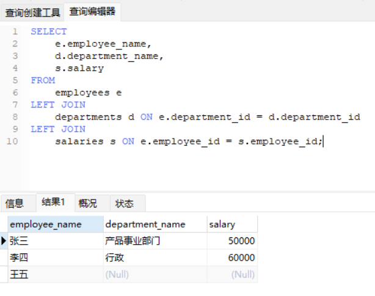

# Mysql 命令详解

## 一、  登录数据库

> 格式 mysql -h 主机地址 -u 用户名 -p 用户密码
>
> mysql -u 用户名 –p
>
> 输入指令后使用密码登录
>
> 

## 二、修改数据库密码

> 修改数据库本地账号密码  
>
> ```
> alter user 'root'@'localhost' identified by 'root';
> ```
>
> 或者
>
> ```
> set password = password(‘root’);
> ```
>
> 设置本地密码永不过期
>
> ```
> alter user 'root'@'localhost' password expire never;
> ```
>
>  使修改生效
>
> ```
> FLUSH PRIVILEGES;
> ```

## 三、数据库用户操作

### 1、查看现用用户

> 首先到mysql库中
>
> ```
> use mysql;
> ```
>
> 查询host,user 数据
>
> ```
>     select Host,User from user;
> ```
>
> 下面的列表就是查询user表后可以访问数据库的指定的Ip地址
>
> 

### 2、增加新用户

> grant 权限 on 数据库.表名 to ‘用户名’@’登录主机’ identified by "密码";
>
> 例：增加一个用户user密码为password，让其可以在本机上登录， 并对所有数据库有查询、插入、修改、删除的权限。首先用以root用户连入mysql，然后键入以下命令：
>
> ```
> grant select,insert,update,delete on *.* to'user'@'localhost' identified by "password";
> ```
>
> 如果希望该用户能够在任何机器上登陆mysql，则将localhost改为"%"。
>
> ```
> grant all on *.* to 'wang'@'localhosl' identified by "password";
> ```
>
> - 库名:要远程访问的数据库名称,所有的数据库使用“*”
>
> - 表名:要远程访问的数据库下的表的名称，所有的表使用“*”
>
> - 用户名:要赋给远程访问权限的用户名称
>
> - 登录主机:可以远程访问的电脑的IP地址，所有的地址使用“%”
>
> - 密码:要赋给远程访问权限的用户对应使用的密码

### 3、删除用户

> drop user '用户名'@'登录主机';
>
> ```
> drop user 'wang'@'192.168.101.148';
> ```
>
> 

### 4、查看用户权限

> show grants for ‘用户名’@’登录主机’;
>
> 添加一个本地登录只有查询和修改权限的user用户
>
> ```
> grant select, update on *.* to'user'@'localhost' identified by "password";
> ```
>
> 查看 user 用户权限
>
> ```
>   show grants for 'user'@'localhost';
> ```
>
> 

### 5、修改权限

> 删除 user用户的update 权限
>
> ```
> revoke update on *.* from 'user'@'localhost';
> ```
>
> 

### 6 、查看Mysql 当前登录用户

> ```
> select user();
> ```
>
> 

## 四、数据库及表管理

### 1、查看数据库

> ```
> show databases;
> ```
>
> 

### 2、查看数据中的表

> 首先进入数据库 use 数据库名;
>
> 显示库中的表结构
>
> ```
> show tables;
> ```
>
> 
>
> 查看表中所有字段的注释
>
> ```
> show full columns from 表名;
> ```

### 3、显示数据表结构

> ```
> describe 表名;
> desc 表名;
> ```
>
> 

### 4、查看表内容

> ```
> select 表字段 for 表名称 where 条件;
> ```
>
> 

### 5、查看表字段注释信息

```
show full columns from 表名;
show full columns from student;
```


## 五、mysqldump 导出库表详细举例

> 在mysql中有个测试库，下面有两个表student表和teachers表
>
> 

### 1、导出指定数据库

> mysqldump -u 用户名 -p数据库名 > 导出的文件名
>
> 导出test库下的所有表
>
> 

### 2、导出整个数据库

> 查询数据库，并吧查询数据重定向出来
>
> mysqldump -u 用户名 -p数据库名 –e “select * from …” > ~/nohup.out

### 3、导出一个表

> mysqldump -u 用户名 -p数据库名 表名> 导出的文件名
>
>    导出 test 库中的student表
>
> 

## 六 、sql查询命令

### 1、统计查询

> count() 括号中是*，是统计查询数据的所有行数，括号中是字段名，统计的是字段查询出来的行数。
>
> select count(*) from 表名 where 条件;

### 2、排序

> select * from 表名 where 条件 order by 表字段 asc; //asc 升序排列（默认） 
>
> select * from 表名 where 条件 order by 表字段 desc; //desc 降序排列 

### 4、分页

> select * from 表名 where 条件 limit 10; //在页面中展示10行数据 

### 5、函数

```
1. CONCAT CONCAT函数可以将多个字符串连接在一起，例如：
SELECT CONCAT('Hello', ' ', 'World');
结果为：'Hello World'
select concat(列名1,列名2) from 表名

2. SUBSTRING

SUBSTRING函数可以截取字符串中的一部分，例如：
SELECT SUBSTRING('Hello World', 1, 5);
结果为：'Hello'
select substring(列名,1,5) from 表名

3. LENGTH
LENGTH函数可以计算字符串的长度，例如：
SELECT LENGTH('Hello World');
结果为：11
select length(列名) from 表名

4. NOW
NOW函数可以获取当前时间，例如：
SELECT NOW();
结果为：'2022-08-08 16:32:28'

5. DATE_FORMAT DATE_FORMAT函数可以将日期格式化为特定的格式，例如：
SELECT DATE_FORMAT(NOW(), '%Y-%m-%d %H:%i:%s');
结果为：
'2022-08-08 16:32:28'

6. YEAR YEAR函数可以获取日期中的年份，例如：
SELECT YEAR('2022-08-08');
结果为：2022
7. MONTH
MONTH函数可以获取日期中的月份，例如：
SELECT MONTH('2022-08-08');
结果为：8
8. DAY DAY函数可以获取日期中的日份，例如：
SELECT DAY('2022-08-08');
结果为：8
16. HOUR HOUR函数可以获取时间中的小时，例如：
SELECT HOUR(NOW());
结果为：16

19. SUM SUM函数可以计算给定列的总和，例如：
SELECT SUM(price) FROM products;
结果为：1162.57

20. COUNT COUNT函数可以计算指定列的行数，例如：
SELECT COUNT(*) FROM orders;
结果为：54
```

## 七、多表联合查询

1. **INNER JOIN（内连接）**：

   - INNER JOIN返回两个表中字段匹配的行。
   - 它显示了两个表中都满足条件的记录。
   - 与join不同的是，INNER JOIN需要明确指定连接条件，即ON子句。
   - 当使用join不带任何类型指定时，默认行为与INNER JOIN相同，但INNER JOIN明确表明了连接类型，使SQL语句更加清晰易懂。

2. **LEFT JOIN（左连接）**

   - LEFT JOIN返回左表中的所有记录以及右表中与左表中联接字段相等的记录。

   - 如果右表中没有匹配的记录，则用NULL填充。

   - LEFT JOIN通常用于查询某个表中的所有数据，并且希望将这些数据与另一个表中的数据进行关联。

3. **RIGHT JOIN（右连接）**

   - RIGHT JOIN返回右表中的所有记录和左表中匹配的记录。

   - 如果左表中没有匹配的记录，则结果集中左表的部分显示为NULL。

   - RIGHT JOIN更适用于查询某个表中的特定数据，并且希望将这些数据与另一个表中的所有数据进行关联。

```
SELECT 
    e.employee_name, 
    d.department_name
FROM 
    employees e
LEFT JOIN 
    departments d ON e.department_id = d.department_id;
employees 表是左表（别名为 e）。
departments 表是右表（别名为 d）。
```

笔记：

部门表


员工表


项目表


工资表


```
# 查询示例INNER JOIN（内连接）
# 获取有分配部门和薪资的员工信息：
SELECT 
    e.employee_name, 
    d.department_name, 
    s.salary
FROM 
    employees e
INNER JOIN 
    departments d ON e.department_id = d.department_id
INNER JOIN 
    salaries s ON e.employee_id = s.employee_id;
```


```
LEFT JOIN（左连接）
获取所有员工及其部门（如果有的话）和薪资（如果有的话）：

SELECT 
    e.employee_name, 
    d.department_name, 
    s.salary
FROM 
    employees e
LEFT JOIN 
    departments d ON e.department_id = d.department_id
LEFT JOIN 
    salaries s ON e.employee_id = s.employee_id;
```



```
RIGHT JOIN（右连接）
SELECT 
    d.department_name, 
    e.employee_name
FROM 
    departments d
RIGHT JOIN 
    employees e ON d.department_id = e.department_id;
```


