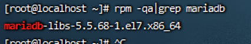
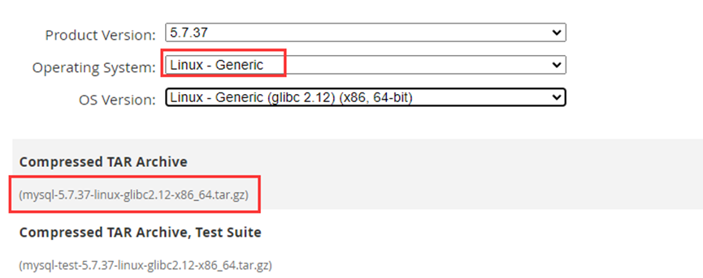
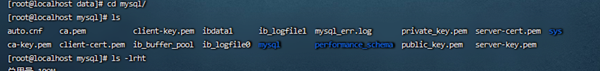
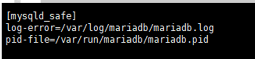
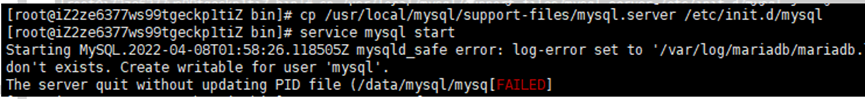
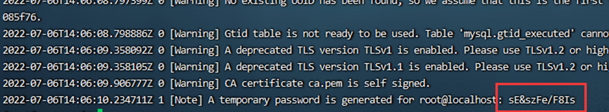

# Mysql-Linux安装文档

## 一、前期准备工作

### 1、检查系统是否安装mysql

> ```
> rpm -qa|grep mariadb
> ```
>
> 
>
> 如果有，删除安装的mysql
>
> ```
>  yum remove mariadb-libs-5.5.68-1.el7.x86_64
> ```
>


### 2、关闭防火墙、关闭selinux

> 关闭selinux
>
> ```
> sed -i 's/enforcing/disabled/' /etc/selinux/config
> ```
>
> SELinux共有3个状态enforcing （执行中）、permissive （不执行但产生警告）、disabled（关闭）。
>
> ```
> 执行命令 getenforce 检查是否关闭selinux
> ```
>
> 
>
> 关闭防火墙
>
> ```
> systemctl status firewalld  		查看防火墙是否关闭
> 
> systemctl stop firewalld  			暂时关闭防火墙
> 
> systemctl disable firewalld 		永久关闭防火墙
> ```
>
> 
>

## 二、安装Mysql

### 1、下载安装包

> 去mysql官网下载适合版本的mysql（https://dev.mysql.com/）
>
> MySQL Downloads ==> MySQL Community Server ==> Archives
>
> 

### 2、解压

> 将下载好的安装包解压到/usr/local下并重命名mysql

### 3、创建用户和组

> ```
> groupadd mysql
> ```
>
> ```
> useradd -r -g mysql mysql
> ```
>

### 4、赋权限

> 在/use/local/mysql/data 下创建一个mysql数据目录，并赋予权限
>
> ```
> mkdir -p /usr/local/mysql/data/mysql 
> ```
>
> ```
> chown mysql:mysql –R /usr/local/mysql/data/mysql
> ```
>

### 5、初始化安装依赖包

> ```
> yum install libaio
> ```
>

### 6、配置my.cnf

> 首先切换到文件所在目录/etc备份这文件 
>
> vi /etc/my.cnf
>
> ```
> [client]
> 
> port=3306
> 
> [mysqld]
> 
> # 将bind-address后面增加远程访问IP地址或者禁掉这句话就可以让远程机登陆访问了
> 
> # bind-address=192.168.37.113
> 
> datadir=/usr/local/mysql/data/mysql
> 
> basedir=/usr/local/mysql
> 
> socket=/tmp/mysql.sock
> 
> user=mysql
> 
> port=3306
> 
> log-error=/usr/local/mysql/data/mysql/mysql_err.log
> 
> pid-file=/usr/local/mysql/data/mysql/mysql.pid
> 
> character-set-server=utf8
> 
> explicit_defaults_for_timestamp=true
> 
> symbolic-links=0
> 
>  
> 
> [mysqld_safe]
> 
> log-error=/var/log/mariadb/mariadb.log
> 
> pid-file=/var/run/mariadb/mariadb.pid
> 
> !includedir /etc/my.cnf.d
> ```
>

### 7、初始化数据库

> 切换到Mysql安装目录的bin目录下
>
> ```
> cd /usr/local/mysql/bin
> ```
>
> ```
> ./mysqld --initialize --user=mysql --datadir=/usr/local/mysql/data/mysql --basedir=/usr/local/mysql
> ```
>
> 
>

### 8、配置环境变量

> ```
> vim /etc/profile
> ```
>
> ```
> export PATH=$PATH:/usr/local/mysql/bin
> ```
>

### 9、设置开机自启

> ```
> cp /usr/local/mysql/support-files/mysql.server /etc/init.d/mysql
> ```
>

### 10、启动mysql

> 先将mysql.server放置到/etc/init.d/mysql中
>
> ```
> cp /usr/local/mysql/support-files/mysql.server /etc/init.d/mysql
> ```
>

### 11、启动mysql

> ```
> service mysql start
> ```
>
> 启动会报错找不到配置文件中的文件
>
> 
>
> 下面是报错内容：
>
> 
>
> 解决办法：
>
> 创建文件并赋予权限
>
> ```
> touch /var/log/mariadb/mariadb.log
> ```
>
> ```
> chown -R mysql:mysql /var/log/mariadb/
> ```
>
> 接着启动mysql
>
> ```
> service mysql start
> ```


### 12、修改密码

> 查看密码
>
> ```
> cat /usr/local/mysql/data/mysql/mysql_err.log
> ```
>
> 
>
> 切换到mysql的bin目录下,登录mysql
>
> ```
>    ./mysql -u root –p
> ```
>
> 修改数据库本地账号密码     
>
> ```
> alter user 'root'@'localhost' identified by 'root';
> ```
>
> 或者
>
> ```
> set password = password(‘root’);
> ```
>
> 设置本地密码永不过期
>
> ```
> alter user 'root'@'localhost' password expire never;
> ```
>
> 使修改生效
>
> ```
> FLUSH PRIVILEGES;
> ```