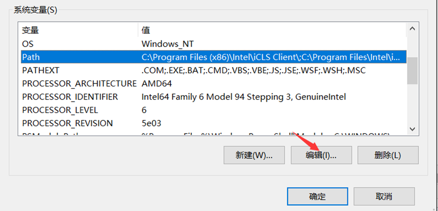

# Mysql-zip-windows安装

## 1、下载

> 去mysql官网下载适合版本的mysql（https://dev.mysql.com/）
>
> MySQL Downloads ==> MySQL Community Server ==> Archives

## 2、配置环境变量

> 之后在里边新建一条，将你mysql解压之后的bin目录写进去
>
> 

## 3、 配置初始化的配置文件my.ini

> 和bin文件夹在同一目录下，新建记事本，在里边粘贴下边代码
>
> 
>
> 注释：my.ini 在附件

## 4、然后以管理员身份运行cmd

> 直接输入mysqld --initialize --console 执行
>
> 执行完成后，其中有一行话temporary password is generated for root@localhost:，
>
> @localhost:后的就是root用户的初始密码，这个密码之后会用到

 

##  5、  安装服务

> 在cmd中执行mysqld --install 服务名
>
> 可以不写服务名，默认是mysql，如果需要安装多个服务，那么可以起其他的名字。

## 6、服务启动。

> 安装完成后在cmd中执行 net start mysql，那么

## 7、登录mysql客户端

> 接下来登录mysql客户端，以root用户登录：在cmd中执行 mysql -u root -p
>
> 然后输入之前记下的密码

## 8、mysql就登录成功了。

> 想改密码可以在mysql中输入
>
> ALTER USER 'root'@'localhost' IDENTIFIED WITH mysql_native_password BY '新密码';
>
> 至此mysql的zip安装完成。
>
> 参考链接：https://www.cnblogs.com/sfencs-hcy/p/9769505.html