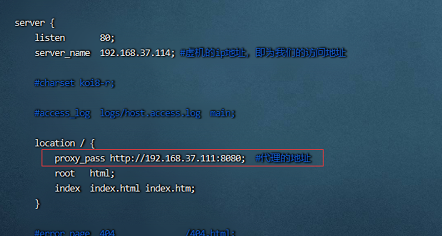
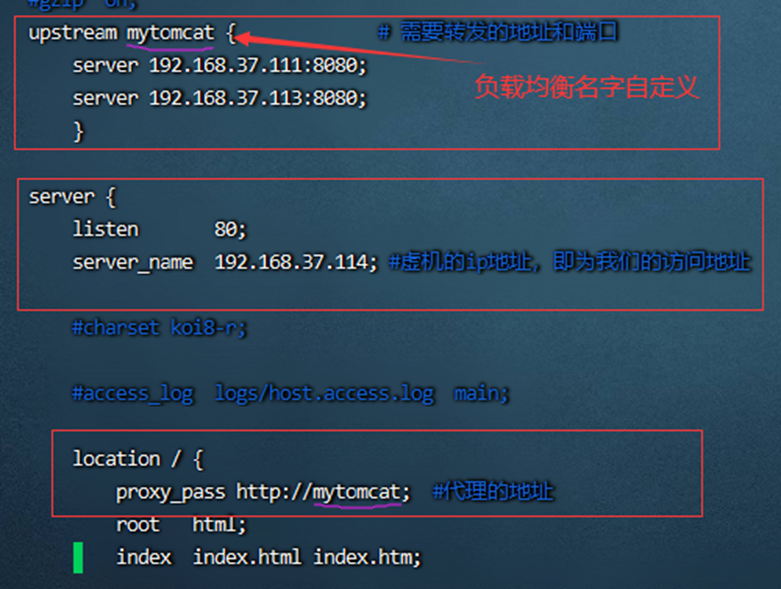

# nginx作用

**在日常开发过程中nginx的主要作用是反向代理、负载均衡。**

## 一、反向代理

反向代理应该是Nginx做的最多的一件事了。反向代理（Reverse Proxy）方式是指以代理服务器来接受internet上的连接请求，然后将请求转发给内部网络上的服务器，并将从服务器上得到的结果返回给internet上请求连接的客户端，此时代理服务器对外就表现为一个反向代理服务器。简单来说就是真实的服务器不能直接被外部网络访问，所以需要一台代理服务器，而代理服务器能被外部网络访问的同时又跟真实服务器在同一个网络环境，当然也可能是同一台服务器，端口不同而已。

​		下面贴上一段简单的实现反向代理的代码：

直接从外网访问 http://192.168.37.114:80 就可以通过nginx 跳转到内网代理地址 http://192.168.37.111:8080，此为反向代理。

注意：代理地址不一定是ip，也可以是域名。

## 二、负载均衡

### 1、负载均衡的作用

1、转发功能

按照一定的算法【权重、轮询】，将客户端请求转发到不同应用服务器上，减轻单个服务器压力，提高系统并发量。

2、故障移除

通过心跳检测的方式，判断应用服务器当前是否可以正常工作，如果服务器期宕掉，自动将请求发送到其他应用服务器。

3、恢复添加

如检测到发生故障的应用服务器恢复工作，自动将其添加到处理用户请求队伍中。

二、Nginx实现负载均衡（常有轮询法和加权轮询法）

1、源地址哈希法：根据获取客户端的IP地址，通过哈希函数计算得到一个数值，用该数值对服务器列表的大小进行取模运算，得到的结果便是客服端要访问服务器的序号。采用源地址哈希法进行负载均衡，同一IP地址的客户端，当后端服务器列表不变时，它每次都会映射到同一台后端服务器进行访问。

2、轮询法：将请求按顺序轮流地分配到后端服务器上，它均衡地对待后端的每一台服务器，而不关心服务器实际的连接数和当前的系统负载。

3、随机法：通过系统的随机算法，根据后端服务器的列表大小值来随机选取其中的一台服务器进行访问。

4、加权轮询法：不同的后端服务器可能机器的配置和当前系统的负载并不相同，因此它们的抗压能力也不相同。给配置高、负载低的机器配置更高的权重，让其处理更多的请；而配置低、负载高的机器，给其分配较低的权重，降低其系统负载，加权轮询能很好地处理这一问题，并将请求顺序且按照权重分配到后端。

5、加权随机法：与加权轮询法一样，加权随机法也根据后端机器的配置，系统的负载分配不同的权重。不同的是，它是按照权重随机请求后端服务器，而非顺序。

6、最小连接数法：由于后端服务器的配置不尽相同，对于请求的处理有快有慢，最小连接数法根据后端服务器当前的连接情况，动态地选取其中当前积压连接数最少的一台服务器来处理当前的请求，尽可能地提高后端服务的利用效率，将负责合理地分流到每一台服务器。

### 2、nginx.conf配置

1、轮询 （默认采用轮询方式）轮询访问

2、权重

再4次访问众，上述会出现访问1次111，访问3次113 的情况

3、最少连接

