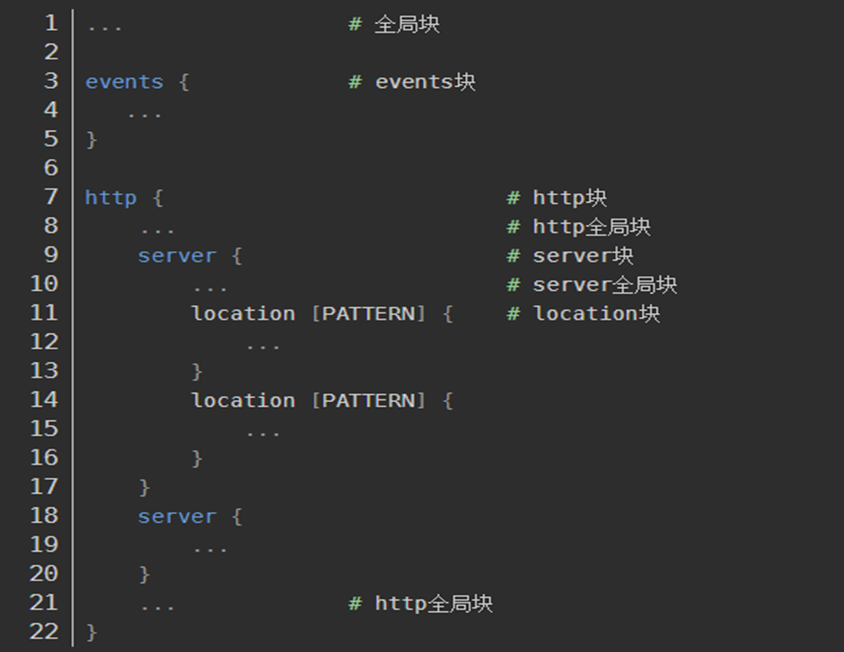

## ngxin.conf 配置

### 1、   nginx.conf 文件配置结构

- 全局块： 配置影响 nginx 全局的指令。一般有运行 nginx 服务器的用户组、nginx 进程 pid 存放路径、日志存放路径、配置文件引入、允许生成 worker process 数等；
- Events 块： 配置影响 nginx 服务器或与用户的网络连接。有每个进程的最大连接数、选取哪种事件驱动模型处理连接请求、是否允许同时接受多个网路连接、开启多个网络连接序列化等；
- Http 块： 可以嵌套多个 server、配置代理、缓存、日志定义等绝大多数功能和第三方模块的配置。如文件引入、mime-type 定义、日志自定义、是否使用 sendfile 传输文件、连接超时时间、单连接请求数等；
- Server 块： 配置虚拟主机的相关参数，一个 http 中可以有多个 server；
- Location 块： 配置请求的路由，以及各种页面的处理情况。

注意：Nginx 配置的注释是以 # 开头，并且每条语句都要以 ; 结束，除了语句块 {}。