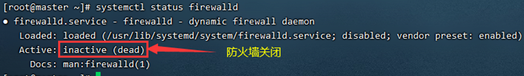

# openVPV

参考链接：https://zhuanlan.zhihu.com/p/199176752

## 1、前期准备工作

> 1. 关闭防火墙
>
>    ```
>    systemctl status firewalld      	查看防火墙是否关闭
>    
>    systemctl stop firewalld	    	暂时关闭防火墙
>    
>    systemctl disable firewalld   		永久关闭防火墙
>    ```
>
>    
>
> 2. 关闭selinux
>
>    > SELinux共有3个状态enforcing （执行中）、permissive （不执行但产生警告）、disabled（关闭）
>
>    ```
>    sed -i 's/enforcing/disabled/' /etc/selinux/config
>    ```
>
> 3. 执行命令 getenforce 检查是否关闭 selinux
>
>    
>
> 4. 关闭swap（关闭内存交换）
>
>    ```
>    swapoff –a  			 # 临时关闭
>    
>    vi /etc/fstab  			 # 永久关闭，注释这一行: swap defaults 0 0
>    ```
>
> 5. 检查swap 是否关闭
>
>    > 查看swap是否全为0，全部为零则已经关闭内存交换
>
>    ```
>    free -m 
>    ```
>

## 2、安装epel仓库和openvpn, Easy-RSA

```
yum -y install epel-release && yum -y install openvpn easy-rsa
```

## 3、配置EASY-RSA 3.0

在/etc文件夹下面创建openvpn并在openvpn下创建easy-rsa文件夹，并把相关文件复制进去（此处可能版本会不同，根据实际情况进行复制）

```
cp -r /usr/share/easy-rsa/3/* /etc/openvpn/easy-rsa/
cp –p /usr/share/doc/easy-rsa-3.0.6/vars.example /etc/openvpn/easy-rsa/vars
```

根据需求更改配置vars，配置如下：


## 4、创建OpenVPN相关的密钥

我们将创建CA密钥，server端、client端密钥，DH和CRL PEM, TLS认证钥匙ta.key，首先切换到easy-rsa文件下。

```
cd /etc/openvpn/easy-rsa/
```

## 5、创建服务端证书及key

进入/etc/openvpn/easy-rsa/目录

**5.1 初始化PKI目录**

```
./easyrsa init-pki
```

**5.2 创建根证书** （nopass 不需要设置密码)

```
./easyrsa build-ca nopass 
```


注意：还需要输入common name 通用名，这个你自己随便设置个独一无二的。（执行后生产根证书ca.crt、跟密钥ca.kay）

**5.3 创建服务器密钥**

创建服务器密钥名称为 server1.key

```
./easyrsa gen-req server1 nopass
```

添加nopass 选项，是指不需要为密钥添加密码。


注意：该过程中需要输入common name，随意但是不要跟之前的根证书的一样（执行后生产服务器证书server1.crt、服务器密钥server1.key）

**5.4 用CA证书签署server1密钥**

```
 ./easyrsa sign-req server server1
```


**5.5 创建客户端密钥**

创建客户端密钥名称为 client1.key（client1可自定义）

```
./easyrsa gen-req client1 nopass
```


```
注意：该过程中需要输入common name，随意定义。（执行后生产客户端证书client1.crt、客户端密钥client1.key）
```

**5.6 用CA证书签署client1密钥**
./easyrsa sign-req client client1


需要手动输入 yes

**5.7 创建DH密钥 （这个过程需要等待一段时间）**

```
./easyrsa gen-dh 
```


(执行完成后生产密钥交换文件dh.pem)

**5.8 创建TLS认证密钥**

```
openvpn --genkey --secret /etc/openvpn/easy-rsa/ta.key
```

作用：拒绝服务器攻击证书文件

**5.9 生成 证书撤销列表(CRL)密钥**

CRL(``证书撤销列表``)``密钥用于撤销客户端密钥。如果服务器上有多个客户端证书，希望删除某个密钥，那么只需使用下面命令撤销即可

```
./easyrsa revoke NAME
```

生成``CRL``密钥：

```
./easyrsa gen-crl
```


## 6 、复制证书文件

复制ca证书，ta.key和server端证书及密钥到/etc/openvpn/server文件夹里。

```
cp -p pki/ca.crt /etc/openvpn/server/

cp -p pki/issued/server1.crt /etc/openvpn/server/

cp -p pki/private/server1.key /etc/openvpn/server/

cp -p ta.key /etc/openvpn/server/
```

复制ca证书，ta.key和client端证书及密钥到/etc/openvpn/client文件夹里

```
cp -p pki/ca.crt /etc/openvpn/client/

cp -p pki/issued/client1.crt /etc/openvpn/client/

cp -p pki/private/client1.key /etc/openvpn/client/

cp -p ta.key /etc/openvpn/client/
```

复制dh.pem , crl.pem到/etc/openvpn/client文件夹里

```
cp pki/dh.pem /etc/openvpn/server/

cp pki/crl.pem /etc/openvpn/server/
```

## 7、修改OpenVPN配置文件

复制模板到主配置文件夹里面

```
cp -p /usr/share/doc/openvpn-2.4.8/sample/sample-config-files/server.conf /etc/openvpn/server/
```

```
例如：查看配置如下cat server.conf |grep '^[^#|^;]'
```


## 8、开启路由转发

```
echo 'net.ipv4.ip_forward = 1' >> /etc/sysctl.conf
```

```
输入 sysctl –p 查看是否开启
```


## 9、启动openvpn服务并开机启动

```
#启动服务
systemctl enable openvpn-server@server

#设置开机启动
systemctl start openvpn-server@server

#重启服务
systemctl restart openvpn-server@server
```

## 10、检查一下服务是否启动

```
netstat –tlunp
```


```
systemctl status openvpn-server@server
```


## 11、**OpenVPN 客户端安装**

```
cp -p /usr/share/doc/openvpn-2.4.8/sample/sample-config-files/client.conf /etc/openvpn/client/
```

输入 `cat client.conf |grep '^[^#|^;]'` 查看配置如下


1. 更改client.conf文件名为client.ovpn，然后把/etc/openvpn/client文件夹打包压缩，并将解压好的配置文件导出。

2. 在需要远程服务器的win10 机器上按照openvpn客户端，客户端程序在附件中。

3. 客户机安装openvpn-install-2.4.8-I602-Win10该软件包，安装完成之后解压刚才的client.tar.gz压缩包，把里面的文件复制到C:\Program Files\OpenVPN\config

4. 然后点击桌面上的OpenVPN GUI以管理员身份运行

   

5.   电脑右下角有一个小电脑

   

6. 右键点击连接，连接成功之后小电脑变成绿色。


**注意事项**

> 做实验时在测试环境做的。如果在真实环境操作，请在出口防火墙添加端口映射，开放openvpn的端口1194 tcp和udp协议的。
>
> **证书文件整合**
>
> ca.crt | client1.crt | client1.csr | client1.key | client.ovpn 合并成一个文件：
>
> 把ca.crt证书放入client.ovpn配置文件
>
> 如果你有好几个网站的openvpn配置你可以在config目录下为每一个网站建一个文件夹，也可以都放在config目录下，不过是不是有很多.crt和.key文件很烦人呀，其实你可以把它们都删除了，只需要把他们放入client.ovpn配置文件。
>
> 用写字板打开各个client.ovpn文件在最后面添加
>
> <ca>
>
> </ca>
>
> <cert>
>
> </cert>
>
> <key>
>
> </key>
>
> key-direction 1
>  <tls-auth>
>
> </tls-auth>
>
> 用记事本打开ca.crt把文件内容复制到<ca>和</ca>的中间，
>
> 用记事本打开client.crt把文件内容复制到<cert>和</cert>的中间，
>
> 用记事本打开client.key把文件内容复制到<key>和</key>的中间，
>
> 用记事本打开ta.key把文件内容复制到<tls-auth>和</tls-auth>的中间，
>
> （ca.crt、client.crt、client.key、ta.key这些文件不一定全都与，有那些就修改那些；这些文件的名字不一定都是这样，可以在.ovpn配置文件里搜索ca、cert、key、tls-auth看他们所对应的文件名）
>
> 修改完成后删除类似
>
> tls-auth ta.key 1
>  ca ca.crt
>  cert client.crt
>  key client.key
>
> 的那几行，然后保.ovpn文件即可删除那些.crt和.key文件而正常使用了。
>
> 对了，若有ddns或者IP映射和固定域名，记得修改.ovpn文件中的remote 属性
>
> ```
> remote 192.168.3.122 1194
> ```
>
> **win10客户端连接过程中会提示2个警告信息**
>
> **警告1：Fri May 08 00:19:05 2020 WARNING: --ns-cert-type is DEPRECATED. Use --remote-cert-tls instead.**
>
> 解决：
>
> ```
> #win客户端修改配置文件注释一个和添加一个
> ;ns-cert-type server
> remote-cert-tls server
> ```
>
> **警告2：Fri May 08 00:19:06 2020 WARNING: this configuration may cache passwords in memory -- use the auth-nocache option to prevent this**
>
> 解决：
>
> ```
> #win10客户端配置文件添加
> auth-nocache
> ```
>
> **客户端链接**
>
> 链接: [https://pan.baidu.com/s/1fq6Rmt_NdeOzn_CInXWP_g](https://link.zhihu.com/?target=https%3A//pan.baidu.com/s/1fq6Rmt_NdeOzn_CInXWP_g)
>
> 本文原创地址：[https://www.linuxprobe.com/centos7-config-openvpn-one.html](https://link.zhihu.com/?target=https%3A//www.linuxprobe.com/centos7-config-openvpn-one.html)
>
> 本文原创地址：[https://www.linuxprobe.com/centos7-](https://link.zhihu.com/?target=https%3A//www.linuxprobe.com/centos7-config-openvpn-two.html)
>
>  
>
> (
>
> 基于Linux平台下的VPN服务器
>
> openvpn
>
> 模拟实验环境
>
> vment1:192.168.0.0/24 企业内网
>
> vment8:172.16.0.0/16 internet 外网
>
> 1.CentOS7 （vpn服务器）
>
> 内网 à vment1 à 192.168.0.0
>
> 外网 à vment8 à 192.168.0.0
>
> 2.Window10 (公网用户) à vment8 à 192.168.0.0
>
> Window7 (企业内网服务器) à vment1 à 192.168.0.0
>
> )
>
>  