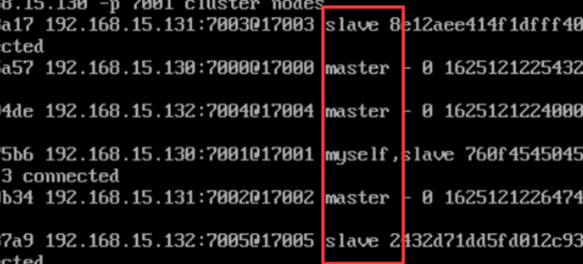

# Redis集群搭建

转载来源：https://www.cnblogs.com/Dfengshuo/p/11912061.html

## 1、Redis三主三从集群规划

> 10.0.128.19  使用端口 7000  7001
>
> 10.0.128.20  使用端口 7002  7003
>
> 10.0.128.21  使用端口 7004  7005

## **2.** 安装redis及依赖包 （3台）

> 1. 下载安装包 https://redis.io/
>
> 2. 将下载的源码包解压到/usr/local下（并重命名为redis）。
>
> 3. 检查系统是否安装gcc，如果没有需要下载
>
>    ```
>    yum -y install tcl gcc
>    ```
>
>    
>
> 4. cd /usr/local/redis
>
> 5. make MALLOC=libc
>
> 6. cd src
>
> 7. make test(如下图所示说明成功)
>
>    
>
> 8. make install

## **3.** **关闭防火墙**

> 检查防火墙状态
>
> ```
> systemctl status firewalld
> ```
>
> 如果防火墙开启，设置永远关闭
>
> ```
> systemctl disable firewalld
> ```

## 4、创建配置文件存放位置

> 在redis文件下建一个cluster文件夹
>
> 节点1 (10.0.128.19)
>
> ```
> mkdir -p /usr/local/redis/cluster/7000
> 
> mkdir -p /usr/local/redis/cluster/7001
> ```
>
> 节点2 (10.0.128.19)
>
> ```
> mkdir -p /usr/local/redis/cluster/7002
> 
> mkdir -p /usr/local/redis/cluster/7003
> ```
>
> 节点3 (10.0.128.19)
>
> ```
> mkdir -p /usr/local/redis/cluster/7004
> 
> mkdir -p /usr/local/redis/cluster/7005
> ```

## **5.** **配置文件分别拷贝到3个节点的6个文件夹里**

```
cp /usr/local/redis/redis.conf /usr/local/redis/cluster/700X
```

## **6.** **修改配置文件**

```
# 六个节点都需要修改
vi /usr/local/redis /cluster/700X/redis.conf 
```

修改配置文件内容如下几个：

1、设置端口（默认端口为6379）

port 6379 ==> port 7000 

2、 设置ip 

bind 127.0.0.1==> bind 10.0.128.19

3、用守护线程的方式启动 

daemonize no ==> daemonize yes  

4、运行记录

pidfile /var/run/redis_6379.pid ==> pidfile /var/run/redis_7000.pid

5、开启集群模式此redis实例作为集群的一个节点

打开注释：cluster-enabled yes ==> cluster-enabled yes 

6、用于记录集群中有哪些节点

cluster-config-file nodes-6379.conf ==> cluster-config-file nodes-7000.conf
cluster-node-timeout 15000 ==> cluster-node-timeout 15000

7、开启AOF持久化

appendonly no ==> appendonly yes 

## **7.** **启动服务（手动启动）**

分别在三个节点启动服务，每个节点启动2个，共6个redis（注意，在手动启动时候要进入700X文件夹下去启动,因为在哪里启动，运行文件就会在哪里生产）

```
cd usr/local/redis /cluster/700X
```

```
redis-server redis.conf
```

## **1.** **设置开机自动启动**

这里使用init.d方式

1. cd /etc/init.d 下创建一个redis文件

2. vim redis (内容如下)

   ```
   #!/bin/sh
   # chkconfig: 2345 10 90  
   # description: Start and Stop redis  
   cd /usr/local/redis/bin/cluster/7000
   redis-server redis.conf
   cd /usr/local/redis/bin/cluster/7001
   ```

3. 设置redis 权限

   ```
   chmod 755 /etc/init.d/redis
   ```

4. 启动redis

   ```
   ./redis
   ```

5. 设置开机启动

   ```
   cd /etc/init.d/
   chkconfig redis on (设置开机自启)
   chkconfig –-list （查看所有脚本）
   chkconfig –- del 脚本名  （删除） 
   ```

## `9. `**创建集群（redis没有密码）**

redis-cli –cluster create 前三个是主节点（**master**）后三个是从节点（**slave**）--cluster-replicas 1

replicas 1 表示我们希望为集群中的每个主节点创建一个从节点

redis-cli --cluster create 10.0.128.19:7000（节点1的主） 10.0.128.22：7002（节点2的主） 10.0.128.23:7004（节点3的主） 10.0.128.19:7001（节点1的从） 10.0.128.22:7003（节点2 的从） 10.0.128.23:7005（节点3的从） --cluster-replicas 1

如下图创建成功：


查看属性

```
redis-cli -h 10.0.128.19 -p 7001 cluster nodes查看节点情况
```



进命令行执行

```
  [root@VM_0_22_centos 7003]# redis-cli -h 10.0.128.19 -p  7000 -c  
  10.0.128.19:7000> cluster info  
  10.0.128.19:7000> cluster nodes （查看主备分配是否正确）  
```

## **10.** **高可用测试**

重启某一节点后，查看集群状态是否正常。

可以关闭某一个主节点，比如：10.0.128.19的7000 节点，然后进行查看主从分配状态，查看7000的主节点状态是否master,fail的状态，再次启动7000节点查看7000节点状态.

1. 一组Redis Cluster是由多个Redis实例组成，官方推荐使用6实例，其中3个为主节点，3个为从节点。
2. 一旦有主节点发生故障的时候，Redis Cluster可以选举出对应的从节点成为新的主节点，继续对外服务，从而保证服务的高可用性。
3. 将其中一个redis-master停止掉后、其对应的slave节点会被选举为master节点，旧master节点重新恢复时，其角色会成为slave。

## **11.** 创建集群后，想要重新指定节点为master或者slave

把集群节点全部停止服务，然后删除每台节点aof、rdb、nodes.conf文件删除（友情建议：备份后再删除），然后再重新执行创建集群的命令，按照自己需求重新指定主从节点。

## 12. Redis集群中使用哈希槽来存储客户端的key。

​		在Redis中有16384个哈希槽，如果有集群中有三个节点A，B，C。哈希槽会进行评价分配。

A(slot[0-5500]) B(slot[5501-11000]) C(slot[11001-16384]).  slot 槽节点是平均分配在master节点上的.

​		集群中具有A、B、C三个节点，如果节点B失败了，整个集群就会缺少5501-11000这个范围的槽而不可用为每个节点添加一个从节点A1、B1、C1，整个集群便有三个master节点和三个slave节点组成，在节点B失败后，集群便会选举B1为新的主节点继续服务当B和B1都失败后，集群将不可用。

1. slot 槽节点是存在于Redis集群的master节点中的, 而在slave从节点中是没有槽节点的.
2. slot 槽节点是`平均`分配在master节点上的


3. slot 槽节点是用来保存数据的.


​		在读数据时候输入get key。屏幕下显示 Redirected to slot[741] located at 192.168.15.130:7000 表示重定向到 ip地址为192.168.15 的机器端口为7000 的节点，哈希槽为741 中存储的数据。

## 13． 主从

1. 将数据库复制多个副本部署在不同的服务器上，这样即使有一台服务器出现故障，其他服务器依然可以继续使用。为此redis提供了复制creplication功能，可以实现当一台数据库中的数据更新后自动将更新的数据库同步到其他数据中。

2. 数据库分为两类：

   - 主数据库（master）主数据库可以进行读写操作，当写操作导致数据库变化时会自动同步到从数据库。

   - 从数控库（slave）一般是只读的，并接受主数据库同步过来的数据。

​				一个主 ==> 多个从   一个从 ==> 一个主。

## 14.Redis数据库常用命令

key相关命令

-   set:存放数据
-   get:获取数据
-   keys:获取符合规则的建值列表
-   exists：判断键值是否存在
-   del：删除当前数据库的指定key
-   type:获取key对应的value值类型
-   rename（覆盖）/renamenx(不覆盖)：对已有的key进行重命名
-   dbsize：查看当前数据库中key的数目

## 15. 持久化概述

  		Redis是运行在内存中，内存中的数据断电丢失

 		为了能够重用Redis数据，或者防止系统故障，需要将Redis中Redis中的数据写入到磁盘空间，即持久化。配置文件中的appendonly修改为yes，开启AOF持久化。开启后，启动redis服务端，发现多了一个appendonly.aof文件。

## 16． Redis集群为啥至少要有三个主节点

​		群集规范( [*http://redis.io/topics/cluster-spec*](javascript:void()))没有说明此要求的原因.我想这是因为故障检测和故障转移过程都要求大多数主节点达成协议.如果我们只有2个主设备而一个设备发生故障,则另一个主节点无法根据协议做出决定.它是否正确？

## 17. 集群的fail状态

一、节点的fail

​		节点的fail是通过集群中超过半数的节点检测失效时才生效，这里会触发选举，将slave升级为master

二、集群的fail

​		如果集群任意master挂掉,且当前master没有slave.集群进入fail状态,也可以理解成进群的slot映射[0-16383]不完成时进入fail状态.

​		如果集群超过半数以上master挂掉，无论是否有slave集群进入fail状态.