# Zabbix 监控

## Zabbix 监控入门基础

### 1、Linux主机监控

学习通过apt/yum 安装zabbix agent，对 linux 主机 进行监控

这里zabbix 服务端系统为ubuntu20.04，客户端为centos7

1. zabbix agent安装：

   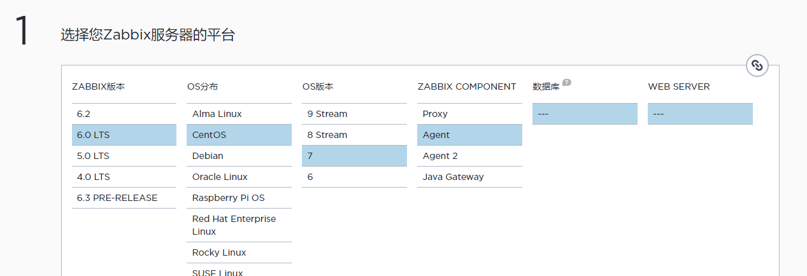

   ```
   # 安装Zabbix库
   rpm -Uvh https://repo.zabbix.com/zabbix/6.0/rhel/7/x86_64/zabbix-release-6.0-4.el7.noarch.rpm
   
   yum clean all
   
   # 安装Zabbix代理
   yum install zabbix-agent
   
   # 启动Zabbix 服务并设置开机自启
   systemctl restart zabbix-agent
   systemctl enable zabbix-agent
   ```

2. zabbix agent 配置文件：

   ```
   vim /etc/zabbix/zabbix_agentd.conf
   
   # 指向当前zabbix server
   Server=192.168.101.103
   
   # 监听端口
   ListenPort=10050
   
   # 被动状态时默认启动的实例数（进程数），为 0 不监听任何端口
   
   # 区分大小写且在zabbix server 唯一的值，（这里设计的本机ip）
   Hostname=192.168.101.104
   ```

3. 重启zabbix agent

   ```
   # 重启 zabbix agent
   systemctl restart zabbix-agent
   
   # 检查 运行状态
   systemctl status zabbix-agent
   
   ● zabbix-agent.service - Zabbix Agent
      Loaded: loaded (/usr/lib/systemd/system/zabbix-agent.service; enabled; vendor preset: disabled)
      Active: active (running) since 四 2022-10-20 04:57:27 CST; 19min ago
    Main PID: 16391 (zabbix_agentd)
      CGroup: /system.slice/zabbix-agent.service
              ├─16391 /usr/sbin/zabbix_agentd -c /etc/zabbix/zabbix_agentd.conf
              ├─16392 /usr/sbin/zabbix_agentd: collector [idle 1 sec]
              ├─16393 /usr/sbin/zabbix_agentd: listener #1 [waiting for connection]
              ├─16394 /usr/sbin/zabbix_agentd: listener #2 [waiting for connection]
              ├─16395 /usr/sbin/zabbix_agentd: listener #3 [waiting for connection]
              └─16396 /usr/sbin/zabbix_agentd: active checks #1 [idle 1 sec]
   ```

4. 验证zabbix agent

   验证zabbix agent进行是否存在，端口是否监听以及日志是否有异常

   ```
   # ps -ef|grep zabbix
   
   zabbix    16391      1  0 04:57 ?        00:00:00 /usr/sbin/zabbix_agentd -c /etc/zabbix/zabbix_agentd.conf
   zabbix    16392  16391  0 04:57 ?        00:00:00 /usr/sbin/zabbix_agentd: collector [idle 1 sec]
   zabbix    16393  16391  0 04:57 ?        00:00:00 /usr/sbin/zabbix_agentd: listener #1 [waiting for connection]
   zabbix    16394  16391  0 04:57 ?        00:00:00 /usr/sbin/zabbix_agentd: listener #2 [waiting for connection]
   zabbix    16395  16391  0 04:57 ?        00:00:00 /usr/sbin/zabbix_agentd: listener #3 [waiting for connection]
   zabbix    16396  16391  0 04:57 ?        00:00:00 /usr/sbin/zabbix_agentd: active checks #1 [idle 1 sec]
   root      39849   5156  0 05:18 pts/0    00:00:00 grep --color=auto zabbix
   
   
   # pstree -p 16391
   # 如果没有 pstree 命令，下载psmisc 
   # yum -y install psmisc
   # 16391 为 ps -ef|grep zabbix 查出的端口号
   zabbix_agentd(16391)─┬─zabbix_agentd(16392)
                        ├─zabbix_agentd(16393)
                        ├─zabbix_agentd(16394)
                        ├─zabbix_agentd(16395)
                        └─zabbix_agentd(16396)
                        
                        
   # lsof -i:10050
   
   zabbix_ag 16391 zabbix    4u  IPv4  64288      0t0  TCP *:zabbix-agent (LISTEN)
   zabbix_ag 16391 zabbix    5u  IPv6  64289      0t0  TCP *:zabbix-agent (LISTEN)
   zabbix_ag 16392 zabbix    4u  IPv4  64288      0t0  TCP *:zabbix-agent (LISTEN)
   zabbix_ag 16392 zabbix    5u  IPv6  64289      0t0  TCP *:zabbix-agent (LISTEN)
   zabbix_ag 16393 zabbix    4u  IPv4  64288      0t0  TCP *:zabbix-agent (LISTEN)
   zabbix_ag 16393 zabbix    5u  IPv6  64289      0t0  TCP *:zabbix-agent (LISTEN)
   zabbix_ag 16394 zabbix    4u  IPv4  64288      0t0  TCP *:zabbix-agent (LISTEN)
   zabbix_ag 16394 zabbix    5u  IPv6  64289      0t0  TCP *:zabbix-agent (LISTEN)
   zabbix_ag 16395 zabbix    4u  IPv4  64288      0t0  TCP *:zabbix-agent (LISTEN)
   zabbix_ag 16395 zabbix    5u  IPv6  64289      0t0  TCP *:zabbix-agent (LISTEN)
   zabbix_ag 16396 zabbix    4u  IPv4  64288      0t0  TCP *:zabbix-agent (LISTEN)
   zabbix_ag 16396 zabbix    5u  IPv6  64289      0t0  TCP *:zabbix-agent (LISTEN)
   
   # tail -f /var/log/zabbix/zabbix_agentd.log
   
   16391:20221020:045727.155 agent #0 started [main process]
    16392:20221020:045727.155 agent #1 started [collector]
    16394:20221020:045727.156 agent #3 started [listener #2]
    16393:20221020:045727.156 agent #2 started [listener #1]
    16395:20221020:045727.158 agent #4 started [listener #3]
    16396:20221020:045727.158 agent #5 started [active checks #1]
   
   ```

5. zabbix web界面添加被监控主机

   在 zabbix web 界面添加上一步安装了的zabbix agent的linux 主机（192.168.101.104）

   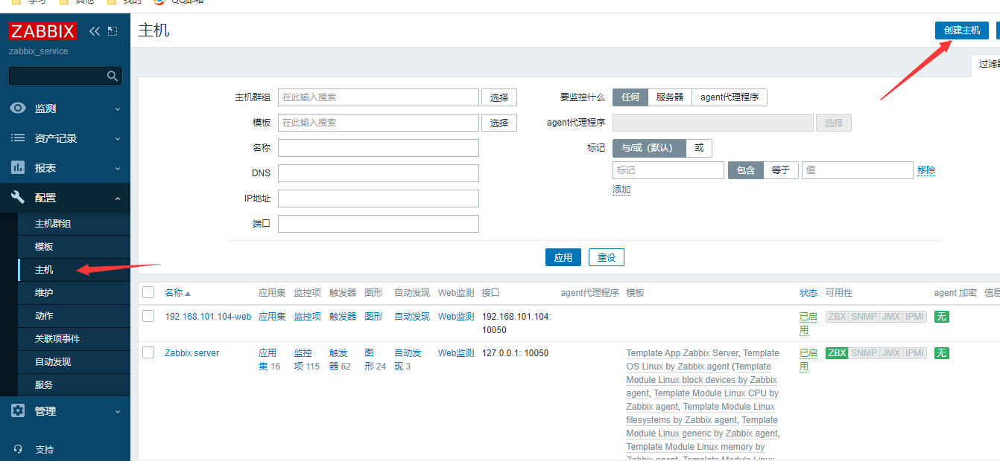

   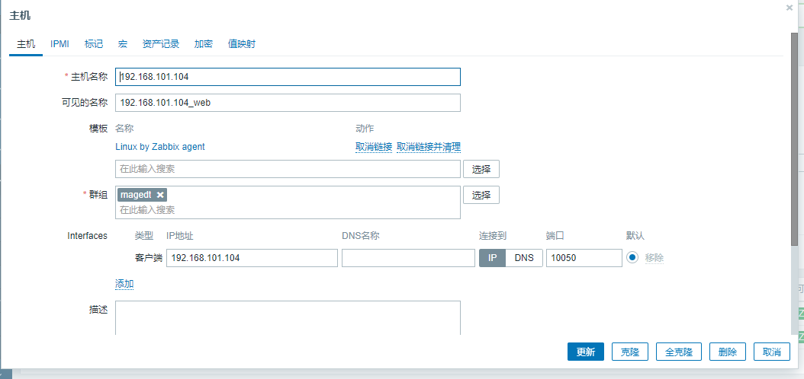

6. 关联模板

   在zabbix对主机实现监控，可以通过添加模板或者添加监控项实现对指定的监控目标进行数据采集，通常采用先创建模板，然后再将模板关联至主机的方式，模板关联如下：

7. 选择模板

   选择符合当前主机监控项的模板，如对linux系统监控可以关联zabbix自带的Template OS Linux模板，如下在搜索框输入linux关键字后会自带匹配符合名称的模板，直接点击即可选择

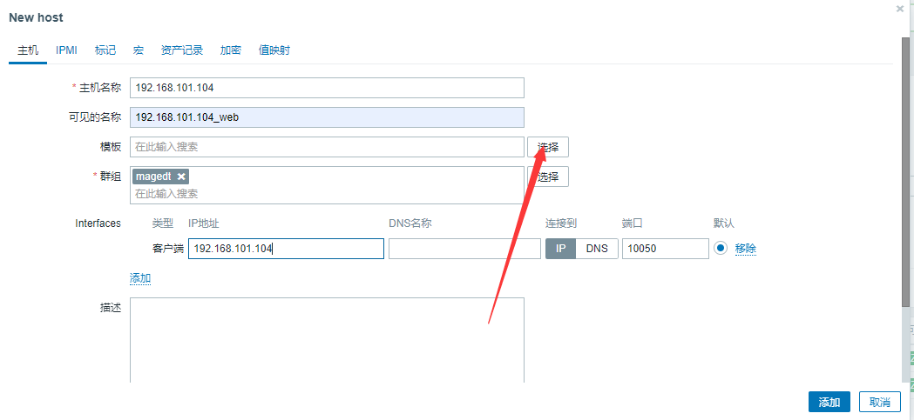

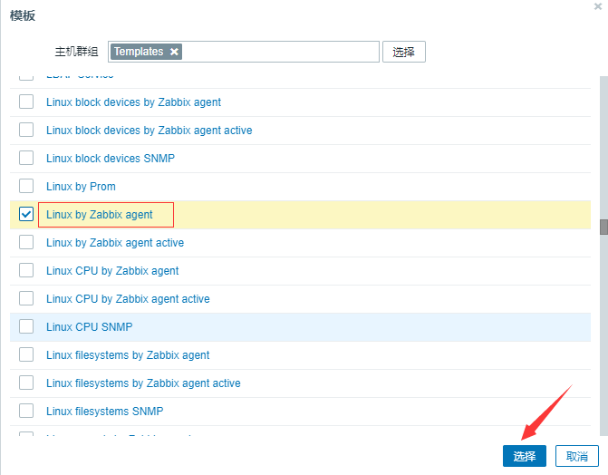

7. 主机添加完成

   需要等待几分钟（具体看模板中监控项的数据采集间隔时间）之后，主机的状态才会变成绿色或者红色，绿色表示 zabbix server对zabbix agent有权限进行数据采集并且当前通讯正常，红色则表示通讯异常，通讯异常会有多种原因，具体可以看相关日志或者到时候点击红色方框会有相关报错显示。

   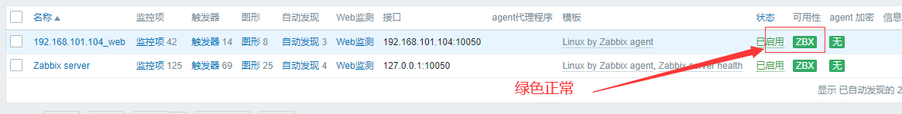

8. 验证主机数据

   经过一段时间的数据采集后，验证zabbix server 是否有刚添加完成的监控数据和图形，图形显示如下

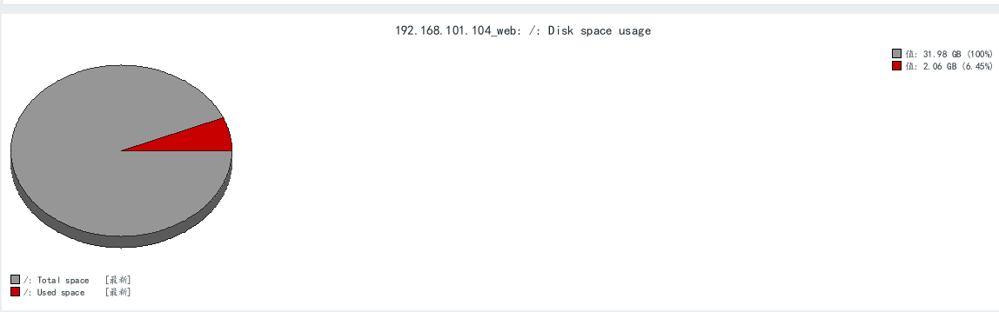

至此，针对linux系统的zabbix agent 安装，添加主机和监控就简单完成

### 2、tomcat 监控

学习如何通过java  gateway 实现对tomcat的指标进行采集和图形展示，如堆栈内存利用率、当前会话连接数、繁忙线程等。

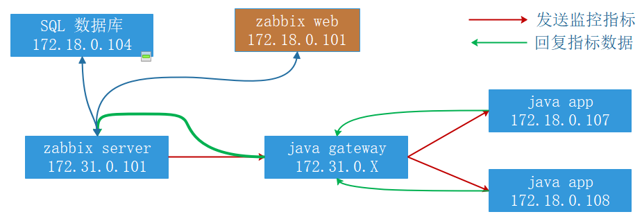

1. 准备jdk环境，tomcat，java项目。

   这里设置了tomcat默认访问路径为webapp/demo

   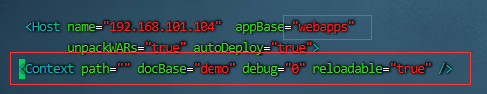

2. 验证tomcat web页面。

   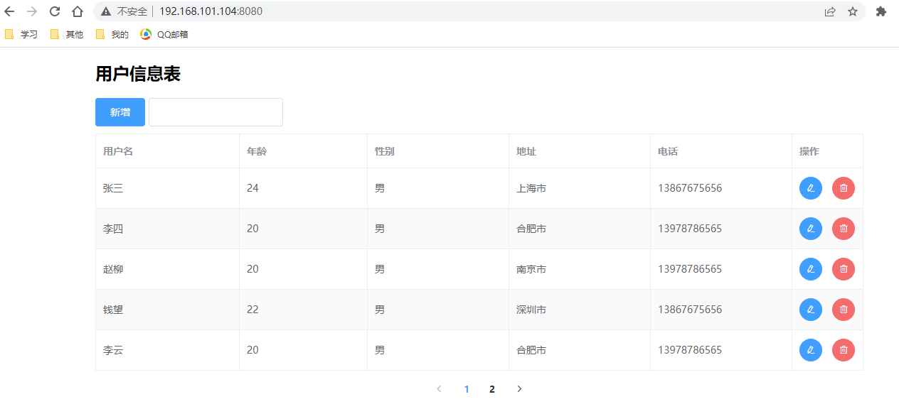

3. 部署java gateway服务器。

   java gateway是独立于zabbix server和zabbix agent的组件，也就是java gateway可以是单独的一台服务器，但是也可以和zabbix server 或者 zabbix agent公用一台服务器，前提是端口不要配置冲突了。

   本次和zabbix  agent 公用一台服务器，ip地址为192.168.101.104

   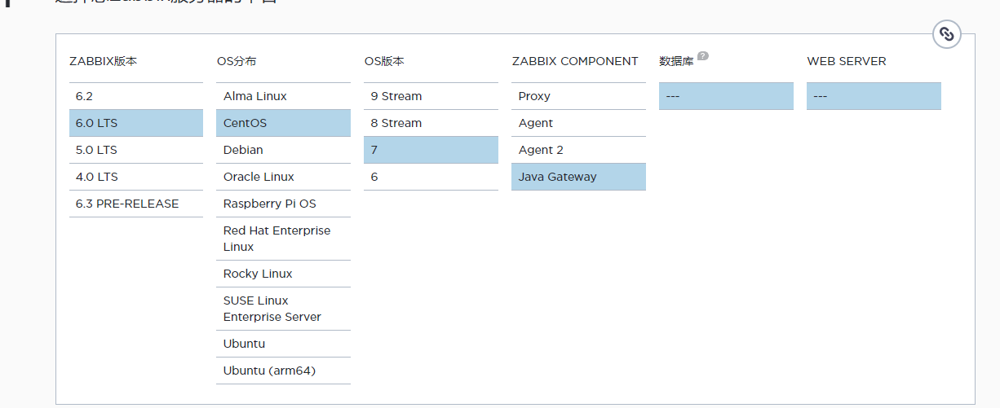

   ```
   # 安装Zabbix库
   rpm -Uvh https://repo.zabbix.com/zabbix/6.0/rhel/7/x86_64/zabbix-release-6.0-4.el7.noarch.rpm
   
   yum clean all
   
   # 安装Zabbix代理
   yum install zabbix-java-gateway
   
   # 启动Zabbix 服务并设置开机自启
   systemctl restart zabbix-java-gateway
   systemctl enable zabbix-java-gateway
   ```

4. 修改zabbix gateway配置文件

   ```
   vim /etc/zabbix/zabbix_java_gateway.conf
   LISTEN_IP="0.0.0.0"
   LISTEN_PORT=10052   # 配置zabbix gateway端口
   PID_FILE="/var/run/zabbix/zabbix_java_gateway.pid"
   START_POLLERS=50
   TIMEOUT=30
   
   # 重启 zabbix gateway服务
   systemctl restart zabbix-java-gateway
   
   # 验证java gateway端口
   lsof -i:10052
   
   COMMAND    PID   USER   FD   TYPE  DEVICE SIZE/OFF NODE NAME
   java    119667 zabbix   12u  IPv6 2833083      0t0  TCP *:10052 (LISTEN)
   ```

5. 配置 zabbix server 调用java gateway

   ```
   # 这里在 zabbix server 服务器上配置
    vim /etc/zabbix/zabbix_server.conf
    
    JavaGateway=192.168.101.104  # 监听的zabbix gateway地址
    JavaGatewayPort=10052  # 指定java gateway的服务监听端口
    StartJavaPollers=20   # 启动多少个进程去轮询 java gateway
    
    # 重启 zabbix server
    systemctl restart zabbix-server
    
    # 查看启动的java进程
    ps -ef|grep java  # 因为这里设置的 StartJavaPollers=20 所以应该看到20个java进程
   ```

6. tomcat开启JMX监控

   JMX在java编译语言中定义了应用程序以及网络管理和监控的体系结构、设计模式、应用程序接口以及服务，通常使用JMX来监控系统的运行情况。

   ```
   # vim /usr/local/tomcat/bin/catalina.sh
   
   
   CATALINA_OPTS="$CATALINA_OPTS -Dcom.sun.management.jmxremote -Dcom.sun.management.jmxremote.port=8090 -Dcom.sun.management.jmxremote.ssl=false -Dcom.sun.management.jmxremote.authenticate=false -Djava.rmi.server.hostname=192.168.101.104"
   
   # 修改后重启tomcat，如何tomcat 正常启动则配置完成
   ```

   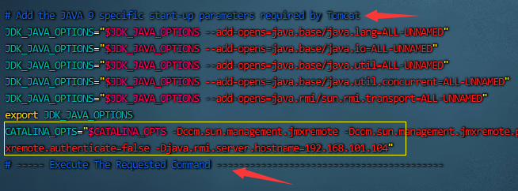

   ```
   解释：
   # 启动远程监控
    -Dcom.sun.management.jmxremote  
   # 默认启动的JMX端口号，要和zabbix添加主机时候的端口一致
    -Dcom.sun.management.jmxremote.port=8090
   # 不使用ssl认证
    -Dcom.sun.management.jmxremote.ssl=false
   # 不使用用户密码
    -Dcom.sun.management.jmxremote.authenticate=false
   # tomcat主机自己的ip地址，不要写zabbix server的地址
    -Djava.rmi.server.hostname=192.168.101.104
   ```

7. 通过jconsole验证JMX数据

   在windows安装windows版的jdk，完成后在bin下运行jconsole.exe。

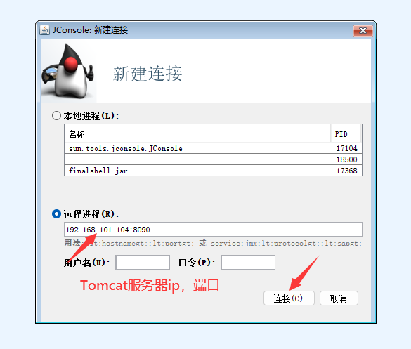

当显示当前的JMX数据，则配置成功

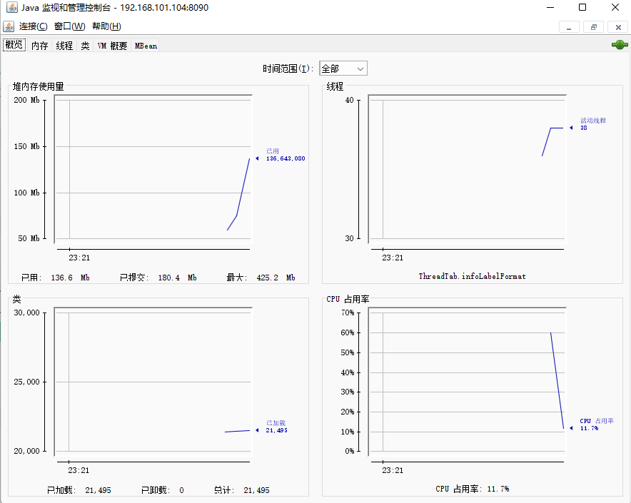

8. zabbix server添加JMX监控

   由于tomcat 和zabbix  agent 公用一台服务器，找到之前配置的主机

   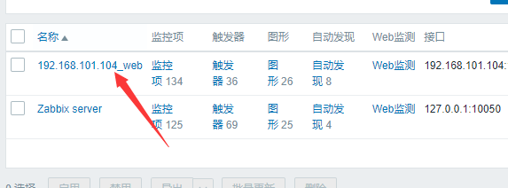

   添加监控并关联模板

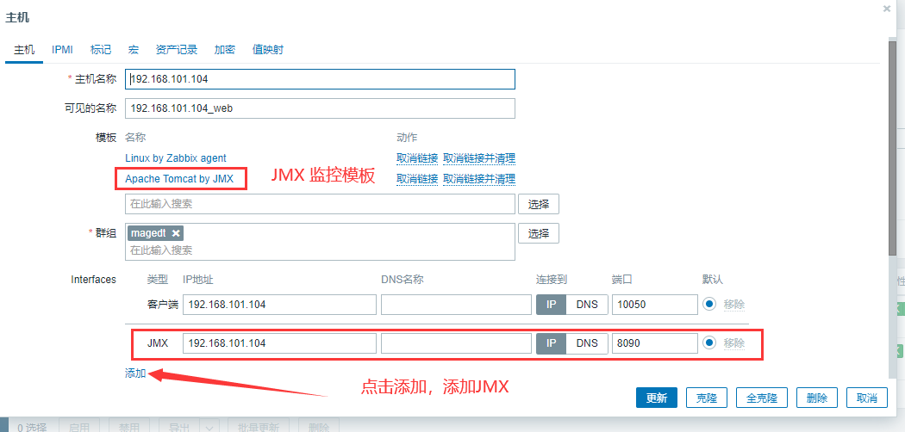

确认更新完成后，会多出一个JMX的标志，由红变绿。说明监控添加配置成功

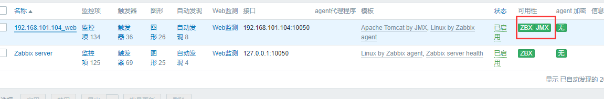

过一段时间，可以中主机哪里看到 JMX 监控数据

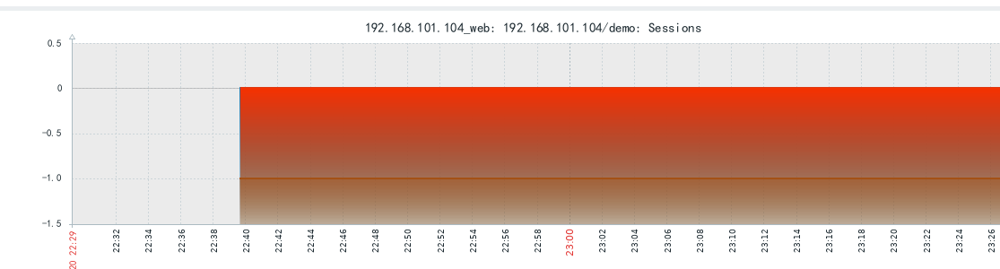

### 3、JMX监控生产模板使用

生产环境的JMX监控模板使用，主要添加了自定义的监控项和阙值

