# Zabbix5.0

> 本文档介绍使用二进制包的方式安装
>
> 官方安装网站：https://www.zabbix.com/cn/download

这里选择 Zabbix 服务器的平台为 centos 7

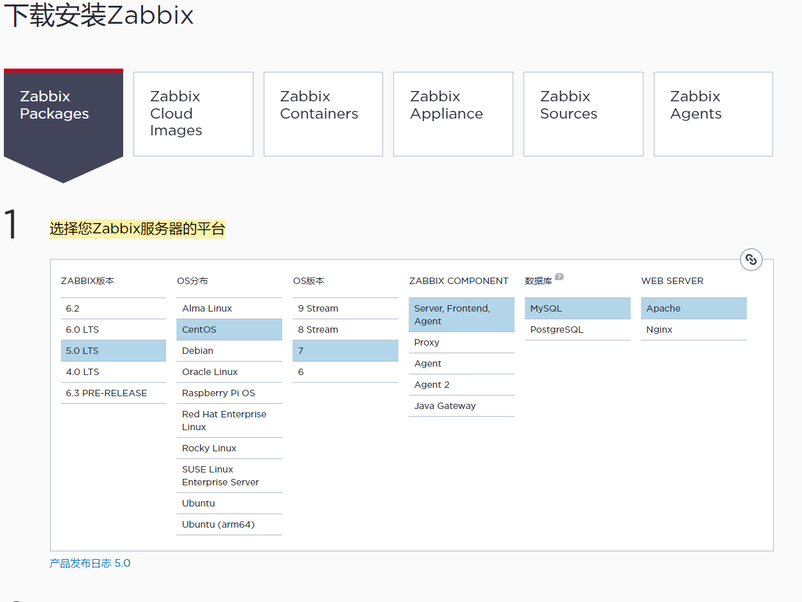

## 一、安装和配置Zabbix

1. 安装Zabbix库

   ```
   rpm -Uvh https://repo.zabbix.com/zabbix/5.0/rhel/7/x86_64/zabbix-release-5.0-1.el7.noarch.rpm
   
   yum clean all
   ```

2. 安装Zabbix server，Web前端，agent

   ```
   yum install zabbix-server-mysql zabbix-agent
   ```

3. 安装Zabbix repository安装Zabbix前端

   ```
   # 启用红帽软件集合
   yum install centos-release-scl
   ```

4. 编辑配置文件 /etc/yum.repos.d/zabbix.repo

   ```
   [zabbix-frontend]
   ...
   enabled=1
   ...
   ```

5. 安装Zabbix前端包。

   ```
   yum install zabbix-web-mysql-scl zabbix-apache-conf-scl
   ```

6. 创建初始数据库

   ```
   # mysql -uroot -p
   password
   mysql> create database zabbix character set utf8 collate utf8_bin;
   mysql> create user zabbix@'%' identified by 'zabbix';
   mysql> grant all privileges on zabbix.* to zabbix@'%';
   mysql> quit;
   ```

7. 导入初始架构和数据，系统将提示您输入新创建的密码。

   ```
   zcat /usr/share/doc/zabbix-server-mysql*/create.sql.gz | mysql -uzabbix -p zabbix
   ```

8. 为Zabbix server配置数据库

   ```
   # 编辑配置文件 /etc/zabbix/zabbix_server.conf
   
   DBPassword=zabbix
   ```

9. 为Zabbix前端配置PHP

   ```
   # 编辑配置文件 /etc/opt/rh/rh-php72/php-fpm.d/zabbix.conf 
   # 安装Zabbix前端包。取消注释并为您设置正确的时区。
   
   php_value[date.timezone] =  Asia/Shanghai
   
   ```

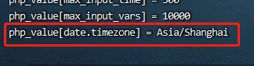

10. 启动Zabbix server和agent进程

    ```
    # 启动Zabbix server和agent进程，并为它们设置开机自启
    
    systemctl restart zabbix-server zabbix-agent httpd rh-php72-php-fpm
    systemctl enable zabbix-server zabbix-agent httpd rh-php72-php-fpm
    
    
    # 看进程、端口
    ps aux|grep zabbix
    netstat -anplut|grep zabbix
    
    
    # 查看zabbix日志
    tail -f /var/log/zabbix/zabbix_server.log
    ```

11. 启动web

    zabbix部署ip/zabbix (192.168.101.103/zabbix)

## 二、前端安装

出现这个页面就说明成功连接zabbix前端啦！

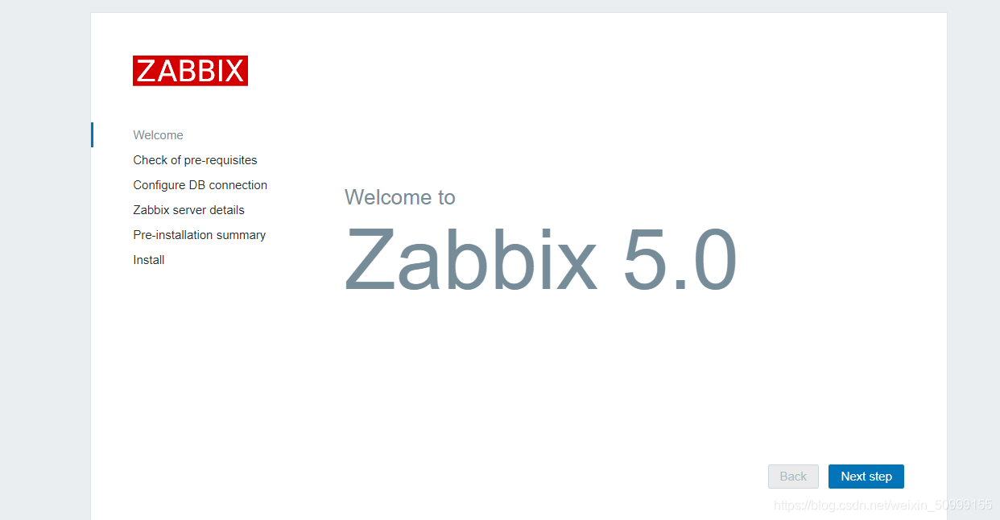

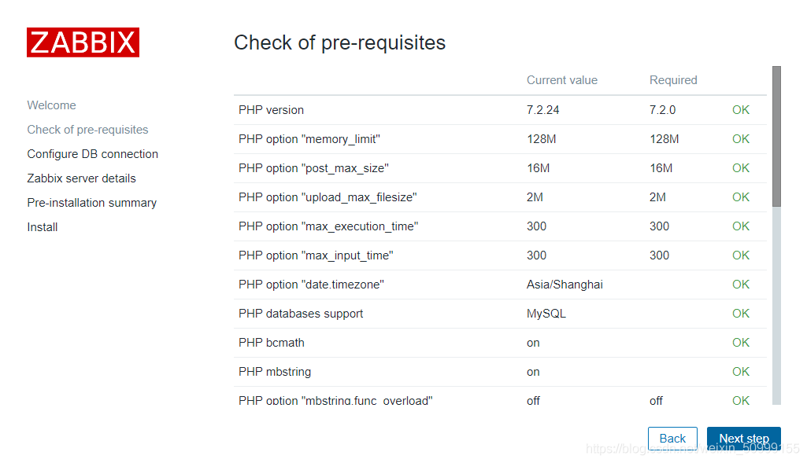

 这里填写数据库的端口号、密码。

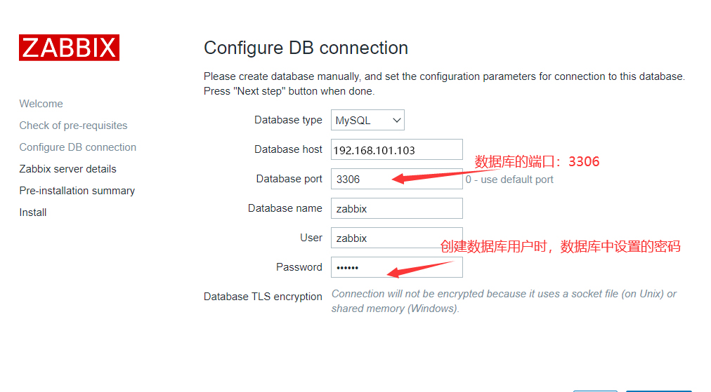

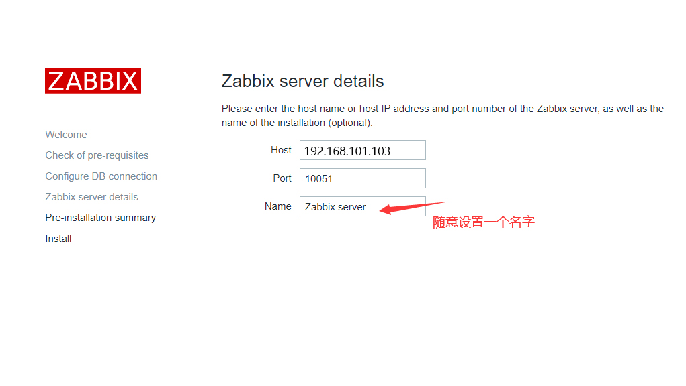

 最后出现这个界面，就已经配置好了zabbix。

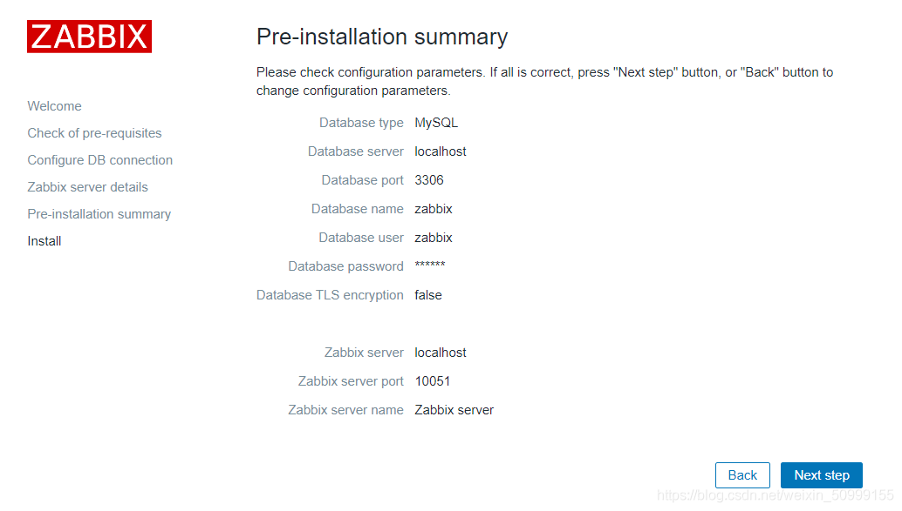

 成功设置！

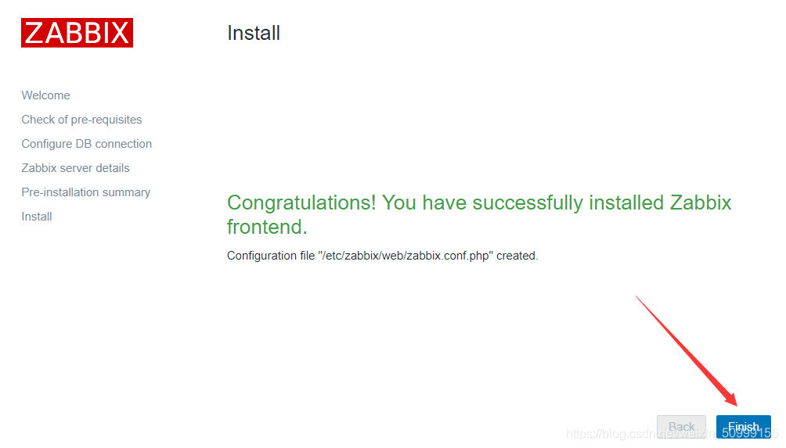

## 三、登陆zabbix

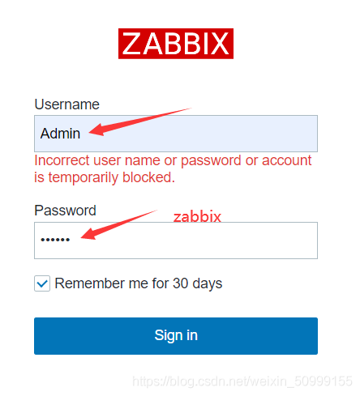

首先，把页面显示设置为中文的。

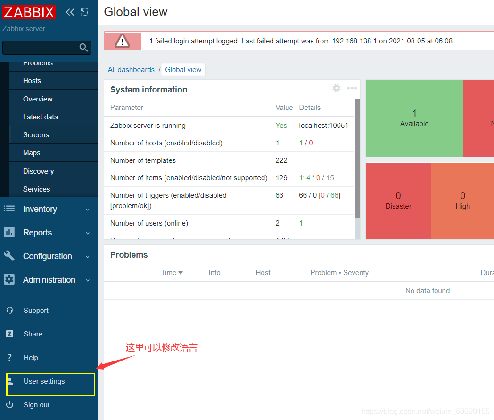

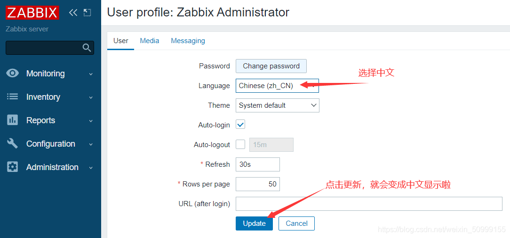

## 四、解决zabbix前端的中文乱码

1、打开windows机器C盘，找到以下路径中的楷体，将此文件复制到桌面（复制出来的字体名字为simkai.ttf）。

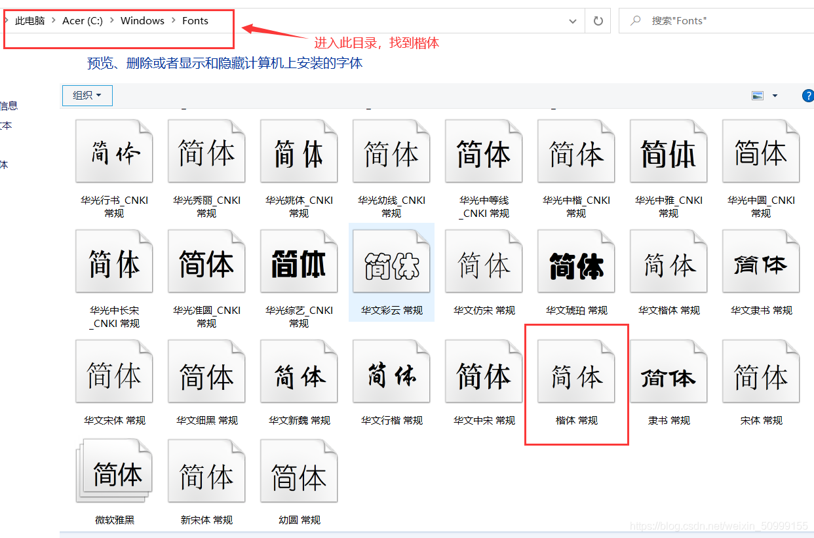

2、在xshell中传输文件

```
[root@zabbix ~]# yum install lrzsz -y simkai.ttf
[root@zabbix ~]# rz    #选中刚刚的楷体文件
 
[root@zabbix-server ~]# find / -name "*.ttf"
#找到zabbix前端所用的字体文件所属路径
```

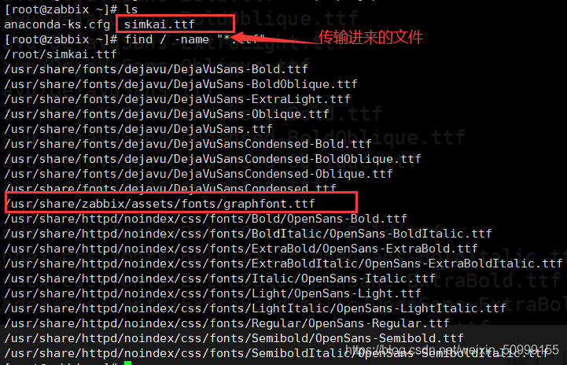

 3、修改配置文件

```
# 进入此目录
[root@zabbix ~]# cd /usr/share/zabbix/assets/fonts
 
# cp复制刚刚的文件到当前目录下
[root@zabbix fonts]# cp /root/simkai.ttf .
 
# 编辑zabbix配置文件
[root@zabbix fonts]# vim /usr/share/zabbix/include/defines.inc.php
 
```

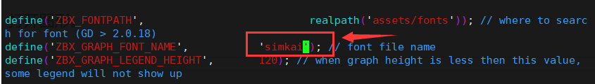

 4、回到zabbix前端，点击主机——图形

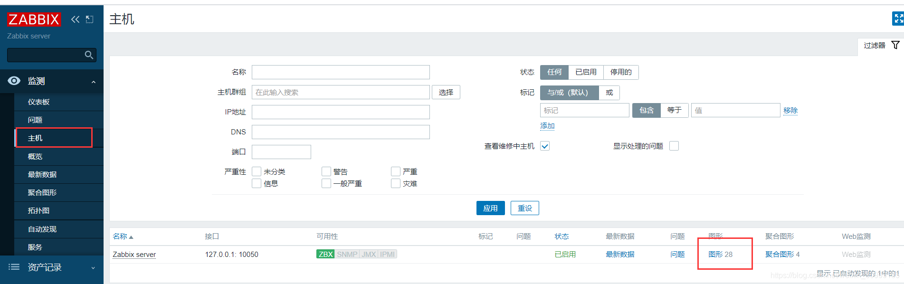

 5、出现这个界面就安装好zabbix啦！没有中午乱码

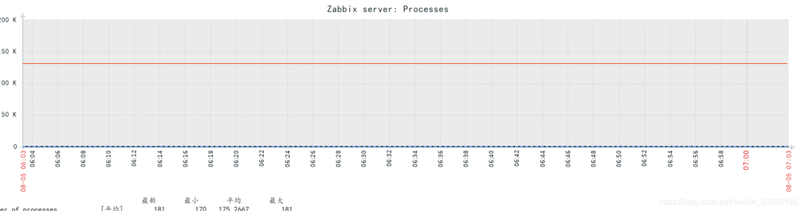