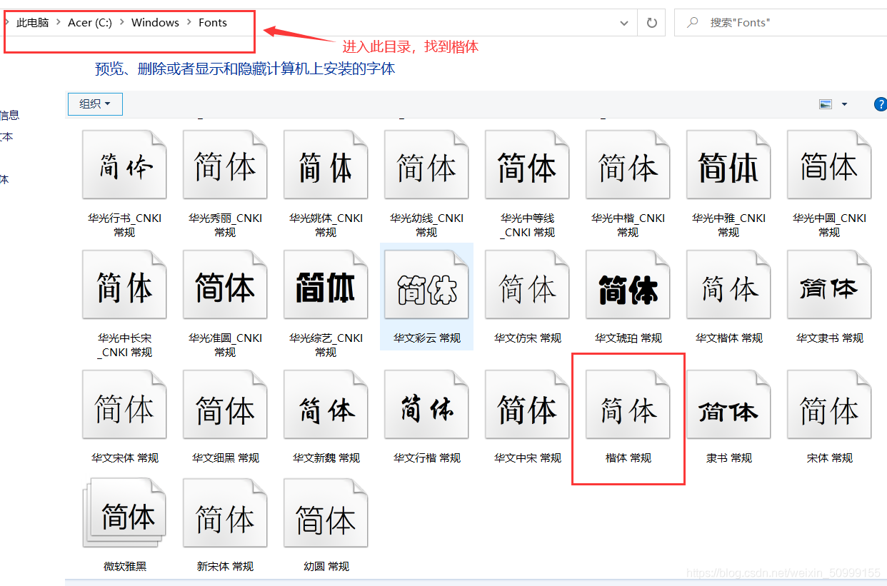

# Zabbix6.0

> 本文档介绍使用二进制包的方式安装
>
> 官方安装网站：https://www.zabbix.com/cn/download

这里选择 Zabbix 服务器的平台为 Ubuntu20.04


## 一、安装和配置Zabbix

1. 安装Zabbix库

   ```
   # wget https://repo.zabbix.com/zabbix/6.0/ubuntu/pool/main/z/zabbix-release/zabbix-release_6.0-4%2Bubuntu20.04_all.deb
   # dpkg -i zabbix-release_6.0-4+ubuntu20.04_all.deb
   # apt update
   ```

2. 安装Zabbix server，Web前端，agent

   ```
   # apt install zabbix-server-mysql zabbix-frontend-php zabbix-apache-conf zabbix-sql-scripts zabbix-agent
   ```

   

3. 创建初始数据库

   ```
   # mysql -uroot -p
   password
   mysql> create database zabbix character set utf8mb4 collate utf8mb4_bin;
   mysql> create user zabbix@localhost identified by 'password';
   mysql> grant all privileges on zabbix.* to zabbix@localhost;
   mysql> quit;
   ```

7. 导入初始架构和数据，系统将提示您输入新创建的密码。

   ```
   # zcat /usr/share/zabbix-sql-scripts/mysql/server.sql.gz | mysql --default-character-set=utf8mb4 -uzabbix -p zabbix
   ```

5. 为Zabbix server配置数据库

   ```
   # 编辑配置文件 /etc/zabbix/zabbix_server.conf
   
   DBPassword=zabbix
   ```

6. 启动Zabbix server和agent进程

   ```
   # 启动Zabbix server和agent进程，并为它们设置开机自启
   
   # systemctl restart zabbix-server zabbix-agent apache2
   # systemctl enable zabbix-server zabbix-agent apache2
   
   
   # 看进程、端口
   ps aux|grep zabbix
   netstat -anplut|grep zabbix
   
   
   # 查看zabbix日志
   tail -f /var/log/zabbix/zabbix_server.log
   ```

7. 启动web

   zabbix部署ip/zabbix (192.168.101.105/zabbix)

## 二、前端安装

出现这个页面就说明成功连接zabbix前端啦！


 这里填写数据库的端口号、密码。


 最后出现这个界面，就已经配置好了zabbix。


 成功设置！


## 三、登陆zabbix

用户名 Admin 密码：zabbix


首先，把页面显示设置为中文的。


如果这里没有中文选项，是因为你系统里没中文环境

第一步，安装中文包：

```
apt-get install language-pack-zh-hant language-pack-zh-hans
```

第二部，重新配置系统安装的语言包：选择中文utf-8

```
dpkg-reconfigure locales 
```

第三步，重启apache

```
 sudo /etc/init.d/apache2 restart
```


## 四、解决zabbix前端的中文乱码

1、打开windows机器C盘，找到以下路径中的楷体，将此文件复制到桌面（复制出来的字体名字为simkai.ttf）。



2、将字体上传到zabbix web 目录下

```
# 具体路径为 /usr/share/zabbix/assets/fonts
```


 3、修改配置文件

```
 find / -name defines.inc.php
 这里查到的路径为 /usr/share/zabbix/include/defines.inc.php
 
vim /usr/share/zabbix/include/defines.inc.php
 
```


 4、回到zabbix前端，点击主机——图形


 5、出现这个界面就安装好zabbix啦！没有中午乱码


