# IDEA githu使用

## 1、创建GitHub 仓库

1. 登录github，在GitHub中新建一个repositories

   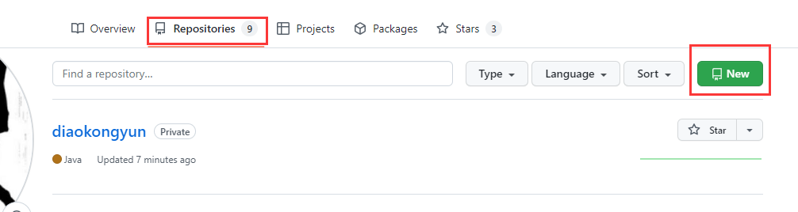

   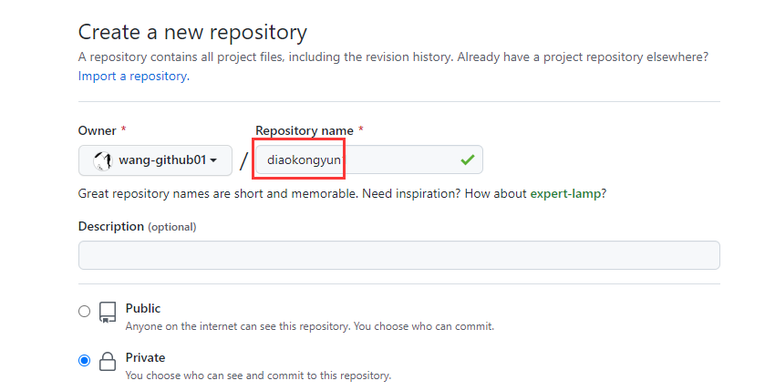

2. 在新创建的仓库repositories中便可查看在idea中用于使用的git连接

   > 选择HTTPS ，显示的***.git
   >
   > 便是在idea中使用的连接，复制该链接
   >
   > 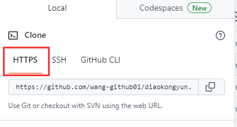

## 2、IDEA创建项目提交到GitHub

1. 登录GitHub账号

   Settings ==> Version Control ==> GitHup (使用自己账号登录) ==> 然后apply + OK

   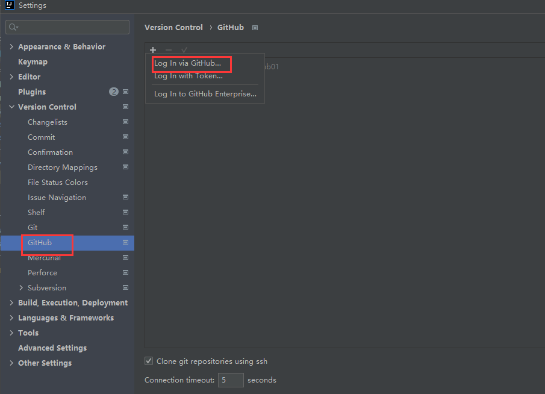

   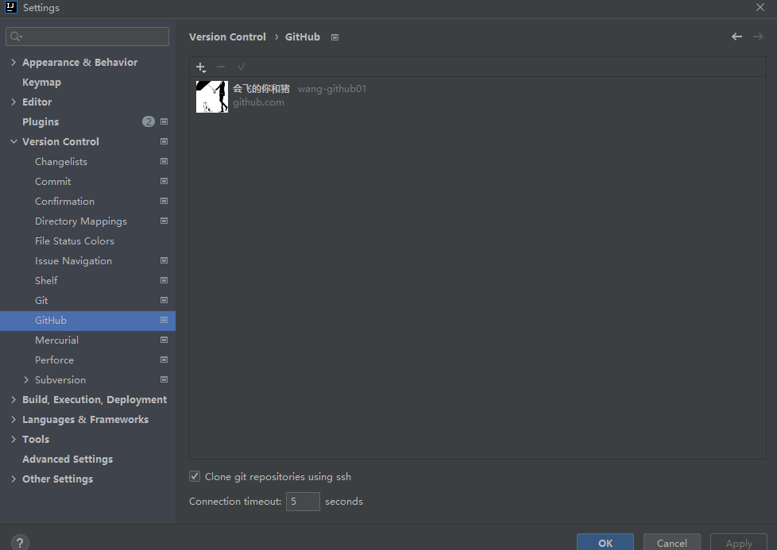

2. VCS中选择第一个Enable Version

   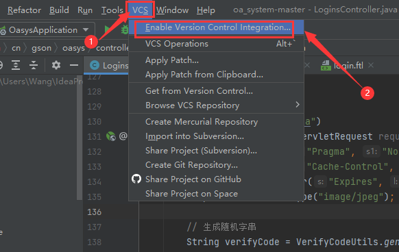

3. 选择Git 点击ok

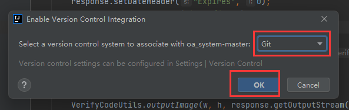

4. 此时idea上方的VCS显示将变成Git，文件时红色

   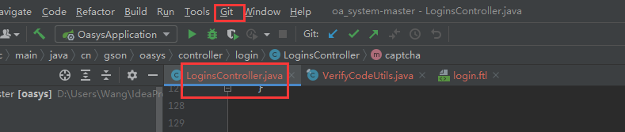

5. 右键需要上传的项目-->git-->Add

   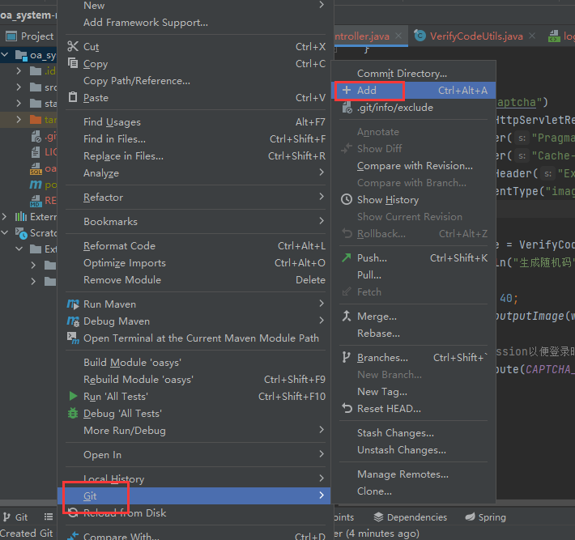

6. 然后再右键项目-->git-->Commint Directory

   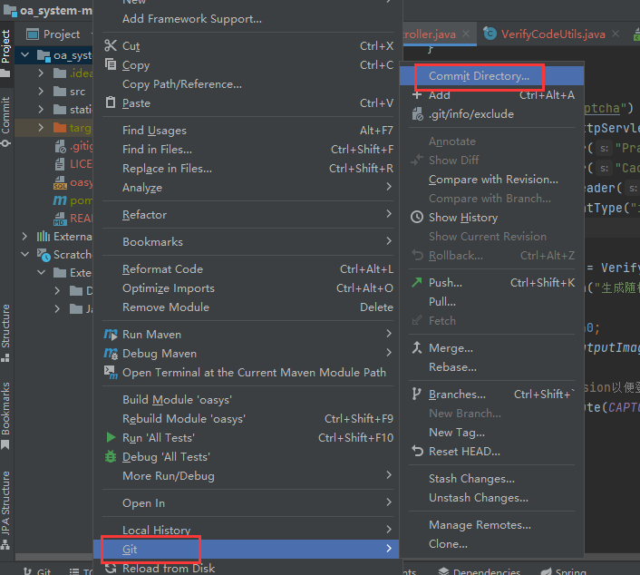

   到此便将项目添加到git上，但是此时仍保存在本地中

7. 此时在idea上方，点击git-->commit

   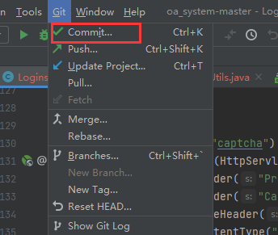

   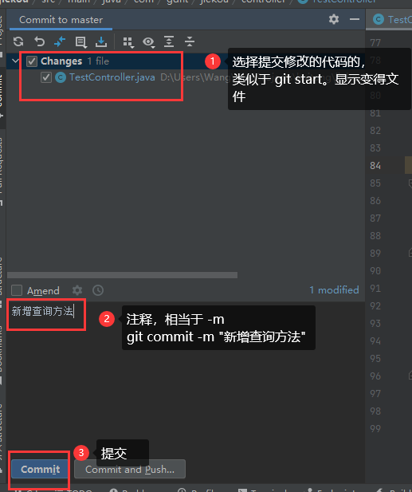

8. commit成功后，再git-->push

   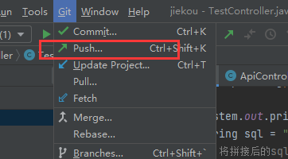

   如下为上传到git服务器的push页面，此页面将显示你提交的所有文件信息

   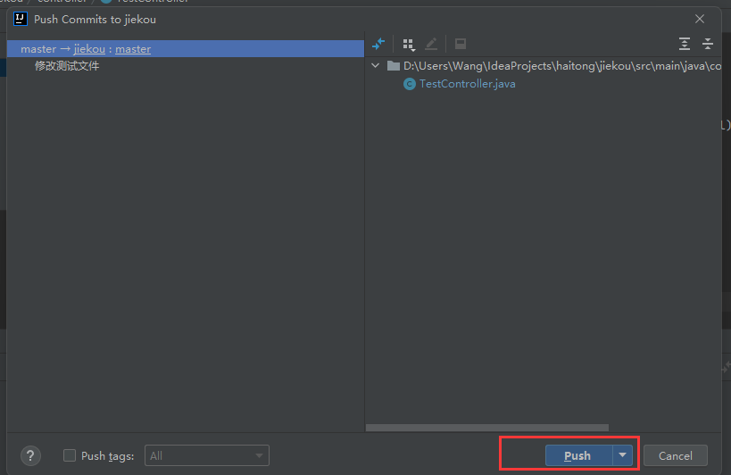

   > push成功后，便将项目提交到远程github中了。
   >
   > 也可commit时选择commit and push

9. push成功后，右下角的提示信息，注意最下方显示当前的操作的是master分支。（可新建自己的分支，避免与master冲突）

   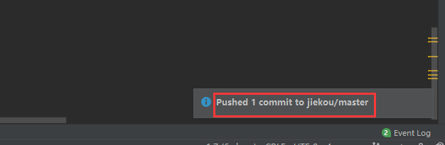

