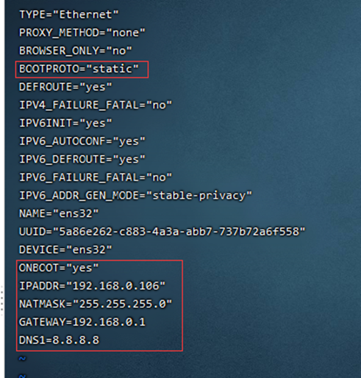

# Linux 网络配置

## 设置静态网络ip

 Linux 查看ip命令 ifconfig 或者 ip addr

```
cd /etc/sysconfig/network-scripts/ifcfg-ens33     (网卡名称为“ens33”，不同机可能不一样)
```

编辑网卡参数

```
BOOTPROTO=static

ONBOOT=yes

IPADDR=192.168.0.106  # 静态虚拟机ip

NATMASK=255.255.255.0 # 子网掩码和本机一致

GATEWAY=192.168.0.1  # 默认网关和本机一致

DNS1=8.8.8.8      # 设置DNS
```

