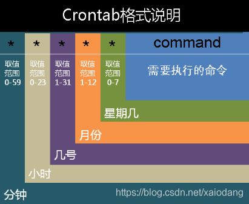

# crontab 定时器



具体执行 crontab -e 或者 直接编译 crontab文件 vi /etc/crontab

使用 crontab -e 可以在普通用户下设置定时任务，vi /etc/crontab 是在root用户中设置的可以执行一些root权限的命令。

格式：

> ​		minute hour day month week user-name command
>
> ​				minute---分钟 （0-59）
>
> 　		　hour------小时（0-23）
> 　	　	day--------日期（1-31）
> 　		　month---月份（1-12）
> 　	　	week----星期（0-6） //0代表星期天	
>
> 除了数字还有几个个特殊的符号就是" * "、" / "和" - "、" , "，*代表所有的取值范围内的数字，"/"代表每的意思，"*/5"表示每5个单位，"-"代表从某个数字到某个数字，","分开几个离散的数字。

crontab每分钟定时执行：

```
*/1 * * * * sh /home/postgres/pgsql.sh //每隔1分钟执行一次脚本
*/10 * * * * sh /home/postgres/pgsql.sh //每隔10分钟执行一次脚本
```

crontab每小时定时执行：

```
0 */1 * * * sh /home/postgres/pgsql.sh //每1小时执行一次脚本
0 */2 * * * sh /home/postgres/pgsql.sh //每2小时执行一次脚本
```

crontab每天定时执行：

```
0 10 * * * sh /home/postgres/pgsql.sh //每天10点执行脚本
30 19 * * * sh /home/postgres/pgsql.sh //每天19点30分执行脚本
```

crontab每周定时执行：

```
0 10 * * 1 sh /home/postgres/pgsql.sh //每周一10点执行脚本
30 17 * * 1-5 sh /home/postgres/pgsql.sh //每周一到周五17点30分执行脚本
0 10 * * 1、3、5 sh /home/postgres/pgsql.sh // 每周1，周3，周5执行脚本
```

crontab每月定时执行：

```
0 10 1 * * sh /home/postgres/pgsql.sh //每月1日10点执行脚本
0 20 8 * * sh /home/postgres/pgsql.sh //每月8日20点执行脚本
```

crontab每年定时执行：

```
0 10 1 10 * sh /home/postgres/pgsql.sh //每年的10月1日10点执行脚本
0 20 8 8 * sh /home/postgres/pgsql.sh //每年的8月8日20点执行脚本
```


```
crontab –e : 修改 crontab 文件. 如果文件不存在会自动创建。 
crontab –l : 显示 crontab 文件。 
crontab -r : 删除 crontab 文件。
crontab -ir : 删除 crontab 文件前提醒用户。
```

查看定时任务日志 

```
tail -f /var/log/cron
```
