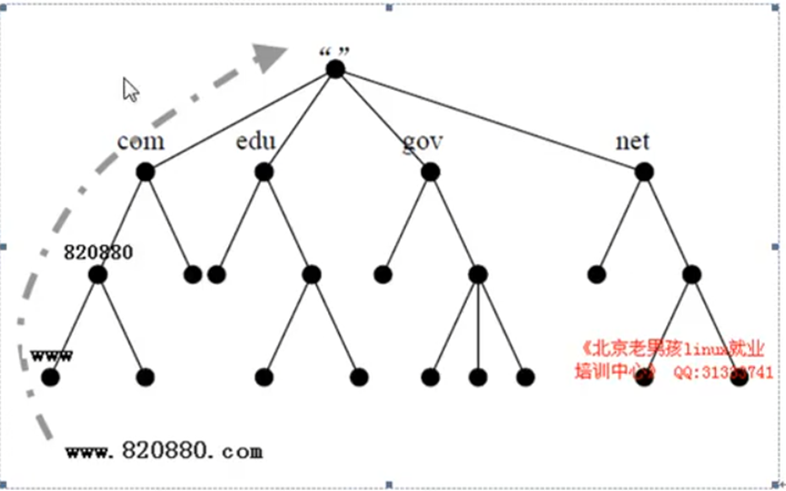
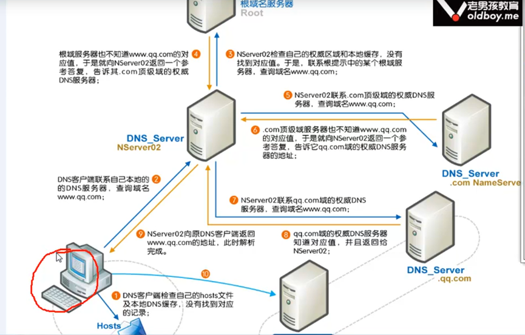

# 网络相关知识

## 1、DNS(域名解析系统)

   1. DNS是什么？

        > 主要用于将域名解析成IP地址。
        >
        > www.baidu.com ==>110.242.68.4（过程就需要DNS解析，是电脑里配置的DNS）

   2. DNS能干什么？

      > 解析A记录：域名 è IP (www.baidu.com ==>110.242.68.4)
      >
      > MX解析记录 [1689783713@qq.com](mailto:1689783713@qq.com) 搭建邮件服务器
      >
      > PTR 反向解析 110.242.68.4 è www.baidu.cmo

   3. DNS A 记录：

      > 浏览器 ==> [www.baidu.com](http://www.baidu.com) ==>  网站服务器ip ==> ip地址对应的网站服务

​       

## 2、DNS 解析流程原理

DNS 结构



以百度为例 [www.baidu.com](http://www.baidu.com).

1. 首先解析 .  ==>  根（在com后面有一个点）全球一共有13台
2. 然后解析 com
3. 接着解析 baidu
4. 最后解析 www

DNS解析流程图



## 3、DNS解析查询

dig @8.8.8.8 [www.baidu.com](http://www.baidu.com) +trace 命令可用于查看DNS解析过程。

- dig www.baidu.com
- nslookup www.baidu.com
- host www.baidu.com
- ping [www.baidu.com](http://www.baidu.com)

## 4、配置网卡

​    配置网卡文件 /etc/sysconfig/network-scripts/ifcfg-ens32

```
#HWADDR=00:0C:29:3A:CE:35 ç 以太网硬件地址即MAC地址、在虚拟机上没有此项配置

TYPE=Ethernet ç 上网类型，目前都是以太网

PROXY_METHOD=none

BROWSER_ONLY=no

BOOTPROTO=none ç 启动协议，获取配置方式有none|bootp|dhcp 三项

DEFROUTE=yes

IPV4_FAILURE_FATAL=no

IPV6INIT=yes ç 是否支持ipv6

IPV6_AUTOCONF=yes

IPV6_DEFROUTE=yes

IPV6_FAILURE_FATAL=no

IPV6_ADDR_GEN_MODE=stable-privacy

NAME=ens32

\#UUID=b1191d38-0e56-4162-a6d2-f3d91166beb4 ç 通用唯一码，在虚拟机上没有

DEVICE=ens32 ç 逻辑设备名

ONBOOT=yes ç 这个地方为yes，才能保证下次开机启动自动激活网卡

IPADDR=192.168.37.110 ç linux服务器的固定ip

NETMASK=255.255.255.0 ç 子网掩码

GATEWAY=192.168.37.1 ç 网关

DNS1=114.114.114.114 ç 主DNS, 这里会默认覆盖以及优先于/etc/resolv.conf的配置生效
```

##  5. DNS 常用地址

```
8.8.8.8
114.114.114.114
```

## 6 修改主机名的步骤

>  hostname wang (重启会失效不推荐使用哦~)
>
> vim /etc/sysconfig/

## 7 网关

​		大家都知道，从一个房间走到另一个房间，必然要经过一扇门。同样，从一个网络向另一个网络发送信息，也必须经过一道“关口”，这道关口就是网关。[顾名思义](https://baike.baidu.com/item/顾名思义)，网关（Gateway）是一个网络连接到另一个网络的“关口”。也就是网络[关卡](https://baike.baidu.com/item/关卡)。

## 8. 查看网络配置信息

```
ifconfg/ip addr
```

## 9. 网络及服务排查

检查百度网站是否有故障

1.  ping [www.baidu.com](http://www.baidu.com) icmp协议（高速公路有没有修通）
2. traceroute [www.baidu.com](http://www.baidu.com) 基础检查、各个高速结点有没有修通
3. telnet [www.baidu.com](http://www.baidu.com) 80

## 10. 抓包工具

tcpdump

```
tcpdump –n icmp –i eth0
```

## 11． 重置网络配置

```
netsh winsock reset
```

